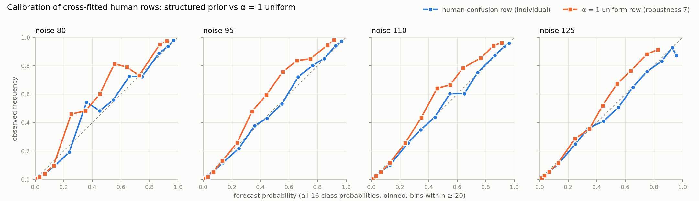
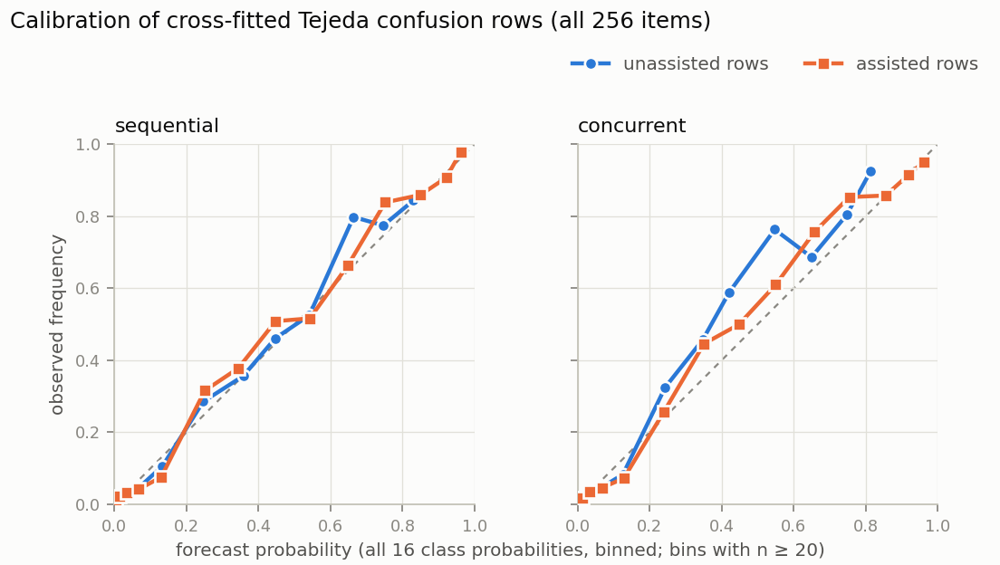
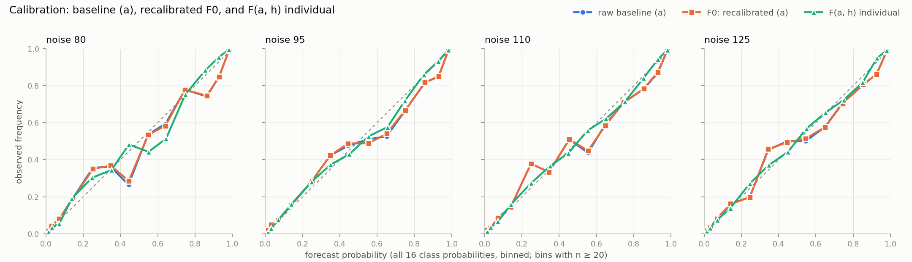
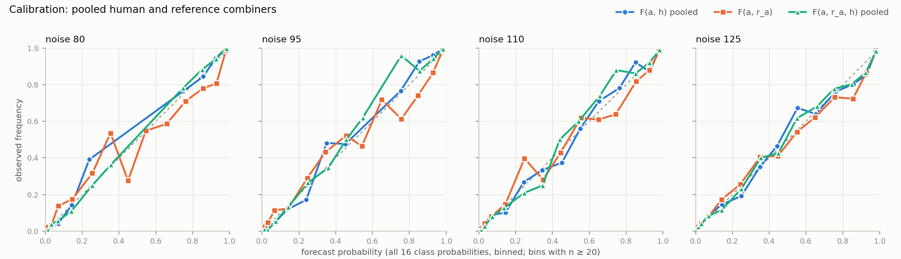
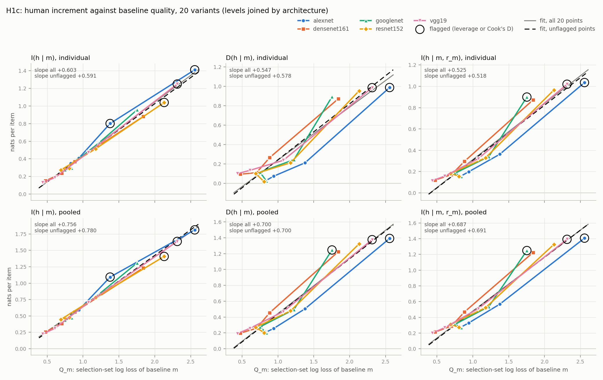

# Full-run report: hai-reference SPEC v1

Governing text: `specs/hai_reference_spec_v1.md` at `a5c3283` (SPEC v1 with Amendments 1 to 3). Run 2026-09-17. Not committed.

**Delivered:** §9 items 3 to 9 — H1a, H1b, H1c with leverage marks and the unflagged refit, H2, H3a to H3c (sequential design primary, concurrent design descriptive), and robustness items 1 to 7. §9 items 1 and 2 carry over from `reports/d1_d2_snapshot_deid.md`. The pilot (`reports/pilot_REPORT.md`) was self-contained, and nothing from it enters these numbers.

**Units:** nats per item unless a row says Brier. Positive increments mean the added source lowers out-of-fold loss.

## Summary

**ImageNet-16H (test set: 900 images, 3,600 items, 21,742 ratings, 145 persons)**
- **Baseline (a)** is `vgg19_epoch10` (runner-up `densenet161_epoch10`). The Brier score picks the same variant.
- **H1a:** `I(h | a)` is +0.131 [+0.107, +0.157] individual and +0.224 [+0.183, +0.264] pooled. Both intervals exclude 0.
- **H1b:**
  - `D(h | a)`: +0.099 [+0.072, +0.128] individual; +0.192 [+0.150, +0.236] pooled.
  - `I(h | a, r_a)`: +0.114 [+0.090, +0.139] individual; +0.201 [+0.161, +0.243] pooled.
  - `I(r_a | a)`: +0.032 [+0.015, +0.050].
  - **Reading rule (§7):** `I(h | a, r_a)` is bounded away from zero in both versions, so the claim that humans carry information the classifiers lack is **supported** against baseline (a).
- **H1c:**
  - Every human increment rises with `Q_m`. Individual `I(h | m)` has slope +0.603 on all 20 points and +0.591 on unflagged points. The sign holds with flagged points removed for all seven quantities.
  - On the open question: `I(h | m, r_m)` does **not** fall to zero at the best variant. It is +0.114 individual at `vgg19_epoch10`, and its lowest lower bound across the 20 variants is +0.090.
- **H2:** split-half Pearson +0.486 [+0.318, +0.626], Spearman +0.437 [+0.288, +0.571], 145 persons. The per-person increment is moderately stable across halves.

**Tejeda (all 256 items; sequential design primary)**
- **Participants:** 72 (24 per AI level), after excluding S143 and S661 (the two-tab pattern).
- **H3a:** `Δ_p` is positive at every level: below +0.122 [+0.086, +0.159], at +0.310 [+0.252, +0.369], above +0.439 [+0.356, +0.537]. The recorded direction (positive at the above-human level) holds.
- **H3b: not supported at any level.** No level's one-sided 95% lower bound on `IB_p` is above zero: below -0.080, at -0.464, above -0.530. People who see the model do not beat it in log loss.
- **H3c:** `β_seen − β_unseen` is negative at every level, but every interval includes zero: below -0.042 [-0.199, +0.107], at -0.162 [-0.319, +0.024], above -0.037 [-0.591, +0.259]. **Not supported** under the primary estimator.
- **Concurrent design (descriptive only, trials in blocks):** 61 participants. Direction of `Δ_p` as in the sequential design. The `β` differences are positive at two levels, the opposite sign to the sequential design.

**Robustness**
- The H1a and H1b conclusions hold under all six items that re-run them (1, 2, 3, 4, 6, 7).
- Item 3 (the reference pooled from 19 variants) leaves the human quantities in place, but the reference itself adds almost nothing: `I(r_a | a)` +0.007 [-0.001, +0.014].
- H2 holds under items 1, 2, 4 and 7, and cannot be computed under item 6.
- For H3c, the Brier and α = 1 versions give intervals below zero at the at-human level (α = 1 also at below-human). The primary does not.
- Item 5 is algebraically identical to the primary H3c estimator (see below).

## Findings that need the designer's attention

1. **The strength grid's upper edge binds everywhere.** Inner cross-validation chose strength 16, the largest value in {1, 2, 4, 8, 16}, in every row fit: all 25 ImageNet-16H fits × 4 noise levels, and every Tejeda fit (5 folds × 4 row sets × 2 designs). Human-alone log loss on the test set keeps falling past the grid: 0.956 at 16, 0.947 at 32, 0.940 at 64, 0.936 at 128 (`reports/full_tables/human_alone_losses.csv`; strengths above 16 were computed as a descriptive diagnostic only and enter no result). The grid is [LOCKED], so the rule was applied as written.
2. **Robustness item 7 is not a conservative bound.** Amendment 3 expected the α = 1 uniform rows to understate the increment. In the full run they give a *larger* increment than the structured prior: `I(h | a)` individual +0.141 [+0.114, +0.169] against +0.131 [+0.107, +0.157]. The uniform off-diagonal rule (item 1) is larger too in the individual version (+0.142 [+0.114, +0.170]), though not in the pooled version.
   - The structured rows are the better human-alone forecast (log loss 0.956, against 0.972 for α = 1 and 0.991 for the uniform off-diagonal rule).
   - They are also close to calibrated: the mean probability on the person's own label is 0.771, against an accuracy of 0.778. The α = 1 rows put 0.682 there.
   - The pilot's premise was that a log-linear weight cannot undo a flattened row. In the full run the combiner puts more weight on the flatter rows: mean individual `w_h` is 0.826 for α = 1 rows against 0.581 for structured rows (`combiner_weights.csv`). The mechanism behind the larger increment was not isolated further.
   - The strength is chosen on human-alone log loss, and that is not the quantity the increment measures.
   - The item 7 numbers are reported as they came out, without the "conservative bound" label.
3. **Robustness item 5 repeats the primary.** For any split, the slope of `IB − IA2` on `IA1` equals `β_seen − β_unseen` exactly, because least-squares slopes are linear in the outcome. Its table is shown for completeness; it adds no information.
4. **Robustness item 6 covers 101 test items, not 128.** 27 of the 128 overlap items fall in the selection set, which §4 excludes from every test. H2 cannot be computed on the overlap: nobody has more than 9 overlap items, against the 40-item minimum.
5. **The 19-variant reference in item 3 is nearly empty.** Its increment `I(r_a | a)` falls to +0.007, with an interval that includes zero. A normalized product of 19 vectors is very sharp before clipping; whether that explains the loss of information was not examined.

## Checks

| Check | Result |
|---|---|
| Selection / test images | 300 / 900; folds of 180 test images each |
| Humans per item (test) | 6 on 3458 items, 7 on 142 items |
| Optimizer | all fits converged (840 fitted weight vectors across the main and robustness runs) |
| Negative fitted weights (Amendment 2 item 4) | none |
| Empty prior rows (Amendment 3 item 1.5) | 0 in ImageNet-16H |
| Tejeda exclusions (Amendment 1 item 4) | sequential: S143, S661 (two-tab); concurrent: C787, C978, W672 (two-tab) and C202 (fewer than 30 unassisted trials) |
| Sequential image pairs after exclusions | 13,824 complete (unassisted, assisted); 0 incomplete |
| Reproducibility | four runs gave the same results (to 1e-9) apart from runtime. Between runs, the code changed only to silence spurious NumPy warnings (the leverage now uses the closed form, checked against the matrix form) and to add the human-alone loss diagnostic |
| Runtime | about 64 s |

### Implementation readings new to the full run

Readings confirmed in Amendment 3 item 3 carry over unchanged: random draws, nested fitting, the units weights are fitted on, the optimizer, and normalized product pools. These readings are new; each follows the spec text as closely as I could, and I list them so they can be checked.

1. **Structured rows (ImageNet-16H):**
   - Each fit's inner folds are `rng(20260915).permutation` over its own sorted training images, fold = position mod 5.
   - The strength minimizes summed held-out log loss of the clipped row, separately per noise level. On a tie, the smallest strength wins (no ties occurred).
   - Test-fold rows use strengths chosen on four folds; nested rows use strengths chosen on three.
2. **Tejeda rows:**
   - 5 outer folds by image over the 256 images (seed 20260915), shared by both designs. No nesting, since no weights are fitted.
   - Unassisted rows use a uniform prior: each cell gets strength/16.
   - Assisted rows use the unassisted row, smoothed at its chosen strength and fitted on the same training trials, as prior. Inside the inner CV for the assisted strength, the unassisted prior is refitted on the inner training images at the unassisted strength already chosen.
   - Rows are pooled across noise levels (§3).
3. **H3 gain:** per trial, `G = loss(model vector) − loss(human row)`, both clipped. The model vector is the one stored on the trial row, and it is not recalibrated.
4. **H3c halves:**
   - Sequential: images are split per participant (Amendment 1 item 2). `IA1` comes from half-1 unassisted trials; `IA2` and the `IB` used for `β_seen` both come from half 2, so both outcomes share images and neither shares images with `IA1`.
   - H3a and H3b use all trials.
   - Concurrent: unassisted trials are split at random, and `IB` is all assisted trials.
   - One `rng(20260916)` per design, iterating over participants sorted by code.
5. **Bootstraps:**
   - H1 and H1c: images, `rng(20260916).integers(0, 900, (2000, 900))`. The same draws feed the slope intervals, with flags fixed from the point estimates.
   - H2: persons.
   - H3: participants within level.
   - All percentile 95%; H3b uses the one-sided 5th percentile.
6. **H2:** one global split of the 900 test images (`rng(20260916).permutation`, first 450 = half A), per Amendment 1 item 9. The rating-level increment is `loss(F0 on the item) − loss(F(a, h) on the rating)`, leave-one-out demeaned over the other raters on the item. No Spearman-Brown correction.
7. **Robustness scope:**
   - Items 1, 2, 4 and 7 re-run H1a, H1b and H2. Items 1, 2 and 7 also re-run H3.
   - Item 3 changes only the quantities that involve the reference.
   - Item 6 restricts H1a and H1b to the overlap items in the test set.
   - H1c is not re-run under any robustness item.
   - Item 2 fits combiner weights by Brier and scores Brier; baseline (a) and the confusion rows are unchanged.
   - Item 4 fits all six combiners separately per noise level within each fold.
   - Item 1 uses plain empirical accuracy per (noise, confidence) in the training folds; for Tejeda, per confidence per row set.
   - Item 7 for Tejeda keeps the Amendment 1 30-rating fallback to assisted rows pooled across levels, as the α = 1 rule stood before Amendment 3.

## §9.3 Baseline (a): selection-set table

| Rank | Variant | Selection log loss | Selection Brier | Selection accuracy |
|---:|---|---:|---:|---:|
| 1 | `vgg19_epoch10` **(a)** | 0.4362 | 0.1816 | 0.870 |
| 2 | `densenet161_epoch10` runner-up | 0.4767 | 0.1971 | 0.855 |
| 3 | `vgg19_epoch01` | 0.6082 | 0.2670 | 0.811 |
| 4 | `resnet152_epoch01` | 0.6902 | 0.3004 | 0.776 |
| 5 | `densenet161_epoch01` | 0.7021 | 0.2930 | 0.800 |
| 6 | `googlenet_epoch01` | 0.7490 | 0.3284 | 0.759 |
| 7 | `resnet152_epoch10` | 0.8077 | 0.3418 | 0.749 |
| 8 | `alexnet_epoch10` | 0.8288 | 0.3664 | 0.724 |
| 9 | `googlenet_epoch10` | 0.8400 | 0.3593 | 0.749 |
| 10 | `densenet161_epoch00` | 0.8839 | 0.3616 | 0.738 |
| 11 | `alexnet_epoch01` | 0.9422 | 0.4035 | 0.710 |
| 12 | `vgg19_epoch00` | 1.0753 | 0.4336 | 0.673 |
| 13 | `resnet152_epoch00` | 1.1766 | 0.4704 | 0.649 |
| 14 | `googlenet_epoch00` | 1.2225 | 0.5097 | 0.612 |
| 15 | `alexnet_epoch00` | 1.3769 | 0.5665 | 0.552 |
| 16 | `googlenet_baseline` | 1.7532 | 0.6561 | 0.456 |
| 17 | `densenet161_baseline` | 1.8397 | 0.6346 | 0.494 |
| 18 | `resnet152_baseline` | 2.1305 | 0.7069 | 0.449 |
| 19 | `vgg19_baseline` | 2.3125 | 0.7913 | 0.366 |
| 20 | `alexnet_baseline` | 2.5561 | 0.8710 | 0.293 |

## §9.4 Confusion rows and combiner weights

### Chosen strengths

- **ImageNet-16H:** 16 at every noise level in all 5 outer fits and all 20 nested fits (`reports/full_tables/strengths_h16_outer.csv`, `strengths_h16_nested.csv`). The display fit on all 900 test images also chose 16.
- **Tejeda:** 16 for the unassisted rows and for every assisted row set (below, at and above human), in both designs and all 5 folds (`strengths_tejeda_*_structured.csv`).
- **α = 1 fallback (robustness 7):** in the sequential design, 9 to 15 assisted rows per fold fell back; in the concurrent design, 52 to 57.

### Calibration of the rows

| Noise | Confidence | Ratings | Observed accuracy | Mean diagonal, structured prior | Mean diagonal, α = 1 (R7) |
|---:|---|---:|---:|---:|---:|
| 80 | low | 503 | 0.553 | 0.503 | 0.379 |
| 80 | medium | 849 | 0.794 | 0.785 | 0.591 |
| 80 | high | 4083 | 0.960 | 0.949 | 0.893 |
| 95 | low | 774 | 0.468 | 0.445 | 0.349 |
| 95 | medium | 1157 | 0.831 | 0.812 | 0.659 |
| 95 | high | 3499 | 0.951 | 0.942 | 0.876 |
| 110 | low | 1388 | 0.415 | 0.411 | 0.348 |
| 110 | medium | 1227 | 0.767 | 0.762 | 0.615 |
| 110 | high | 2833 | 0.935 | 0.927 | 0.845 |
| 125 | low | 2404 | 0.329 | 0.334 | 0.295 |
| 125 | medium | 1247 | 0.703 | 0.713 | 0.569 |
| 125 | high | 1778 | 0.872 | 0.878 | 0.751 |

*Figure 1.* ImageNet-16H cross-fitted rows. The structured prior (blue) sits near the diagonal. The α = 1 rows (orange) are underconfident at middling probabilities.

*Figure 2.* Tejeda cross-fitted rows, all 256 items, split into unassisted and assisted.

The full row tables are in the appendix: 12 ImageNet-16H tables, and 18 Tejeda assisted-trial tables (2 designs × 3 AI levels × 3 confidence levels). Unassisted Tejeda rows are in `reports/full_tables/confusion_rows_tejeda_*.csv`.

### Combiner weights, baseline (a)

| Combiner | Weights | Mean over folds (min to max) |
|---|---|---|
| F0 | w_m | 0.997 (0.993 to 0.998) |
| F(a, r_a) | w_m, w_r | 0.786 (0.765 to 0.812); 0.204 (0.186 to 0.213) |
| F(a, h) individual | w_m, w_h | 0.870 (0.863 to 0.876); 0.581 (0.557 to 0.600) |
| F(a, h) pooled | w_m, w_h | 0.773 (0.761 to 0.784); 0.467 (0.447 to 0.491) |
| F(a, r_a, h) individual | w_m, w_r, w_h | 0.685 (0.674 to 0.714); 0.165 (0.144 to 0.177); 0.560 (0.537 to 0.578) |
| F(a, r_a, h) pooled | w_m, w_r, w_h | 0.593 (0.558 to 0.626); 0.160 (0.134 to 0.195); 0.456 (0.433 to 0.481) |

Across all 20 baselines, the fitted `w_h` ranges from individual 0.547 to 0.901; pooled 0.447 to 0.740. All weights for every variant and robustness run are in `reports/full_tables/combiner_weights.csv`.

*Figure 3.* Raw baseline (a), `F0` and `F(a, h)` individual. The raw and `F0` curves nearly coincide (`w_m` ≈ 1).

*Figure 4.* `F(a, h)` pooled, `F(a, r_a)` and `F(a, r_a, h)` pooled.

## H1a and H1b (test set, baseline (a) = `vgg19_epoch10`)

### H1a

| Quantity | Mean, nats per item [95% CI] | Share of draws ≤ 0 | CI excludes 0 |
|---|---|---:|---|
| `I(h | a)` individual | +0.1314 [+0.1073, +0.1569] | 0.0000 | yes |
| `I(h | a)` pooled | +0.2237 [+0.1833, +0.2643] | 0.0000 | yes |

### H1b

| Quantity | Mean, nats per item [95% CI] | Share of draws ≤ 0 | CI excludes 0 |
|---|---|---:|---|
| `I(r_a | a)` | +0.0320 [+0.0153, +0.0496] | 0.0000 | yes |
| `D(h | a)` individual | +0.0994 [+0.0716, +0.1281] | 0.0000 | yes |
| `D(h | a)` pooled | +0.1918 [+0.1502, +0.2359] | 0.0000 | yes |
| `I(h | a, r_a)` individual | +0.1145 [+0.0904, +0.1389] | 0.0000 | yes |
| `I(h | a, r_a)` pooled | +0.2007 [+0.1611, +0.2428] | 0.0000 | yes |

**Reading rule (§7):** `I(h | a, r_a)` is bounded away from zero, individual and pooled. The claim that humans carry information the classifiers lack is supported against baseline (a) and its matched reference.

### Mean out-of-fold losses (descriptive)

| Forecast (test items, out of fold) | Mean log loss |
|---|---:|
| F0: recalibrated (a) | 0.4992 |
| F(a, r_a) | 0.4672 |
| F(a, h) individual (rating mean) | 0.3678 |
| F(a, h) pooled | 0.2755 |
| F(a, r_a, h) individual (rating mean) | 0.3528 |
| F(a, r_a, h) pooled | 0.2665 |

## H1c: the curve over 20 variants

*Figure 5.* Each point is one classifier variant as baseline. The four fine-tuning levels of each architecture are joined by lines. Ringed points are flagged by the leverage rule (leverage > 2p/n = 0.2 or Cook's D > 4/n = 0.2). The grey line fits all 20 points; the dashed black line fits unflagged points only.

### Slopes (co-primary: all points and unflagged points)

| Quantity | Slope, all 20 [95% CI] | Flagged points | Slope, unflagged [95% CI] | Sign holds unflagged |
|---|---|---|---|---|
| `I(h | m)` individual | +0.603 [+0.575, +0.631] | 4: alexnet_baseline, alexnet_epoch00, resnet152_baseline, vgg19_baseline | +0.591 [+0.557, +0.625] | yes |
| `I(h | m)` pooled | +0.756 [+0.722, +0.790] | 4: alexnet_baseline, alexnet_epoch00, resnet152_baseline, vgg19_baseline | +0.780 [+0.738, +0.823] | yes |
| `I(r_m | m)` | +0.055 [+0.038, +0.073] | 2: alexnet_baseline, vgg19_baseline | +0.007 [-0.010, +0.024] | yes |
| `D(h | m)` individual | +0.547 [+0.512, +0.583] | 2: alexnet_baseline, vgg19_baseline | +0.578 [+0.541, +0.615] | yes |
| `D(h | m)` pooled | +0.700 [+0.659, +0.741] | 3: alexnet_baseline, googlenet_baseline, vgg19_baseline | +0.700 [+0.659, +0.742] | yes |
| `I(h | m, r_m)` individual | +0.525 [+0.493, +0.557] | 3: alexnet_baseline, googlenet_baseline, vgg19_baseline | +0.518 [+0.486, +0.549] | yes |
| `I(h | m, r_m)` pooled | +0.687 [+0.648, +0.727] | 3: alexnet_baseline, googlenet_baseline, vgg19_baseline | +0.691 [+0.651, +0.732] | yes |

The directional claim (the increment rises as `Q` worsens) holds for every quantity with flagged points removed (Amendment 1 item 9). The reference's own increment `I(r_m | m)` keeps its sign too, but once the flagged baselines are removed, its slope interval includes zero: +0.007 [-0.010, +0.024].

### Per-variant values, individual version (sorted by `Q_m`; † = flagged for that quantity)

| Variant | `Q_m` | `I(h | m)` [95% CI] | `D(h | m)` [95% CI] | `I(h | m, r_m)` [95% CI] | `I(r_m | m)` |
|---|---:|---|---|---|---:|
| `vgg19_epoch10` | 0.436 | +0.131 [+0.107, +0.157] | +0.099 [+0.072, +0.128] | +0.114 [+0.090, +0.139] | +0.032 |
| `densenet161_epoch10` | 0.477 | +0.151 [+0.125, +0.178] | +0.093 [+0.063, +0.126] | +0.120 [+0.096, +0.147] | +0.057 |
| `vgg19_epoch01` | 0.608 | +0.187 [+0.159, +0.216] | +0.133 [+0.100, +0.165] | +0.157 [+0.130, +0.185] | +0.054 |
| `resnet152_epoch01` | 0.690 | +0.274 [+0.240, +0.309] | +0.100 [+0.056, +0.144] | +0.182 [+0.152, +0.212] | +0.174 |
| `densenet161_epoch01` | 0.702 | +0.236 [+0.203, +0.270] | +0.109 [+0.070, +0.146] | +0.171 [+0.143, +0.200] | +0.127 |
| `googlenet_epoch01` | 0.749 | +0.276 [+0.241, +0.311] | +0.115 [+0.074, +0.154] | +0.183 [+0.152, +0.215] | +0.162 |
| `resnet152_epoch10` | 0.808 | +0.292 [+0.256, +0.330] | +0.016 [-0.035, +0.068] | +0.156 [+0.126, +0.187] | +0.276 |
| `alexnet_epoch10` | 0.829 | +0.351 [+0.313, +0.387] | +0.026 [-0.020, +0.077] | +0.156 [+0.126, +0.186] | +0.324 |
| `googlenet_epoch10` | 0.840 | +0.295 [+0.259, +0.333] | +0.023 [-0.026, +0.074] | +0.154 [+0.125, +0.185] | +0.272 |
| `densenet161_epoch00` | 0.884 | +0.370 [+0.330, +0.414] | +0.264 [+0.223, +0.306] | +0.296 [+0.260, +0.334] | +0.106 |
| `alexnet_epoch01` | 0.942 | +0.408 [+0.370, +0.449] | +0.073 [+0.025, +0.119] | +0.197 [+0.168, +0.229] | +0.335 |
| `vgg19_epoch00` | 1.075 | +0.474 [+0.436, +0.515] | +0.237 [+0.189, +0.287] | +0.321 [+0.286, +0.358] | +0.237 |
| `resnet152_epoch00` | 1.177 | +0.514 [+0.470, +0.561] | +0.212 [+0.161, +0.264] | +0.328 [+0.290, +0.368] | +0.303 |
| `googlenet_epoch00` | 1.223 | +0.581 [+0.533, +0.632] | +0.243 [+0.192, +0.299] | +0.340 [+0.301, +0.381] | +0.338 |
| `alexnet_epoch00` | 1.377 | +0.800 [+0.749, +0.854]† | +0.211 [+0.151, +0.275] | +0.363 [+0.322, +0.406] | +0.589 |
| `googlenet_baseline` | 1.753 | +0.955 [+0.904, +1.006] | +0.892 [+0.840, +0.944] | +0.899 [+0.850, +0.949]† | +0.063 |
| `densenet161_baseline` | 1.840 | +0.880 [+0.828, +0.931] | +0.870 [+0.819, +0.921] | +0.872 [+0.822, +0.923] | +0.009 |
| `resnet152_baseline` | 2.130 | +1.039 [+0.983, +1.095]† | +0.953 [+0.899, +1.009] | +0.966 [+0.913, +1.020] | +0.085 |
| `vgg19_baseline` | 2.313 | +1.247 [+1.188, +1.306]† | +0.986 [+0.927, +1.046]† | +1.020 [+0.965, +1.075]† | +0.261 |
| `alexnet_baseline` | 2.556 | +1.409 [+1.355, +1.461]† | +0.988 [+0.926, +1.050]† | +1.035 [+0.983, +1.090]† | +0.421 |

### Per-variant values, pooled version

| Variant | `Q_m` | `I(h | m)` [95% CI] | `D(h | m)` [95% CI] | `I(h | m, r_m)` [95% CI] | `I(r_m | m)` |
|---|---:|---|---|---|---:|
| `vgg19_epoch10` | 0.436 | +0.224 [+0.183, +0.264] | +0.192 [+0.150, +0.236] | +0.201 [+0.161, +0.243] | +0.032 |
| `densenet161_epoch10` | 0.477 | +0.254 [+0.213, +0.299] | +0.197 [+0.153, +0.242] | +0.213 [+0.170, +0.255] | +0.057 |
| `vgg19_epoch01` | 0.608 | +0.311 [+0.266, +0.358] | +0.257 [+0.211, +0.304] | +0.268 [+0.224, +0.312] | +0.054 |
| `resnet152_epoch01` | 0.690 | +0.446 [+0.395, +0.498] | +0.272 [+0.217, +0.329] | +0.311 [+0.262, +0.361] | +0.174 |
| `densenet161_epoch01` | 0.702 | +0.386 [+0.333, +0.438] | +0.259 [+0.208, +0.311] | +0.289 [+0.241, +0.339] | +0.127 |
| `googlenet_epoch01` | 0.749 | +0.437 [+0.382, +0.494] | +0.276 [+0.221, +0.331] | +0.310 [+0.260, +0.361] | +0.162 |
| `resnet152_epoch10` | 0.808 | +0.478 [+0.421, +0.537] | +0.202 [+0.142, +0.264] | +0.272 [+0.222, +0.324] | +0.276 |
| `alexnet_epoch10` | 0.829 | +0.531 [+0.474, +0.584] | +0.207 [+0.147, +0.267] | +0.272 [+0.223, +0.321] | +0.324 |
| `googlenet_epoch10` | 0.840 | +0.473 [+0.417, +0.530] | +0.201 [+0.142, +0.264] | +0.269 [+0.219, +0.320] | +0.272 |
| `densenet161_epoch00` | 0.884 | +0.559 [+0.501, +0.621] | +0.453 [+0.394, +0.512] | +0.468 [+0.414, +0.526] | +0.106 |
| `alexnet_epoch01` | 0.942 | +0.592 [+0.535, +0.650] | +0.257 [+0.198, +0.317] | +0.328 [+0.280, +0.377] | +0.335 |
| `vgg19_epoch00` | 1.075 | +0.706 [+0.649, +0.769] | +0.469 [+0.409, +0.532] | +0.510 [+0.454, +0.567] | +0.237 |
| `resnet152_epoch00` | 1.177 | +0.780 [+0.714, +0.847] | +0.478 [+0.414, +0.545] | +0.522 [+0.463, +0.583] | +0.303 |
| `googlenet_epoch00` | 1.223 | +0.832 [+0.766, +0.899] | +0.494 [+0.428, +0.563] | +0.536 [+0.477, +0.597] | +0.338 |
| `alexnet_epoch00` | 1.377 | +1.093 [+1.025, +1.160]† | +0.503 [+0.430, +0.579] | +0.568 [+0.506, +0.632] | +0.589 |
| `googlenet_baseline` | 1.753 | +1.309 [+1.241, +1.375] | +1.246 [+1.178, +1.312]† | +1.249 [+1.183, +1.316]† | +0.063 |
| `densenet161_baseline` | 1.840 | +1.233 [+1.164, +1.298] | +1.224 [+1.154, +1.291] | +1.225 [+1.155, +1.291] | +0.009 |
| `resnet152_baseline` | 2.130 | +1.407 [+1.336, +1.480]† | +1.322 [+1.252, +1.393] | +1.328 [+1.259, +1.398] | +0.085 |
| `vgg19_baseline` | 2.313 | +1.637 [+1.563, +1.709]† | +1.375 [+1.300, +1.449]† | +1.392 [+1.320, +1.460]† | +0.261 |
| `alexnet_baseline` | 2.556 | +1.813 [+1.746, +1.878]† | +1.391 [+1.317, +1.465]† | +1.407 [+1.335, +1.477]† | +0.421 |

**The open question.** At the best variant (`vgg19_epoch10`, `Q` = 0.436), `I(h | m, r_m)` is +0.114 [+0.090, +0.139] individual and +0.201 [+0.161, +0.243] pooled. It shrinks toward the best baselines but does not reach zero at any of the 20 variants. The smallest lower bound is +0.090, at `vgg19_epoch10`.

## H2: per-person split-half stability

| Version | Persons | Pearson [95% CI] | Spearman [95% CI] |
|---|---:|---|---|
| Main (baseline (a), individual increment) | 145 | +0.486 [+0.318, +0.626] | +0.437 [+0.288, +0.571] |

- All 145 persons have at least 40 test ratings, so none is excluded.
- Items per half per person: minimum 56, median 75.
- Intervals come from 2,000 bootstrap draws over persons.

## H3: Tejeda

**Interleaving confirmation (§2, deliverable 1):** concurrent-design `model_on` trials are **in blocks** (4 × 48 assisted then 16 unassisted), not interleaved. Under §7 and Amendment 1 item 2, the **sequential design is primary** and every concurrent quantity is **descriptive**. H3 uses all 256 Tejeda items (noise 0 to 170).

### Sequential design (primary): 72 participants, 24 per level

- **Excluded:** S143, S661 (two-tab pattern).
- **Per participant:** 192 unassisted and 192 assisted trials; H3c halves hold 96 unassisted trials each, above the 30-trial demotion threshold.

#### H3a (two-sided) and H3b (one-sided)

| AI level | n | `IA_p` mean [95% CI] | `IB_p` mean [95% CI] | `IB_p` one-sided 95% lower bound | `Δ_p` mean [95% CI] |
|---|---:|---|---|---:|---|
| below human | 24 | -0.097 [-0.218, +0.024] | +0.025 [-0.098, +0.148] | -0.080 | +0.122 [+0.086, +0.159] |
| at human | 24 | -0.693 [-0.813, -0.592] | -0.383 [-0.480, -0.294] | -0.464 | +0.310 [+0.252, +0.369] |
| above human | 24 | -0.814 [-0.980, -0.668] | -0.375 [-0.561, -0.232] | -0.530 | +0.439 [+0.356, +0.537] |

- **H3a:** `Δ_p` > 0 at every level, and every interval excludes zero. The recorded expectation (positive at the above-human level) holds. At the at- and above-human levels, people lose to the model in log loss both before and after seeing it (`IA_p` and `IB_p` both negative); seeing the model narrows the gap.
- **H3b:** not supported at any level. Even at the below-human level, `IB_p` is +0.025, with a one-sided lower bound of -0.080.

#### H3c

| AI level | n | Unassisted trials per half (min / median) | `β_seen` [95% CI] | `β_unseen` [95% CI] | `β_seen − β_unseen` [95% CI] |
|---|---:|---|---|---|---|
| below human | 24 | 96 / 96 | +0.699 [+0.406, +0.975] | +0.740 [+0.488, +1.000] | -0.042 [-0.199, +0.107] |
| at human | 24 | 96 / 96 | +0.528 [+0.223, +0.742] | +0.690 [+0.280, +0.988] | -0.162 [-0.319, +0.024] |
| above human | 24 | 96 / 96 | +0.728 [+0.067, +1.105] | +0.765 [+0.523, +0.945] | -0.037 [-0.591, +0.259] |

The point estimates are negative at every level, in the expected direction. The largest in size is at the at-human level, not the below-human level the spec expected. No interval excludes zero, so H3c is **not supported** under the primary estimator.

### Concurrent design (descriptive only): 61 participants (21 / 20 / 20)

- **Excluded:** C787, C978, W672 (two-tab pattern) and C202 (fewer than 30 unassisted trials).
- **Kept:** 7 participants who also took part in ImageNet-16H.
- **H3c halves:** 32 unassisted trials each (minimum 24, for W724).

#### `IA_p`, `IB_p`, `Δ_p` (descriptive)

| AI level | n | `IA_p` mean [95% CI] | `IB_p` mean [95% CI] | `IB_p` one-sided 95% lower bound | `Δ_p` mean [95% CI] |
|---|---:|---|---|---:|---|
| below human | 21 | -0.028 [-0.159, +0.071] | +0.134 [+0.034, +0.222] | +0.050 | +0.162 [+0.065, +0.259] |
| at human | 20 | -0.589 [-0.684, -0.494] | -0.325 [-0.409, -0.242] | -0.393 | +0.263 [+0.154, +0.383] |
| above human | 20 | -0.857 [-1.005, -0.709] | -0.352 [-0.477, -0.251] | -0.451 | +0.506 [+0.381, +0.624] |

#### `β` slopes (descriptive)

| AI level | n | Unassisted trials per half (min / median) | `β_seen` [95% CI] | `β_unseen` [95% CI] | `β_seen − β_unseen` [95% CI] |
|---|---:|---|---|---|---|
| below human | 21 | 24 / 32 | +0.287 [-0.162, +0.418] | +0.236 [-0.627, +0.458] | +0.051 [-0.242, +0.690] |
| at human | 20 | 32 / 32 | +0.142 [-0.024, +0.390] | -0.176 [-0.451, +0.130] | +0.318 [-0.072, +0.744] |
| above human | 20 | 32 / 32 | +0.284 [-0.023, +0.575] | +0.292 [+0.056, +0.666] | -0.008 [-0.468, +0.331] |

#### Sensitivity: concurrent design without the 7 ImageNet-16H participants (descriptive)

| AI level | n | `IA_p` mean [95% CI] | `IB_p` mean [95% CI] | `IB_p` one-sided 95% lower bound | `Δ_p` mean [95% CI] |
|---|---:|---|---|---:|---|
| below human | 17 | -0.029 [-0.187, +0.095] | +0.113 [-0.006, +0.230] | +0.015 | +0.142 [+0.026, +0.256] |
| at human | 18 | -0.600 [-0.694, -0.501] | -0.330 [-0.424, -0.246] | -0.409 | +0.270 [+0.149, +0.388] |
| above human | 19 | -0.858 [-1.018, -0.704] | -0.356 [-0.489, -0.252] | -0.462 | +0.501 [+0.377, +0.628] |

| AI level | n | Unassisted trials per half (min / median) | `β_seen` [95% CI] | `β_unseen` [95% CI] | `β_seen − β_unseen` [95% CI] |
|---|---:|---|---|---|---|
| below human | 17 | 31 / 32 | +0.310 [-0.259, +0.487] | +0.354 [-0.485, +0.657] | -0.044 [-0.510, +0.558] |
| at human | 18 | 32 / 32 | +0.168 [-0.012, +0.461] | -0.176 [-0.475, +0.207] | +0.343 [-0.115, +0.836] |
| above human | 19 | 32 / 32 | +0.282 [-0.025, +0.583] | +0.303 [+0.058, +0.721] | -0.021 [-0.510, +0.326] |

The concurrent `Δ_p` values are positive at every level, as in the sequential design. The concurrent `β_seen − β_unseen` is positive at the at-human level (+0.318 [-0.072, +0.744]), the opposite sign to the sequential design. The concurrent design confounds seeing the model with block position, and its halves are small (32 trials), so these slopes carry no inferential weight.

## §9.8 Robustness items

### Items 1, 2, 3, 4, 6, 7 on H1a and H1b

| Version | `I(h | a)` individual | `I(h | a)` pooled | `I(r_a | a)` |
|---|---|---|---|
| Main | +0.131 [+0.107, +0.157] | +0.224 [+0.183, +0.264] | +0.032 [+0.015, +0.050] |
| R1 uniform off-diagonal | +0.142 [+0.114, +0.170] | +0.219 [+0.178, +0.260] | +0.032 [+0.015, +0.050] |
| R2 Brier (units: Brier) | +0.063 [+0.051, +0.075] | +0.109 [+0.089, +0.127] | +0.014 [+0.006, +0.023] |
| R3 reference = other 19 pooled | +0.131 [+0.107, +0.157] | +0.224 [+0.183, +0.264] | +0.007 [-0.001, +0.014] (CI includes 0) |
| R4 weights per noise level | +0.133 [+0.108, +0.159] | +0.229 [+0.187, +0.270] | +0.032 [+0.015, +0.051] |
| R6 overlap items (101 test items) | +0.140 [+0.057, +0.241] | +0.269 [+0.124, +0.443] | +0.059 [-0.000, +0.130] (CI includes 0) |
| R7 α = 1 uniform rows | +0.141 [+0.114, +0.169] | +0.233 [+0.191, +0.274] | +0.032 [+0.015, +0.050] |

| Version | `D(h | a)` individual | `D(h | a)` pooled | `I(h | a, r_a)` individual | `I(h | a, r_a)` pooled |
|---|---|---|---|---|
| Main | +0.099 [+0.072, +0.128] | +0.192 [+0.150, +0.236] | +0.114 [+0.090, +0.139] | +0.201 [+0.161, +0.243] |
| R1 uniform off-diagonal | +0.110 [+0.079, +0.142] | +0.187 [+0.144, +0.231] | +0.129 [+0.100, +0.158] | +0.195 [+0.153, +0.236] |
| R2 Brier (units: Brier) | +0.049 [+0.035, +0.063] | +0.094 [+0.074, +0.114] | +0.053 [+0.041, +0.066] | +0.098 [+0.079, +0.117] |
| R3 reference = other 19 pooled | +0.125 [+0.100, +0.150] | +0.217 [+0.177, +0.258] | +0.126 [+0.102, +0.151] | +0.217 [+0.177, +0.258] |
| R4 weights per noise level | +0.101 [+0.072, +0.130] | +0.196 [+0.154, +0.242] | +0.116 [+0.091, +0.141] | +0.204 [+0.163, +0.248] |
| R6 overlap items (101 test items) | +0.081 [+0.002, +0.169] | +0.210 [+0.074, +0.353] | +0.110 [+0.038, +0.191] | +0.230 [+0.096, +0.378] |
| R7 α = 1 uniform rows | +0.109 [+0.079, +0.140] | +0.201 [+0.158, +0.247] | +0.125 [+0.098, +0.152] | +0.209 [+0.168, +0.254] |

- The human increments stay positive with intervals excluding zero in every version.
- **Item 2 (Brier)** is on the Brier scale, not nats, so its magnitudes are not comparable.
- **Item 3:** the reference's own increment is near zero (finding 5 above), and `D` and `I(h | a, r_a)` are higher than in the main run.
- **Item 6:** 101 test items; intervals are about three times wider.

### Items 1, 2, 4, 6, 7 on H2

| Version | Persons | Pearson [95% CI] | Spearman [95% CI] |
|---|---:|---|---|
| Main | 145 | +0.486 [+0.318, +0.626] | +0.437 [+0.288, +0.571] |
| R1 uniform off-diagonal | 145 | +0.477 [+0.318, +0.605] | +0.467 [+0.326, +0.590] |
| R2 Brier | 145 | +0.482 [+0.318, +0.614] | +0.406 [+0.250, +0.538] |
| R4 weights per noise level | 145 | +0.487 [+0.309, +0.629] | +0.436 [+0.282, +0.566] |
| R7 α = 1 uniform rows | 145 | +0.453 [+0.296, +0.590] | +0.440 [+0.298, +0.568] |
| R6 overlap items | 0 | not computable: at most 9 overlap items per person, against the 40-item minimum | — |

### Items 1, 2, 7 on H3 (sequential, primary)

| Version | AI level | `Δ_p` [95% CI] | `IB_p` one-sided lower bound | `β_seen − β_unseen` [95% CI] |
|---|---|---|---:|---|
| Main | below human | +0.122 [+0.086, +0.159] | -0.080 | -0.042 [-0.199, +0.107] |
| Main | at human | +0.310 [+0.252, +0.369] | -0.464 | -0.162 [-0.319, +0.024] |
| Main | above human | +0.439 [+0.356, +0.537] | -0.530 | -0.037 [-0.591, +0.259] |
| R1 uniform off-diagonal | below human | +0.148 [+0.119, +0.177] | +0.040 | -0.093 [-0.221, +0.016] |
| R1 uniform off-diagonal | at human | +0.316 [+0.260, +0.380] | -0.375 | -0.226 [-0.367, +0.001] |
| R1 uniform off-diagonal | above human | +0.421 [+0.351, +0.519] | -0.461 | -0.133 [-0.571, +0.154] |
| R2 Brier (units: Brier) | below human | +0.062 [+0.050, +0.073] | +0.062 | -0.070 [-0.207, +0.073] |
| R2 Brier (units: Brier) | at human | +0.124 [+0.103, +0.150] | -0.075 | -0.258 [-0.392, -0.103] |
| R2 Brier (units: Brier) | above human | +0.155 [+0.126, +0.195] | -0.130 | -0.135 [-0.686, +0.170] |
| R7 α = 1 rows (+ 30-rating fallback) | below human | +0.151 [+0.119, +0.182] | -0.032 | -0.131 [-0.283, -0.018] |
| R7 α = 1 rows (+ 30-rating fallback) | at human | +0.337 [+0.269, +0.414] | -0.420 | -0.343 [-0.516, -0.093] |
| R7 α = 1 rows (+ 30-rating fallback) | above human | +0.450 [+0.370, +0.557] | -0.504 | -0.142 [-0.701, +0.145] |

- **H3a** holds in every version.
- **H3b:** two versions have a one-sided lower bound above zero, both at the below-human level: the Brier version (item 2), +0.062. and the uniform off-diagonal version (item 1), at +0.040.
- **H3c:** item 2 (at-human) and item 7 (below- and at-human) give intervals entirely below zero; the primary does not. The primary result stands as reported. These versions point the same way, with tighter or shifted intervals.

### Items 1, 2, 7 on H3 (concurrent, descriptive)

| Version | AI level | `Δ_p` [95% CI] | `IB_p` one-sided lower bound | `β_seen − β_unseen` [95% CI] |
|---|---|---|---:|---|
| Main | below human | +0.162 [+0.065, +0.259] | +0.050 | +0.051 [-0.242, +0.690] |
| Main | at human | +0.263 [+0.154, +0.383] | -0.393 | +0.318 [-0.072, +0.744] |
| Main | above human | +0.506 [+0.381, +0.624] | -0.451 | -0.008 [-0.468, +0.331] |
| R1 uniform off-diagonal | below human | +0.114 [+0.012, +0.227] | +0.114 | -0.005 [-0.147, +0.629] |
| R1 uniform off-diagonal | at human | +0.246 [+0.146, +0.351] | -0.291 | +0.298 [-0.003, +0.614] |
| R1 uniform off-diagonal | above human | +0.487 [+0.373, +0.597] | -0.381 | -0.086 [-0.483, +0.165] |
| R2 Brier (units: Brier) | below human | +0.055 [+0.024, +0.086] | +0.097 | +0.146 [-0.083, +0.661] |
| R2 Brier (units: Brier) | at human | +0.109 [+0.073, +0.146] | -0.046 | +0.290 [-0.064, +0.621] |
| R2 Brier (units: Brier) | above human | +0.180 [+0.133, +0.225] | -0.107 | -0.143 [-0.528, +0.237] |
| R7 α = 1 rows (+ 30-rating fallback) | below human | +0.177 [+0.082, +0.279] | +0.085 | -0.041 [-0.290, +0.679] |
| R7 α = 1 rows (+ 30-rating fallback) | at human | +0.281 [+0.172, +0.395] | -0.365 | +0.272 [-0.138, +0.684] |
| R7 α = 1 rows (+ 30-rating fallback) | above human | +0.526 [+0.398, +0.646] | -0.414 | -0.096 [-0.525, +0.207] |

### Item 5: H3c with `Δ_p` on the held-out half

Sequential:

| AI level | Slope of held-out-half `Δ_p` on `IA1_p` [95% CI] | `β_seen − β_unseen` [95% CI] |
|---|---|---|
| below human | -0.042 [-0.199, +0.107] | -0.042 [-0.199, +0.107] |
| at human | -0.162 [-0.319, +0.024] | -0.162 [-0.319, +0.024] |
| above human | -0.037 [-0.591, +0.259] | -0.037 [-0.591, +0.259] |

Concurrent (descriptive):

| AI level | Slope of held-out-half `Δ_p` on `IA1_p` [95% CI] | `β_seen − β_unseen` [95% CI] |
|---|---|---|
| below human | +0.051 [-0.242, +0.690] | +0.051 [-0.242, +0.690] |
| at human | +0.318 [-0.072, +0.744] | +0.318 [-0.072, +0.744] |
| above human | -0.008 [-0.468, +0.331] | -0.008 [-0.468, +0.331] |

The two columns are identical by construction (finding 3 above).

## §9.9 Limits

- **6 to 7 humans per item.** Pooled human vectors combine at most 7 correlated ratings, and item-level human quantities are noisy.
- **Labels, not probabilities.** Every human quantity depends on the confusion-row model of the label.
  - The inner CV picked the largest strength the grid allows everywhere (finding 1).
  - The row rules with the better human-alone forecast gave the smaller increments (finding 2).
  - The increments above are conditional on the locked row rule.
- **MTurk population.** ImageNet-16H: 145 workers, no feedback. Tejeda: MTurk workers with trial-by-trial feedback, 72 (sequential) and 61 (concurrent) after exclusions.
- **One image domain.** 16 ImageNet classes under phase noise; the classifiers are fine-tuned to this noise.
- **The Tejeda participants each saw one level.** AI level is between-participant, with 24 (sequential) or 20 to 21 (concurrent) people per level, so level comparisons are across different people.
- **Tejeda-specific:**
  - The gain `G` compares the human row with the model's raw vector, which is not recalibrated.
  - In the sequential design, the assisted answer always follows the unassisted answer on the same image, so seeing the model is confounded with a second look.
  - The concurrent design confounds it with block position.
  - Tejeda's three models are not the `2ntrf` checkpoints (deliverable 1), so the H1 and H3 classifiers differ.
- **Selection and overlap:** baseline (a) was chosen on 300 images (runner-up 0.04 nats behind). The overlap comparison (item 6) rests on 101 items.

## Files

- `pipeline/02_full_run.py`
- `reports/full_REPORT.md` (this file)
- `reports/full_results.json`
- `reports/full_tables/` (selection set, strengths, weights, H1c curve and slopes, confusion rows, calibration bins, row diagonals)
- `reports/full_figures/` (5 PNG)
- `data/full_item_values_baseline_a.csv`, `data/full_h3_participants_*.csv` (gitignored)

Stopped after delivery (§10). Nothing is committed.

## Appendix: confusion rows

Entries are `P(true class | human label, confidence) × 100`, rounded; the bold cell is the human's own label. Column abbreviations are the first three letters of the true class (air, bea, bic, bir, boa, bot, car, cat, cha, clo, dog, ele, key, kni, ove, tru).

### ImageNet-16H rows (display fit on all 900 test images; strength 16 at every noise level)

#### Noise 80, confidence low

| Human label | n | air | bea | bic | bir | boa | bot | car | cat | cha | clo | dog | ele | key | kni | ove | tru |
|---|---:|---:|---:|---:|---:|---:|---:|---:|---:|---:|---:|---:|---:|---:|---:|---:|---:|
| airplane | 9 | **31** | 6 | 1 | 2 | 6 | 4 | 1 | 9 | 8 | 10 | 6 | 2 | 7 | 4 | 1 | 1 |
| bear | 24 | 0 | **58** | 5 | 7 | 0 | 2 | 0 | 5 | 1 | 0 | 14 | 6 | 0 | 0 | 0 | 1 |
| bicycle | 28 | 3 | 9 | **51** | 2 | 6 | 2 | 0 | 1 | 8 | 5 | 5 | 5 | 0 | 0 | 3 | 1 |
| bird | 35 | 0 | 5 | 2 | **53** | 1 | 7 | 0 | 4 | 1 | 10 | 13 | 2 | 1 | 1 | 0 | 0 |
| boat | 26 | 2 | 4 | 8 | 6 | **39** | 2 | 1 | 4 | 13 | 2 | 4 | 2 | 1 | 7 | 1 | 2 |
| bottle | 42 | 2 | 1 | 5 | 0 | 4 | **64** | 0 | 1 | 9 | 2 | 0 | 1 | 0 | 5 | 5 | 0 |
| car | 8 | 3 | 2 | 2 | 5 | 8 | 8 | **14** | 1 | 5 | 11 | 2 | 3 | 2 | 14 | 12 | 7 |
| cat | 25 | 0 | 14 | 4 | 9 | 0 | 4 | 0 | **38** | 7 | 1 | 16 | 2 | 1 | 3 | 1 | 0 |
| chair | 61 | 0 | 1 | 1 | 0 | 1 | 13 | 0 | 1 | **44** | 2 | 2 | 4 | 2 | 8 | 20 | 3 |
| clock | 27 | 0 | 2 | 1 | 1 | 2 | 7 | 0 | 1 | 14 | **50** | 1 | 1 | 6 | 2 | 11 | 1 |
| dog | 27 | 0 | 13 | 1 | 4 | 0 | 5 | 0 | 12 | 1 | 4 | **51** | 7 | 1 | 0 | 0 | 1 |
| elephant | 11 | 0 | 4 | 2 | 3 | 1 | 6 | 0 | 1 | 12 | 0 | 4 | **64** | 0 | 1 | 1 | 1 |
| keyboard | 57 | 0 | 3 | 0 | 0 | 2 | 4 | 0 | 2 | 9 | 8 | 0 | 2 | **40** | 6 | 23 | 0 |
| knife | 17 | 0 | 5 | 2 | 0 | 4 | 6 | 1 | 1 | 18 | 1 | 1 | 2 | 5 | **49** | 4 | 1 |
| oven | 87 | 0 | 0 | 0 | 0 | 0 | 10 | 0 | 0 | 8 | 6 | 1 | 0 | 1 | 2 | **71** | 0 |
| truck | 19 | 9 | 1 | 0 | 0 | 7 | 12 | 1 | 0 | 10 | 1 | 0 | 1 | 2 | 2 | 13 | **41** |

#### Noise 80, confidence medium

| Human label | n | air | bea | bic | bir | boa | bot | car | cat | cha | clo | dog | ele | key | kni | ove | tru |
|---|---:|---:|---:|---:|---:|---:|---:|---:|---:|---:|---:|---:|---:|---:|---:|---:|---:|
| airplane | 32 | **84** | 0 | 0 | 0 | 6 | 0 | 3 | 0 | 0 | 0 | 1 | 0 | 0 | 1 | 5 | 0 |
| bear | 65 | 0 | **91** | 0 | 0 | 0 | 0 | 0 | 3 | 0 | 0 | 5 | 0 | 0 | 0 | 0 | 0 |
| bicycle | 26 | 0 | 1 | **94** | 0 | 0 | 0 | 0 | 0 | 1 | 3 | 0 | 0 | 0 | 0 | 1 | 0 |
| bird | 40 | 0 | 4 | 0 | **91** | 0 | 0 | 0 | 0 | 3 | 0 | 0 | 1 | 0 | 0 | 0 | 0 |
| boat | 54 | 2 | 2 | 0 | 0 | **74** | 0 | 1 | 0 | 7 | 2 | 0 | 2 | 2 | 5 | 0 | 3 |
| bottle | 63 | 0 | 0 | 0 | 0 | 1 | **87** | 0 | 0 | 3 | 0 | 2 | 0 | 0 | 0 | 6 | 0 |
| car | 53 | 1 | 2 | 2 | 2 | 5 | 2 | **60** | 0 | 0 | 5 | 5 | 2 | 2 | 0 | 2 | 11 |
| cat | 50 | 0 | 9 | 0 | 4 | 0 | 0 | 0 | **77** | 2 | 0 | 6 | 1 | 0 | 0 | 0 | 0 |
| chair | 55 | 0 | 2 | 0 | 0 | 0 | 3 | 0 | 0 | **84** | 0 | 1 | 3 | 2 | 2 | 2 | 0 |
| clock | 39 | 0 | 0 | 2 | 2 | 2 | 0 | 0 | 0 | 0 | **82** | 0 | 2 | 3 | 1 | 5 | 0 |
| dog | 75 | 0 | 16 | 0 | 2 | 0 | 2 | 0 | 6 | 0 | 0 | **70** | 0 | 0 | 1 | 1 | 1 |
| elephant | 46 | 0 | 5 | 0 | 2 | 0 | 2 | 0 | 0 | 2 | 0 | 3 | **83** | 0 | 2 | 0 | 0 |
| keyboard | 75 | 0 | 1 | 0 | 0 | 0 | 5 | 1 | 1 | 1 | 2 | 0 | 0 | **71** | 2 | 15 | 0 |
| knife | 42 | 0 | 0 | 0 | 1 | 0 | 4 | 0 | 2 | 4 | 0 | 0 | 2 | 0 | **83** | 0 | 2 |
| oven | 91 | 0 | 0 | 0 | 0 | 0 | 5 | 0 | 0 | 4 | 7 | 0 | 2 | 1 | 1 | **77** | 1 |
| truck | 43 | 4 | 0 | 0 | 0 | 5 | 2 | 5 | 0 | 4 | 2 | 0 | 0 | 0 | 0 | 7 | **71** |

#### Noise 80, confidence high

| Human label | n | air | bea | bic | bir | boa | bot | car | cat | cha | clo | dog | ele | key | kni | ove | tru |
|---|---:|---:|---:|---:|---:|---:|---:|---:|---:|---:|---:|---:|---:|---:|---:|---:|---:|
| airplane | 331 | **97** | 0 | 0 | 0 | 1 | 0 | 0 | 0 | 0 | 0 | 0 | 0 | 0 | 1 | 0 | 0 |
| bear | 215 | 0 | **97** | 0 | 0 | 0 | 0 | 0 | 0 | 0 | 0 | 1 | 1 | 0 | 0 | 0 | 0 |
| bicycle | 275 | 0 | 0 | **99** | 0 | 0 | 0 | 0 | 0 | 0 | 0 | 0 | 0 | 0 | 0 | 0 | 0 |
| bird | 258 | 0 | 0 | 0 | **97** | 0 | 0 | 0 | 0 | 1 | 0 | 0 | 0 | 0 | 0 | 1 | 0 |
| boat | 254 | 1 | 0 | 0 | 0 | **97** | 0 | 0 | 0 | 0 | 0 | 0 | 0 | 0 | 0 | 1 | 0 |
| bottle | 195 | 0 | 0 | 1 | 0 | 0 | **98** | 0 | 0 | 1 | 0 | 0 | 0 | 0 | 0 | 1 | 0 |
| car | 330 | 0 | 0 | 0 | 0 | 1 | 0 | **90** | 0 | 1 | 1 | 0 | 0 | 0 | 0 | 1 | 5 |
| cat | 255 | 0 | 3 | 0 | 0 | 0 | 0 | 0 | **95** | 0 | 0 | 1 | 0 | 0 | 0 | 0 | 0 |
| chair | 201 | 0 | 0 | 0 | 0 | 0 | 1 | 0 | 0 | **97** | 0 | 0 | 0 | 0 | 0 | 1 | 0 |
| clock | 247 | 0 | 0 | 0 | 0 | 0 | 0 | 0 | 0 | 0 | **99** | 0 | 0 | 0 | 0 | 0 | 0 |
| dog | 246 | 0 | 3 | 0 | 0 | 0 | 2 | 0 | 4 | 1 | 0 | **88** | 2 | 0 | 0 | 0 | 0 |
| elephant | 282 | 0 | 1 | 0 | 0 | 0 | 0 | 0 | 0 | 0 | 0 | 0 | **98** | 0 | 0 | 0 | 0 |
| keyboard | 308 | 0 | 0 | 0 | 0 | 0 | 1 | 0 | 0 | 0 | 1 | 0 | 0 | **94** | 1 | 3 | 0 |
| knife | 293 | 0 | 0 | 0 | 0 | 0 | 0 | 0 | 0 | 0 | 0 | 0 | 0 | 1 | **98** | 0 | 0 |
| oven | 164 | 0 | 0 | 0 | 1 | 0 | 1 | 0 | 0 | 2 | 3 | 0 | 0 | 1 | 1 | **92** | 0 |
| truck | 229 | 0 | 0 | 0 | 0 | 1 | 0 | 1 | 0 | 0 | 0 | 0 | 0 | 0 | 0 | 0 | **96** |

#### Noise 95, confidence low

| Human label | n | air | bea | bic | bir | boa | bot | car | cat | cha | clo | dog | ele | key | kni | ove | tru |
|---|---:|---:|---:|---:|---:|---:|---:|---:|---:|---:|---:|---:|---:|---:|---:|---:|---:|
| airplane | 18 | **34** | 13 | 1 | 1 | 5 | 3 | 0 | 3 | 15 | 2 | 2 | 4 | 5 | 9 | 1 | 1 |
| bear | 56 | 0 | **53** | 1 | 5 | 0 | 4 | 0 | 7 | 3 | 0 | 20 | 2 | 0 | 0 | 0 | 3 |
| bicycle | 24 | 0 | 2 | **56** | 4 | 1 | 2 | 0 | 3 | 6 | 3 | 6 | 8 | 0 | 0 | 6 | 1 |
| bird | 42 | 0 | 9 | 7 | **40** | 0 | 4 | 0 | 5 | 6 | 1 | 13 | 7 | 0 | 4 | 2 | 0 |
| boat | 61 | 1 | 6 | 3 | 5 | **28** | 5 | 1 | 6 | 10 | 5 | 3 | 3 | 3 | 13 | 6 | 2 |
| bottle | 62 | 0 | 1 | 1 | 0 | 3 | **68** | 0 | 4 | 12 | 2 | 0 | 0 | 0 | 2 | 5 | 0 |
| car | 35 | 1 | 3 | 3 | 0 | 10 | 8 | **20** | 0 | 4 | 5 | 7 | 1 | 1 | 8 | 15 | 11 |
| cat | 53 | 0 | 19 | 5 | 8 | 0 | 4 | 0 | **40** | 3 | 0 | 17 | 3 | 0 | 0 | 0 | 0 |
| chair | 74 | 1 | 3 | 2 | 0 | 3 | 14 | 0 | 5 | **42** | 3 | 0 | 8 | 4 | 4 | 10 | 0 |
| clock | 38 | 0 | 1 | 3 | 2 | 0 | 6 | 0 | 0 | 16 | **48** | 0 | 1 | 3 | 3 | 12 | 3 |
| dog | 46 | 0 | 23 | 0 | 3 | 0 | 3 | 0 | 10 | 3 | 4 | **42** | 9 | 1 | 0 | 0 | 1 |
| elephant | 27 | 0 | 5 | 1 | 2 | 3 | 6 | 0 | 1 | 5 | 0 | 5 | **70** | 0 | 0 | 1 | 0 |
| keyboard | 80 | 0 | 0 | 0 | 0 | 1 | 5 | 0 | 0 | 10 | 8 | 1 | 1 | **31** | 14 | 27 | 0 |
| knife | 22 | 0 | 2 | 4 | 0 | 4 | 3 | 0 | 1 | 16 | 6 | 1 | 2 | 2 | **58** | 1 | 1 |
| oven | 98 | 0 | 0 | 0 | 0 | 0 | 7 | 0 | 0 | 10 | 5 | 1 | 1 | 6 | 2 | **64** | 3 |
| truck | 38 | 4 | 4 | 0 | 0 | 19 | 8 | 0 | 0 | 12 | 2 | 0 | 1 | 1 | 5 | 20 | **23** |

#### Noise 95, confidence medium

| Human label | n | air | bea | bic | bir | boa | bot | car | cat | cha | clo | dog | ele | key | kni | ove | tru |
|---|---:|---:|---:|---:|---:|---:|---:|---:|---:|---:|---:|---:|---:|---:|---:|---:|---:|
| airplane | 52 | **90** | 0 | 0 | 0 | 1 | 0 | 3 | 0 | 0 | 0 | 2 | 0 | 0 | 2 | 0 | 0 |
| bear | 90 | 0 | **86** | 1 | 1 | 0 | 1 | 0 | 2 | 0 | 0 | 7 | 1 | 0 | 0 | 0 | 0 |
| bicycle | 51 | 0 | 2 | **95** | 0 | 0 | 0 | 0 | 0 | 2 | 0 | 0 | 0 | 0 | 0 | 0 | 0 |
| bird | 75 | 0 | 1 | 0 | **87** | 1 | 0 | 0 | 2 | 2 | 0 | 2 | 1 | 0 | 0 | 2 | 0 |
| boat | 80 | 2 | 1 | 0 | 0 | **82** | 1 | 1 | 2 | 3 | 0 | 1 | 1 | 0 | 0 | 1 | 3 |
| bottle | 76 | 0 | 1 | 0 | 0 | 0 | **91** | 0 | 0 | 0 | 0 | 1 | 0 | 1 | 2 | 0 | 1 |
| car | 63 | 2 | 0 | 0 | 0 | 5 | 0 | **68** | 0 | 3 | 5 | 3 | 0 | 1 | 2 | 5 | 7 |
| cat | 67 | 0 | 5 | 0 | 2 | 0 | 0 | 0 | **83** | 1 | 0 | 8 | 0 | 0 | 0 | 0 | 0 |
| chair | 70 | 3 | 0 | 0 | 0 | 1 | 3 | 0 | 1 | **83** | 0 | 3 | 0 | 0 | 3 | 2 | 0 |
| clock | 59 | 0 | 0 | 0 | 0 | 0 | 0 | 2 | 0 | 0 | **88** | 0 | 0 | 2 | 3 | 4 | 0 |
| dog | 72 | 0 | 14 | 0 | 3 | 1 | 3 | 0 | 1 | 1 | 0 | **75** | 2 | 0 | 0 | 0 | 0 |
| elephant | 63 | 0 | 7 | 0 | 1 | 0 | 0 | 0 | 1 | 0 | 2 | 6 | **82** | 0 | 0 | 0 | 0 |
| keyboard | 95 | 1 | 2 | 0 | 0 | 1 | 3 | 0 | 0 | 3 | 3 | 0 | 0 | **73** | 1 | 12 | 1 |
| knife | 59 | 0 | 2 | 2 | 6 | 0 | 0 | 0 | 0 | 3 | 2 | 0 | 2 | 2 | **77** | 2 | 3 |
| oven | 130 | 0 | 1 | 0 | 0 | 1 | 3 | 0 | 1 | 3 | 5 | 1 | 0 | 3 | 2 | **80** | 1 |
| truck | 55 | 2 | 0 | 0 | 0 | 4 | 0 | 4 | 0 | 4 | 0 | 0 | 0 | 0 | 0 | 4 | **81** |

#### Noise 95, confidence high

| Human label | n | air | bea | bic | bir | boa | bot | car | cat | cha | clo | dog | ele | key | kni | ove | tru |
|---|---:|---:|---:|---:|---:|---:|---:|---:|---:|---:|---:|---:|---:|---:|---:|---:|---:|
| airplane | 300 | **98** | 0 | 0 | 0 | 1 | 0 | 0 | 0 | 0 | 0 | 0 | 0 | 0 | 0 | 0 | 0 |
| bear | 155 | 0 | **95** | 0 | 1 | 0 | 0 | 0 | 2 | 0 | 0 | 2 | 0 | 0 | 0 | 0 | 0 |
| bicycle | 252 | 0 | 0 | **97** | 0 | 0 | 0 | 0 | 0 | 1 | 0 | 0 | 0 | 0 | 0 | 0 | 0 |
| bird | 218 | 0 | 0 | 0 | **97** | 0 | 0 | 0 | 0 | 0 | 0 | 0 | 0 | 0 | 0 | 0 | 0 |
| boat | 209 | 1 | 0 | 0 | 0 | **96** | 1 | 0 | 0 | 1 | 0 | 0 | 0 | 0 | 0 | 0 | 1 |
| bottle | 150 | 0 | 0 | 0 | 0 | 0 | **98** | 0 | 0 | 1 | 0 | 0 | 1 | 0 | 0 | 0 | 0 |
| car | 298 | 0 | 0 | 0 | 0 | 2 | 0 | **92** | 0 | 1 | 0 | 0 | 0 | 0 | 0 | 0 | 3 |
| cat | 214 | 0 | 1 | 0 | 0 | 0 | 0 | 0 | **95** | 1 | 0 | 2 | 0 | 0 | 0 | 0 | 0 |
| chair | 163 | 1 | 0 | 0 | 0 | 1 | 2 | 0 | 0 | **93** | 1 | 1 | 0 | 1 | 0 | 1 | 0 |
| clock | 215 | 0 | 0 | 0 | 0 | 0 | 0 | 0 | 0 | 0 | **99** | 0 | 0 | 0 | 0 | 0 | 0 |
| dog | 206 | 0 | 6 | 0 | 1 | 0 | 2 | 0 | 2 | 0 | 0 | **86** | 1 | 0 | 0 | 0 | 0 |
| elephant | 246 | 0 | 1 | 0 | 1 | 0 | 0 | 0 | 0 | 0 | 0 | 0 | **97** | 0 | 0 | 0 | 0 |
| keyboard | 281 | 0 | 0 | 0 | 0 | 0 | 1 | 0 | 0 | 1 | 0 | 0 | 0 | **93** | 0 | 4 | 0 |
| knife | 255 | 0 | 0 | 0 | 0 | 0 | 0 | 0 | 0 | 0 | 0 | 0 | 0 | 0 | **100** | 0 | 0 |
| oven | 120 | 0 | 0 | 0 | 0 | 0 | 3 | 0 | 0 | 2 | 7 | 0 | 0 | 0 | 0 | **87** | 1 |
| truck | 217 | 0 | 0 | 0 | 0 | 0 | 0 | 2 | 0 | 0 | 0 | 0 | 0 | 0 | 0 | 1 | **93** |

#### Noise 110, confidence low

| Human label | n | air | bea | bic | bir | boa | bot | car | cat | cha | clo | dog | ele | key | kni | ove | tru |
|---|---:|---:|---:|---:|---:|---:|---:|---:|---:|---:|---:|---:|---:|---:|---:|---:|---:|
| airplane | 58 | **28** | 8 | 0 | 2 | 13 | 8 | 0 | 7 | 4 | 4 | 4 | 2 | 7 | 11 | 2 | 2 |
| bear | 99 | 0 | **55** | 5 | 5 | 0 | 4 | 0 | 4 | 1 | 1 | 10 | 9 | 2 | 0 | 1 | 2 |
| bicycle | 40 | 0 | 7 | **49** | 3 | 3 | 7 | 0 | 1 | 10 | 2 | 13 | 4 | 0 | 0 | 1 | 1 |
| bird | 81 | 1 | 14 | 6 | **45** | 1 | 2 | 0 | 9 | 1 | 0 | 9 | 7 | 1 | 1 | 1 | 0 |
| boat | 124 | 4 | 6 | 3 | 4 | **29** | 6 | 2 | 5 | 11 | 5 | 5 | 6 | 1 | 7 | 2 | 3 |
| bottle | 83 | 1 | 1 | 5 | 0 | 4 | **57** | 0 | 2 | 10 | 2 | 0 | 2 | 0 | 7 | 7 | 1 |
| car | 66 | 6 | 4 | 2 | 0 | 6 | 8 | **24** | 0 | 10 | 5 | 3 | 6 | 4 | 4 | 10 | 8 |
| cat | 96 | 0 | 22 | 2 | 10 | 0 | 3 | 0 | **26** | 5 | 1 | 19 | 5 | 1 | 2 | 2 | 0 |
| chair | 127 | 1 | 4 | 2 | 1 | 4 | 15 | 0 | 5 | **39** | 3 | 3 | 4 | 3 | 4 | 10 | 2 |
| clock | 59 | 0 | 8 | 5 | 2 | 0 | 7 | 0 | 0 | 17 | **44** | 0 | 2 | 2 | 2 | 9 | 2 |
| dog | 107 | 0 | 26 | 2 | 3 | 0 | 9 | 0 | 6 | 2 | 3 | **28** | 14 | 4 | 0 | 0 | 1 |
| elephant | 75 | 0 | 7 | 4 | 4 | 3 | 2 | 0 | 2 | 8 | 0 | 7 | **61** | 0 | 0 | 1 | 1 |
| keyboard | 112 | 3 | 2 | 0 | 1 | 0 | 4 | 0 | 1 | 10 | 6 | 0 | 3 | **35** | 10 | 25 | 1 |
| knife | 63 | 0 | 3 | 2 | 0 | 2 | 8 | 0 | 3 | 10 | 1 | 2 | 5 | 3 | **57** | 4 | 0 |
| oven | 144 | 0 | 1 | 1 | 0 | 1 | 10 | 0 | 0 | 15 | 6 | 1 | 3 | 5 | 2 | **54** | 2 |
| truck | 54 | 4 | 0 | 0 | 0 | 11 | 6 | 0 | 2 | 8 | 2 | 0 | 2 | 4 | 7 | 22 | **32** |

#### Noise 110, confidence medium

| Human label | n | air | bea | bic | bir | boa | bot | car | cat | cha | clo | dog | ele | key | kni | ove | tru |
|---|---:|---:|---:|---:|---:|---:|---:|---:|---:|---:|---:|---:|---:|---:|---:|---:|---:|
| airplane | 70 | **79** | 0 | 0 | 4 | 6 | 0 | 0 | 0 | 3 | 0 | 3 | 0 | 0 | 5 | 0 | 0 |
| bear | 60 | 0 | **86** | 0 | 0 | 0 | 0 | 0 | 3 | 0 | 0 | 7 | 2 | 0 | 0 | 0 | 1 |
| bicycle | 62 | 0 | 0 | **91** | 0 | 0 | 0 | 1 | 0 | 2 | 0 | 1 | 0 | 1 | 0 | 2 | 1 |
| bird | 68 | 0 | 2 | 5 | **85** | 1 | 0 | 0 | 0 | 3 | 0 | 0 | 2 | 1 | 0 | 0 | 0 |
| boat | 92 | 5 | 0 | 2 | 3 | **73** | 2 | 0 | 2 | 4 | 2 | 0 | 0 | 0 | 0 | 4 | 1 |
| bottle | 67 | 0 | 1 | 1 | 0 | 0 | **85** | 0 | 1 | 5 | 0 | 2 | 1 | 0 | 1 | 0 | 0 |
| car | 86 | 0 | 0 | 0 | 0 | 5 | 2 | **62** | 1 | 1 | 4 | 1 | 0 | 5 | 2 | 5 | 11 |
| cat | 75 | 0 | 8 | 0 | 4 | 0 | 1 | 0 | **73** | 0 | 0 | 10 | 1 | 0 | 0 | 1 | 0 |
| chair | 67 | 0 | 0 | 3 | 0 | 0 | 3 | 0 | 1 | **77** | 3 | 4 | 0 | 0 | 2 | 6 | 1 |
| clock | 67 | 0 | 0 | 0 | 0 | 2 | 3 | 1 | 0 | 4 | **81** | 0 | 1 | 3 | 2 | 3 | 0 |
| dog | 92 | 1 | 16 | 0 | 3 | 0 | 2 | 0 | 4 | 2 | 0 | **65** | 4 | 0 | 0 | 0 | 1 |
| elephant | 70 | 0 | 4 | 3 | 2 | 0 | 0 | 0 | 0 | 1 | 0 | 6 | **82** | 0 | 0 | 1 | 0 |
| keyboard | 105 | 0 | 0 | 1 | 1 | 0 | 2 | 0 | 2 | 1 | 0 | 0 | 0 | **75** | 3 | 14 | 1 |
| knife | 56 | 0 | 0 | 2 | 1 | 0 | 2 | 0 | 0 | 2 | 2 | 2 | 0 | 3 | **85** | 2 | 0 |
| oven | 122 | 1 | 0 | 0 | 0 | 0 | 5 | 1 | 1 | 5 | 7 | 0 | 0 | 3 | 4 | **72** | 2 |
| truck | 68 | 3 | 0 | 0 | 0 | 4 | 0 | 7 | 0 | 2 | 1 | 0 | 0 | 0 | 1 | 6 | **75** |

#### Noise 110, confidence high

| Human label | n | air | bea | bic | bir | boa | bot | car | cat | cha | clo | dog | ele | key | kni | ove | tru |
|---|---:|---:|---:|---:|---:|---:|---:|---:|---:|---:|---:|---:|---:|---:|---:|---:|---:|
| airplane | 264 | **96** | 0 | 0 | 0 | 3 | 0 | 0 | 0 | 0 | 0 | 0 | 0 | 0 | 0 | 0 | 0 |
| bear | 94 | 0 | **96** | 0 | 0 | 0 | 0 | 0 | 1 | 0 | 1 | 1 | 0 | 1 | 0 | 0 | 0 |
| bicycle | 202 | 0 | 0 | **97** | 0 | 0 | 0 | 0 | 0 | 1 | 0 | 0 | 0 | 0 | 0 | 0 | 0 |
| bird | 187 | 0 | 0 | 0 | **96** | 0 | 0 | 0 | 1 | 0 | 1 | 1 | 0 | 1 | 0 | 0 | 1 |
| boat | 172 | 3 | 0 | 0 | 1 | **94** | 0 | 1 | 1 | 0 | 0 | 0 | 0 | 0 | 1 | 0 | 1 |
| bottle | 114 | 0 | 2 | 1 | 0 | 0 | **96** | 1 | 0 | 0 | 0 | 1 | 0 | 0 | 0 | 0 | 0 |
| car | 288 | 1 | 0 | 0 | 0 | 1 | 1 | **88** | 0 | 0 | 1 | 1 | 0 | 1 | 0 | 1 | 4 |
| cat | 185 | 0 | 0 | 1 | 1 | 0 | 0 | 0 | **96** | 0 | 0 | 2 | 0 | 0 | 0 | 1 | 1 |
| chair | 109 | 1 | 0 | 0 | 0 | 0 | 1 | 0 | 1 | **91** | 2 | 0 | 0 | 1 | 1 | 2 | 1 |
| clock | 195 | 0 | 0 | 0 | 0 | 0 | 0 | 0 | 0 | 0 | **97** | 0 | 0 | 1 | 0 | 1 | 0 |
| dog | 161 | 0 | 6 | 1 | 1 | 1 | 2 | 0 | 1 | 1 | 0 | **86** | 1 | 0 | 0 | 1 | 0 |
| elephant | 173 | 0 | 2 | 1 | 2 | 0 | 0 | 0 | 1 | 1 | 0 | 1 | **93** | 0 | 0 | 0 | 0 |
| keyboard | 230 | 0 | 1 | 0 | 0 | 0 | 2 | 0 | 0 | 0 | 1 | 0 | 0 | **90** | 0 | 4 | 1 |
| knife | 208 | 0 | 0 | 0 | 0 | 0 | 0 | 0 | 0 | 0 | 0 | 0 | 0 | 0 | **99** | 0 | 0 |
| oven | 73 | 0 | 0 | 0 | 0 | 0 | 4 | 0 | 0 | 1 | 7 | 0 | 0 | 0 | 3 | **85** | 0 |
| truck | 178 | 1 | 0 | 0 | 0 | 1 | 0 | 4 | 1 | 0 | 0 | 0 | 0 | 0 | 0 | 2 | **92** |

#### Noise 125, confidence low

| Human label | n | air | bea | bic | bir | boa | bot | car | cat | cha | clo | dog | ele | key | kni | ove | tru |
|---|---:|---:|---:|---:|---:|---:|---:|---:|---:|---:|---:|---:|---:|---:|---:|---:|---:|
| airplane | 121 | **28** | 11 | 3 | 4 | 10 | 7 | 2 | 8 | 5 | 3 | 4 | 2 | 4 | 3 | 2 | 2 |
| bear | 165 | 1 | **35** | 8 | 6 | 0 | 4 | 1 | 6 | 5 | 0 | 17 | 12 | 1 | 1 | 1 | 2 |
| bicycle | 102 | 1 | 4 | **40** | 7 | 3 | 7 | 1 | 3 | 10 | 0 | 9 | 9 | 1 | 2 | 1 | 4 |
| bird | 134 | 1 | 8 | 8 | **44** | 3 | 3 | 0 | 6 | 3 | 1 | 7 | 9 | 3 | 3 | 1 | 0 |
| boat | 273 | 6 | 5 | 2 | 4 | **27** | 7 | 3 | 3 | 7 | 4 | 3 | 8 | 3 | 6 | 4 | 6 |
| bottle | 89 | 0 | 6 | 6 | 2 | 2 | **48** | 1 | 1 | 6 | 3 | 4 | 4 | 0 | 6 | 9 | 1 |
| car | 143 | 6 | 4 | 3 | 2 | 4 | 4 | **21** | 2 | 7 | 3 | 3 | 5 | 3 | 9 | 12 | 12 |
| cat | 202 | 1 | 15 | 6 | 12 | 1 | 4 | 1 | **25** | 6 | 2 | 14 | 8 | 3 | 1 | 1 | 0 |
| chair | 187 | 2 | 3 | 4 | 2 | 5 | 6 | 1 | 4 | **29** | 5 | 4 | 7 | 6 | 6 | 14 | 2 |
| clock | 96 | 1 | 6 | 4 | 1 | 0 | 7 | 2 | 3 | 4 | **35** | 3 | 5 | 6 | 8 | 10 | 5 |
| dog | 200 | 1 | 21 | 2 | 7 | 2 | 6 | 0 | 6 | 6 | 3 | **24** | 11 | 2 | 1 | 1 | 4 |
| elephant | 121 | 0 | 8 | 4 | 6 | 2 | 5 | 0 | 2 | 8 | 0 | 9 | **51** | 1 | 2 | 2 | 2 |
| keyboard | 215 | 2 | 1 | 1 | 1 | 2 | 8 | 2 | 2 | 8 | 7 | 1 | 2 | **31** | 8 | 22 | 1 |
| knife | 88 | 1 | 4 | 4 | 0 | 2 | 8 | 2 | 1 | 11 | 3 | 2 | 5 | 5 | **44** | 1 | 4 |
| oven | 168 | 2 | 2 | 2 | 0 | 4 | 6 | 1 | 1 | 14 | 8 | 2 | 2 | 4 | 5 | **45** | 2 |
| truck | 100 | 9 | 1 | 2 | 1 | 5 | 6 | 3 | 0 | 8 | 1 | 2 | 4 | 6 | 3 | 13 | **37** |

#### Noise 125, confidence medium

| Human label | n | air | bea | bic | bir | boa | bot | car | cat | cha | clo | dog | ele | key | kni | ove | tru |
|---|---:|---:|---:|---:|---:|---:|---:|---:|---:|---:|---:|---:|---:|---:|---:|---:|---:|
| airplane | 84 | **79** | 0 | 2 | 0 | 6 | 0 | 2 | 1 | 1 | 0 | 1 | 0 | 0 | 1 | 2 | 3 |
| bear | 56 | 0 | **76** | 0 | 0 | 3 | 2 | 0 | 6 | 0 | 1 | 5 | 5 | 1 | 0 | 0 | 0 |
| bicycle | 59 | 0 | 3 | **88** | 0 | 1 | 0 | 0 | 0 | 3 | 0 | 0 | 0 | 2 | 0 | 3 | 0 |
| bird | 56 | 0 | 2 | 0 | **82** | 2 | 1 | 0 | 3 | 3 | 0 | 2 | 5 | 0 | 0 | 0 | 0 |
| boat | 100 | 2 | 0 | 1 | 2 | **64** | 3 | 6 | 3 | 4 | 2 | 3 | 1 | 2 | 3 | 0 | 4 |
| bottle | 72 | 0 | 0 | 1 | 2 | 1 | **79** | 0 | 0 | 2 | 1 | 4 | 0 | 5 | 0 | 4 | 0 |
| car | 122 | 5 | 0 | 2 | 1 | 2 | 2 | **62** | 1 | 2 | 3 | 0 | 2 | 5 | 1 | 5 | 8 |
| cat | 95 | 0 | 8 | 3 | 4 | 1 | 3 | 0 | **65** | 2 | 0 | 7 | 5 | 2 | 0 | 0 | 0 |
| chair | 53 | 2 | 0 | 0 | 3 | 3 | 2 | 0 | 0 | **69** | 2 | 2 | 5 | 3 | 2 | 5 | 2 |
| clock | 74 | 0 | 0 | 0 | 0 | 3 | 1 | 0 | 0 | 1 | **79** | 2 | 0 | 5 | 3 | 5 | 0 |
| dog | 87 | 0 | 16 | 2 | 3 | 1 | 3 | 0 | 6 | 1 | 3 | **57** | 3 | 3 | 0 | 1 | 0 |
| elephant | 62 | 0 | 5 | 2 | 7 | 1 | 1 | 0 | 1 | 2 | 3 | 5 | **69** | 0 | 0 | 3 | 1 |
| keyboard | 107 | 0 | 1 | 0 | 2 | 1 | 1 | 0 | 0 | 1 | 4 | 0 | 0 | **75** | 4 | 11 | 0 |
| knife | 78 | 2 | 1 | 1 | 3 | 0 | 1 | 2 | 0 | 1 | 0 | 1 | 1 | 1 | **81** | 2 | 0 |
| oven | 80 | 1 | 0 | 0 | 0 | 0 | 2 | 0 | 1 | 9 | 6 | 1 | 1 | 4 | 5 | **67** | 3 |
| truck | 62 | 2 | 1 | 1 | 0 | 6 | 0 | 4 | 0 | 3 | 2 | 0 | 0 | 0 | 0 | 12 | **69** |

#### Noise 125, confidence high

| Human label | n | air | bea | bic | bir | boa | bot | car | cat | cha | clo | dog | ele | key | kni | ove | tru |
|---|---:|---:|---:|---:|---:|---:|---:|---:|---:|---:|---:|---:|---:|---:|---:|---:|---:|
| airplane | 207 | **90** | 1 | 0 | 1 | 4 | 0 | 0 | 1 | 0 | 0 | 0 | 0 | 0 | 0 | 0 | 0 |
| bear | 49 | 0 | **80** | 0 | 0 | 0 | 3 | 0 | 3 | 2 | 2 | 2 | 5 | 2 | 0 | 0 | 2 |
| bicycle | 123 | 1 | 0 | **95** | 0 | 0 | 0 | 0 | 0 | 2 | 0 | 1 | 0 | 1 | 1 | 0 | 1 |
| bird | 103 | 0 | 1 | 1 | **93** | 0 | 0 | 1 | 2 | 0 | 0 | 3 | 0 | 0 | 0 | 0 | 0 |
| boat | 97 | 1 | 0 | 0 | 0 | **88** | 3 | 1 | 0 | 0 | 0 | 2 | 2 | 1 | 0 | 0 | 3 |
| bottle | 67 | 0 | 0 | 0 | 0 | 1 | **92** | 0 | 0 | 0 | 0 | 0 | 0 | 2 | 0 | 4 | 0 |
| car | 206 | 0 | 0 | 0 | 0 | 4 | 0 | **88** | 0 | 2 | 1 | 0 | 0 | 1 | 0 | 0 | 3 |
| cat | 123 | 0 | 2 | 1 | 2 | 0 | 1 | 0 | **87** | 1 | 1 | 4 | 1 | 0 | 0 | 1 | 1 |
| chair | 64 | 1 | 1 | 1 | 0 | 0 | 5 | 0 | 0 | **78** | 0 | 0 | 4 | 1 | 3 | 4 | 0 |
| clock | 147 | 0 | 0 | 1 | 1 | 0 | 1 | 0 | 0 | 0 | **95** | 0 | 0 | 1 | 0 | 1 | 0 |
| dog | 88 | 0 | 10 | 2 | 0 | 0 | 0 | 0 | 6 | 1 | 1 | **75** | 3 | 1 | 0 | 0 | 1 |
| elephant | 67 | 0 | 8 | 3 | 3 | 0 | 1 | 0 | 0 | 1 | 0 | 1 | **83** | 0 | 0 | 0 | 0 |
| keyboard | 142 | 0 | 1 | 1 | 1 | 1 | 5 | 0 | 1 | 1 | 0 | 0 | 0 | **83** | 1 | 5 | 1 |
| knife | 145 | 1 | 0 | 1 | 0 | 0 | 0 | 0 | 1 | 1 | 1 | 0 | 0 | 0 | **95** | 0 | 1 |
| oven | 43 | 0 | 0 | 2 | 0 | 0 | 4 | 0 | 0 | 0 | 7 | 0 | 0 | 5 | 7 | **74** | 0 |
| truck | 107 | 1 | 0 | 1 | 0 | 2 | 0 | 4 | 0 | 1 | 0 | 0 | 0 | 0 | 0 | 2 | **89** |

### Tejeda sequential design: assisted-trial rows (display fit on all 256 images; strength 16 for every row set)

#### Sequential, assisted, AI below human, confidence low

| Human label | n | air | bea | bic | bir | boa | bot | car | cat | cha | clo | dog | ele | key | kni | ove | tru |
|---|---:|---:|---:|---:|---:|---:|---:|---:|---:|---:|---:|---:|---:|---:|---:|---:|---:|
| airplane | 56 | **44** | 2 | 8 | 1 | 8 | 4 | 4 | 3 | 2 | 2 | 2 | 3 | 10 | 4 | 2 | 1 |
| bear | 94 | 2 | **30** | 5 | 6 | 1 | 5 | 9 | 3 | 7 | 5 | 8 | 11 | 1 | 2 | 1 | 5 |
| bicycle | 40 | 2 | 0 | **59** | 1 | 4 | 1 | 5 | 1 | 3 | 0 | 3 | 2 | 4 | 3 | 2 | 9 |
| bird | 116 | 4 | 8 | 7 | **36** | 4 | 8 | 1 | 4 | 2 | 6 | 6 | 4 | 4 | 3 | 1 | 2 |
| boat | 118 | 15 | 2 | 4 | 5 | **28** | 2 | 5 | 0 | 4 | 8 | 1 | 2 | 7 | 4 | 4 | 7 |
| bottle | 101 | 1 | 2 | 2 | 3 | 2 | **31** | 2 | 6 | 3 | 6 | 2 | 2 | 10 | 9 | 12 | 6 |
| car | 59 | 4 | 5 | 4 | 3 | 5 | 7 | **35** | 3 | 3 | 1 | 2 | 4 | 4 | 2 | 4 | 14 |
| cat | 43 | 1 | 4 | 5 | 1 | 4 | 5 | 11 | **36** | 8 | 1 | 12 | 7 | 1 | 1 | 0 | 2 |
| chair | 127 | 4 | 5 | 5 | 4 | 7 | 5 | 2 | 5 | **30** | 8 | 6 | 2 | 3 | 7 | 4 | 3 |
| clock | 64 | 3 | 1 | 4 | 4 | 3 | 9 | 4 | 5 | 2 | **20** | 10 | 7 | 7 | 7 | 7 | 6 |
| dog | 423 | 3 | 10 | 5 | 5 | 5 | 7 | 5 | 9 | 7 | 4 | **15** | 7 | 4 | 5 | 4 | 5 |
| elephant | 41 | 1 | 1 | 6 | 4 | 1 | 7 | 5 | 3 | 4 | 3 | 3 | **51** | 3 | 3 | 3 | 3 |
| keyboard | 91 | 3 | 3 | 1 | 5 | 4 | 3 | 4 | 1 | 4 | 5 | 3 | 2 | **34** | 16 | 9 | 4 |
| knife | 46 | 6 | 6 | 4 | 5 | 3 | 5 | 6 | 4 | 3 | 3 | 3 | 3 | 6 | **29** | 8 | 7 |
| oven | 53 | 0 | 3 | 1 | 0 | 1 | 2 | 3 | 3 | 4 | 5 | 1 | 2 | 2 | 14 | **52** | 7 |
| truck | 64 | 5 | 2 | 3 | 2 | 11 | 1 | 6 | 2 | 4 | 7 | 1 | 3 | 6 | 3 | 10 | **35** |

#### Sequential, assisted, AI below human, confidence medium

| Human label | n | air | bea | bic | bir | boa | bot | car | cat | cha | clo | dog | ele | key | kni | ove | tru |
|---|---:|---:|---:|---:|---:|---:|---:|---:|---:|---:|---:|---:|---:|---:|---:|---:|---:|
| airplane | 48 | **73** | 0 | 1 | 3 | 7 | 0 | 3 | 1 | 4 | 1 | 2 | 0 | 2 | 2 | 1 | 1 |
| bear | 76 | 4 | **40** | 1 | 8 | 1 | 3 | 6 | 5 | 3 | 0 | 7 | 8 | 4 | 3 | 0 | 6 |
| bicycle | 58 | 2 | 2 | **67** | 0 | 4 | 2 | 0 | 2 | 4 | 2 | 0 | 2 | 2 | 2 | 1 | 8 |
| bird | 98 | 3 | 8 | 7 | **50** | 2 | 5 | 3 | 3 | 2 | 3 | 2 | 2 | 2 | 5 | 3 | 0 |
| boat | 85 | 14 | 3 | 4 | 2 | **48** | 4 | 7 | 1 | 2 | 3 | 0 | 3 | 1 | 4 | 3 | 3 |
| bottle | 79 | 4 | 2 | 5 | 3 | 1 | **44** | 3 | 3 | 4 | 4 | 2 | 0 | 11 | 5 | 5 | 4 |
| car | 64 | 6 | 2 | 2 | 2 | 5 | 5 | **51** | 2 | 1 | 1 | 1 | 3 | 5 | 2 | 1 | 12 |
| cat | 53 | 2 | 3 | 2 | 3 | 0 | 1 | 2 | **58** | 4 | 4 | 8 | 4 | 5 | 4 | 0 | 1 |
| chair | 90 | 0 | 4 | 4 | 4 | 3 | 4 | 2 | 5 | **51** | 6 | 3 | 2 | 3 | 3 | 2 | 3 |
| clock | 85 | 2 | 4 | 1 | 2 | 3 | 3 | 3 | 5 | 5 | **53** | 1 | 3 | 6 | 3 | 6 | 2 |
| dog | 277 | 3 | 8 | 6 | 4 | 3 | 6 | 4 | 10 | 3 | 5 | **23** | 6 | 3 | 7 | 2 | 6 |
| elephant | 58 | 2 | 3 | 4 | 2 | 2 | 3 | 2 | 2 | 4 | 3 | 2 | **60** | 5 | 0 | 3 | 2 |
| keyboard | 73 | 0 | 0 | 2 | 2 | 0 | 0 | 3 | 2 | 2 | 6 | 2 | 1 | **60** | 5 | 12 | 3 |
| knife | 73 | 3 | 2 | 4 | 3 | 2 | 3 | 0 | 3 | 5 | 4 | 4 | 2 | 6 | **52** | 5 | 1 |
| oven | 87 | 1 | 2 | 0 | 1 | 5 | 2 | 0 | 1 | 5 | 3 | 3 | 2 | 6 | 3 | **62** | 2 |
| truck | 65 | 4 | 3 | 2 | 2 | 3 | 1 | 5 | 0 | 2 | 2 | 1 | 3 | 4 | 2 | 17 | **51** |

#### Sequential, assisted, AI below human, confidence high

| Human label | n | air | bea | bic | bir | boa | bot | car | cat | cha | clo | dog | ele | key | kni | ove | tru |
|---|---:|---:|---:|---:|---:|---:|---:|---:|---:|---:|---:|---:|---:|---:|---:|---:|---:|
| airplane | 113 | **91** | 0 | 0 | 2 | 3 | 0 | 1 | 2 | 0 | 0 | 0 | 0 | 0 | 1 | 0 | 0 |
| bear | 94 | 1 | **78** | 4 | 1 | 2 | 1 | 1 | 0 | 1 | 0 | 5 | 3 | 0 | 0 | 0 | 1 |
| bicycle | 101 | 0 | 0 | **94** | 0 | 0 | 1 | 2 | 0 | 0 | 0 | 1 | 0 | 1 | 0 | 0 | 0 |
| bird | 117 | 1 | 0 | 2 | **81** | 3 | 2 | 2 | 1 | 2 | 1 | 1 | 3 | 0 | 1 | 0 | 0 |
| boat | 132 | 3 | 2 | 0 | 2 | **81** | 1 | 1 | 1 | 1 | 3 | 0 | 0 | 2 | 1 | 2 | 2 |
| bottle | 106 | 1 | 0 | 1 | 0 | 1 | **83** | 0 | 0 | 3 | 1 | 1 | 0 | 2 | 2 | 4 | 0 |
| car | 115 | 1 | 0 | 1 | 0 | 2 | 0 | **85** | 0 | 1 | 1 | 1 | 1 | 1 | 0 | 0 | 5 |
| cat | 85 | 1 | 1 | 0 | 1 | 0 | 0 | 0 | **84** | 2 | 2 | 3 | 2 | 0 | 2 | 1 | 0 |
| chair | 101 | 0 | 0 | 1 | 1 | 0 | 1 | 0 | 4 | **83** | 0 | 2 | 0 | 1 | 1 | 3 | 1 |
| clock | 101 | 1 | 0 | 0 | 0 | 0 | 1 | 0 | 1 | 1 | **89** | 0 | 1 | 0 | 1 | 2 | 1 |
| dog | 167 | 2 | 9 | 2 | 3 | 2 | 3 | 2 | 8 | 5 | 2 | **49** | 5 | 1 | 2 | 3 | 4 |
| elephant | 108 | 0 | 0 | 0 | 1 | 1 | 3 | 0 | 1 | 0 | 0 | 3 | **89** | 0 | 0 | 0 | 0 |
| keyboard | 85 | 0 | 0 | 1 | 0 | 0 | 0 | 0 | 0 | 0 | 1 | 0 | 0 | **91** | 2 | 4 | 0 |
| knife | 87 | 1 | 0 | 2 | 1 | 0 | 0 | 0 | 0 | 0 | 1 | 1 | 0 | 3 | **89** | 0 | 0 |
| oven | 83 | 1 | 0 | 0 | 2 | 0 | 2 | 0 | 0 | 0 | 8 | 0 | 0 | 1 | 1 | **80** | 1 |
| truck | 108 | 5 | 0 | 2 | 0 | 2 | 0 | 3 | 1 | 2 | 1 | 0 | 0 | 0 | 0 | 3 | **80** |

#### Sequential, assisted, AI at human, confidence low

| Human label | n | air | bea | bic | bir | boa | bot | car | cat | cha | clo | dog | ele | key | kni | ove | tru |
|---|---:|---:|---:|---:|---:|---:|---:|---:|---:|---:|---:|---:|---:|---:|---:|---:|---:|
| airplane | 34 | **41** | 3 | 6 | 3 | 11 | 2 | 2 | 6 | 4 | 1 | 3 | 2 | 7 | 2 | 4 | 3 |
| bear | 55 | 3 | **30** | 6 | 7 | 4 | 7 | 1 | 0 | 6 | 1 | 13 | 9 | 4 | 2 | 2 | 3 |
| bicycle | 24 | 2 | 0 | **40** | 1 | 3 | 3 | 8 | 6 | 2 | 3 | 5 | 13 | 3 | 6 | 1 | 2 |
| bird | 139 | 5 | 8 | 15 | **20** | 6 | 8 | 4 | 7 | 0 | 7 | 4 | 2 | 5 | 6 | 1 | 2 |
| boat | 152 | 7 | 4 | 4 | 5 | **28** | 9 | 4 | 2 | 5 | 6 | 5 | 3 | 1 | 5 | 7 | 5 |
| bottle | 56 | 1 | 2 | 2 | 4 | 5 | **43** | 4 | 4 | 2 | 4 | 7 | 2 | 4 | 3 | 9 | 4 |
| car | 30 | 6 | 4 | 2 | 1 | 2 | 7 | **46** | 1 | 3 | 1 | 1 | 2 | 4 | 6 | 2 | 12 |
| cat | 34 | 3 | 6 | 4 | 4 | 1 | 2 | 3 | **44** | 4 | 1 | 19 | 4 | 1 | 1 | 1 | 3 |
| chair | 59 | 1 | 4 | 4 | 2 | 1 | 7 | 2 | 5 | **46** | 4 | 6 | 2 | 6 | 4 | 5 | 1 |
| clock | 54 | 5 | 1 | 3 | 7 | 1 | 10 | 2 | 4 | 6 | **26** | 4 | 6 | 8 | 6 | 7 | 4 |
| dog | 336 | 4 | 10 | 5 | 5 | 2 | 3 | 4 | 10 | 11 | 4 | **14** | 11 | 3 | 6 | 3 | 6 |
| elephant | 30 | 1 | 4 | 7 | 1 | 1 | 6 | 2 | 2 | 3 | 4 | 14 | **30** | 5 | 10 | 1 | 8 |
| keyboard | 128 | 4 | 6 | 3 | 3 | 5 | 4 | 3 | 3 | 5 | 3 | 2 | 4 | **30** | 10 | 11 | 4 |
| knife | 44 | 1 | 3 | 1 | 2 | 3 | 5 | 1 | 7 | 5 | 2 | 3 | 3 | 5 | **53** | 5 | 2 |
| oven | 56 | 0 | 1 | 1 | 0 | 2 | 2 | 3 | 5 | 4 | 14 | 3 | 0 | 6 | 5 | **46** | 6 |
| truck | 81 | 5 | 2 | 2 | 2 | 1 | 9 | 18 | 1 | 2 | 4 | 0 | 1 | 6 | 1 | 14 | **31** |

#### Sequential, assisted, AI at human, confidence medium

| Human label | n | air | bea | bic | bir | boa | bot | car | cat | cha | clo | dog | ele | key | kni | ove | tru |
|---|---:|---:|---:|---:|---:|---:|---:|---:|---:|---:|---:|---:|---:|---:|---:|---:|---:|
| airplane | 40 | **78** | 0 | 1 | 1 | 10 | 0 | 3 | 1 | 0 | 1 | 1 | 0 | 1 | 1 | 1 | 1 |
| bear | 54 | 4 | **52** | 5 | 6 | 0 | 2 | 1 | 5 | 1 | 1 | 10 | 3 | 2 | 2 | 0 | 5 |
| bicycle | 33 | 0 | 1 | **77** | 1 | 6 | 3 | 1 | 0 | 1 | 1 | 1 | 3 | 1 | 1 | 1 | 2 |
| bird | 93 | 5 | 5 | 6 | **43** | 3 | 6 | 1 | 2 | 0 | 5 | 5 | 4 | 8 | 4 | 2 | 1 |
| boat | 64 | 5 | 2 | 1 | 1 | **52** | 11 | 8 | 1 | 1 | 5 | 2 | 1 | 2 | 3 | 1 | 5 |
| bottle | 54 | 3 | 0 | 1 | 1 | 1 | **69** | 2 | 1 | 6 | 2 | 2 | 2 | 0 | 3 | 3 | 4 |
| car | 53 | 3 | 4 | 1 | 1 | 4 | 2 | **45** | 2 | 4 | 2 | 4 | 1 | 6 | 1 | 4 | 17 |
| cat | 43 | 0 | 2 | 3 | 5 | 0 | 1 | 0 | **62** | 1 | 1 | 12 | 5 | 1 | 4 | 2 | 1 |
| chair | 45 | 0 | 3 | 1 | 1 | 1 | 3 | 3 | 1 | **70** | 3 | 6 | 1 | 2 | 3 | 1 | 1 |
| clock | 50 | 2 | 1 | 5 | 1 | 1 | 3 | 1 | 1 | 1 | **56** | 1 | 6 | 3 | 4 | 11 | 3 |
| dog | 195 | 4 | 7 | 5 | 5 | 1 | 4 | 4 | 9 | 8 | 3 | **27** | 10 | 4 | 4 | 1 | 5 |
| elephant | 39 | 1 | 6 | 6 | 3 | 1 | 4 | 1 | 5 | 4 | 0 | 3 | **63** | 1 | 2 | 1 | 1 |
| keyboard | 65 | 2 | 4 | 1 | 0 | 2 | 0 | 2 | 3 | 4 | 1 | 0 | 0 | **52** | 12 | 15 | 1 |
| knife | 43 | 1 | 1 | 4 | 5 | 3 | 1 | 1 | 3 | 3 | 6 | 1 | 1 | 6 | **60** | 3 | 0 |
| oven | 60 | 0 | 0 | 0 | 2 | 2 | 1 | 4 | 2 | 1 | 9 | 0 | 1 | 2 | 2 | **72** | 1 |
| truck | 80 | 3 | 0 | 0 | 0 | 0 | 3 | 11 | 0 | 2 | 1 | 2 | 2 | 7 | 0 | 10 | **57** |

#### Sequential, assisted, AI at human, confidence high

| Human label | n | air | bea | bic | bir | boa | bot | car | cat | cha | clo | dog | ele | key | kni | ove | tru |
|---|---:|---:|---:|---:|---:|---:|---:|---:|---:|---:|---:|---:|---:|---:|---:|---:|---:|
| airplane | 152 | **97** | 0 | 0 | 0 | 1 | 0 | 0 | 0 | 0 | 0 | 0 | 0 | 0 | 0 | 1 | 1 |
| bear | 117 | 1 | **84** | 2 | 3 | 0 | 1 | 0 | 1 | 0 | 1 | 3 | 2 | 0 | 0 | 0 | 2 |
| bicycle | 129 | 0 | 0 | **97** | 0 | 1 | 0 | 0 | 0 | 0 | 0 | 0 | 0 | 1 | 0 | 0 | 0 |
| bird | 187 | 2 | 3 | 4 | **71** | 3 | 2 | 1 | 4 | 0 | 2 | 1 | 0 | 3 | 4 | 1 | 1 |
| boat | 167 | 3 | 1 | 1 | 0 | **77** | 3 | 2 | 1 | 1 | 5 | 1 | 0 | 1 | 1 | 1 | 2 |
| bottle | 126 | 0 | 1 | 1 | 1 | 1 | **85** | 0 | 0 | 0 | 0 | 2 | 1 | 0 | 2 | 5 | 0 |
| car | 161 | 0 | 1 | 0 | 0 | 1 | 0 | **87** | 0 | 2 | 0 | 1 | 1 | 1 | 0 | 0 | 6 |
| cat | 117 | 1 | 2 | 0 | 0 | 0 | 0 | 1 | **86** | 2 | 1 | 4 | 2 | 1 | 0 | 0 | 0 |
| chair | 106 | 0 | 1 | 0 | 0 | 0 | 0 | 2 | 3 | **85** | 0 | 0 | 0 | 1 | 0 | 3 | 3 |
| clock | 150 | 0 | 1 | 1 | 2 | 1 | 1 | 1 | 3 | 0 | **83** | 1 | 1 | 2 | 1 | 4 | 1 |
| dog | 248 | 3 | 6 | 5 | 4 | 2 | 3 | 2 | 6 | 8 | 3 | **43** | 7 | 2 | 4 | 1 | 3 |
| elephant | 139 | 0 | 2 | 0 | 0 | 1 | 0 | 0 | 0 | 1 | 0 | 2 | **91** | 1 | 0 | 1 | 0 |
| keyboard | 154 | 0 | 1 | 0 | 1 | 0 | 0 | 1 | 0 | 1 | 2 | 0 | 0 | **81** | 4 | 8 | 1 |
| knife | 106 | 0 | 1 | 0 | 0 | 0 | 0 | 0 | 0 | 1 | 0 | 0 | 0 | 0 | **96** | 0 | 0 |
| oven | 92 | 0 | 0 | 0 | 2 | 0 | 0 | 1 | 0 | 0 | 7 | 1 | 0 | 3 | 2 | **81** | 1 |
| truck | 134 | 2 | 0 | 0 | 0 | 1 | 1 | 5 | 1 | 3 | 2 | 1 | 0 | 0 | 1 | 5 | **78** |

#### Sequential, assisted, AI above human, confidence low

| Human label | n | air | bea | bic | bir | boa | bot | car | cat | cha | clo | dog | ele | key | kni | ove | tru |
|---|---:|---:|---:|---:|---:|---:|---:|---:|---:|---:|---:|---:|---:|---:|---:|---:|---:|
| airplane | 24 | **51** | 2 | 5 | 2 | 6 | 5 | 7 | 3 | 2 | 2 | 2 | 2 | 6 | 5 | 0 | 1 |
| bear | 32 | 5 | **59** | 1 | 2 | 1 | 5 | 4 | 1 | 3 | 1 | 5 | 5 | 3 | 1 | 1 | 2 |
| bicycle | 23 | 2 | 0 | **54** | 1 | 6 | 1 | 8 | 1 | 5 | 0 | 2 | 3 | 5 | 7 | 1 | 2 |
| bird | 127 | 3 | 8 | 8 | **31** | 5 | 9 | 1 | 7 | 2 | 2 | 8 | 1 | 8 | 5 | 1 | 2 |
| boat | 64 | 4 | 4 | 1 | 6 | **40** | 4 | 9 | 1 | 2 | 5 | 1 | 1 | 4 | 15 | 2 | 2 |
| bottle | 52 | 6 | 4 | 1 | 3 | 2 | **35** | 4 | 1 | 8 | 4 | 6 | 4 | 8 | 6 | 3 | 6 |
| car | 45 | 3 | 1 | 3 | 1 | 11 | 5 | **43** | 3 | 2 | 8 | 6 | 3 | 2 | 3 | 1 | 6 |
| cat | 39 | 3 | 8 | 7 | 3 | 2 | 4 | 1 | **42** | 3 | 8 | 10 | 6 | 1 | 1 | 1 | 1 |
| chair | 47 | 1 | 1 | 3 | 1 | 3 | 8 | 1 | 3 | **44** | 3 | 2 | 4 | 1 | 9 | 6 | 10 |
| clock | 50 | 1 | 4 | 3 | 3 | 4 | 8 | 1 | 2 | 5 | **23** | 3 | 1 | 11 | 8 | 23 | 1 |
| dog | 295 | 5 | 9 | 7 | 7 | 3 | 7 | 4 | 9 | 8 | 4 | **16** | 9 | 4 | 3 | 2 | 3 |
| elephant | 27 | 1 | 11 | 3 | 1 | 1 | 5 | 2 | 9 | 3 | 2 | 6 | **35** | 1 | 18 | 1 | 2 |
| keyboard | 39 | 3 | 3 | 3 | 1 | 2 | 7 | 1 | 1 | 1 | 3 | 1 | 1 | **43** | 7 | 19 | 1 |
| knife | 33 | 3 | 5 | 1 | 4 | 2 | 4 | 2 | 5 | 4 | 6 | 1 | 2 | 10 | **45** | 4 | 2 |
| oven | 35 | 0 | 2 | 1 | 3 | 3 | 1 | 1 | 2 | 9 | 6 | 3 | 3 | 3 | 5 | **55** | 4 |
| truck | 98 | 6 | 1 | 0 | 1 | 5 | 1 | 14 | 2 | 4 | 6 | 1 | 5 | 3 | 1 | 13 | **38** |

#### Sequential, assisted, AI above human, confidence medium

| Human label | n | air | bea | bic | bir | boa | bot | car | cat | cha | clo | dog | ele | key | kni | ove | tru |
|---|---:|---:|---:|---:|---:|---:|---:|---:|---:|---:|---:|---:|---:|---:|---:|---:|---:|
| airplane | 37 | **76** | 0 | 1 | 1 | 3 | 0 | 7 | 5 | 0 | 1 | 1 | 0 | 1 | 1 | 1 | 1 |
| bear | 63 | 1 | **47** | 3 | 8 | 2 | 3 | 2 | 2 | 2 | 3 | 11 | 4 | 3 | 1 | 3 | 5 |
| bicycle | 54 | 0 | 1 | **84** | 0 | 1 | 2 | 0 | 0 | 1 | 1 | 0 | 0 | 4 | 1 | 1 | 3 |
| bird | 90 | 0 | 8 | 8 | **46** | 2 | 8 | 0 | 2 | 1 | 2 | 2 | 2 | 12 | 5 | 0 | 1 |
| boat | 77 | 5 | 2 | 1 | 2 | **61** | 5 | 3 | 1 | 1 | 0 | 0 | 3 | 1 | 9 | 5 | 3 |
| bottle | 80 | 4 | 1 | 5 | 2 | 2 | **48** | 3 | 2 | 7 | 1 | 2 | 6 | 3 | 4 | 6 | 3 |
| car | 123 | 6 | 6 | 3 | 4 | 6 | 1 | **35** | 4 | 3 | 3 | 3 | 2 | 3 | 5 | 4 | 12 |
| cat | 72 | 1 | 5 | 2 | 3 | 1 | 0 | 0 | **58** | 1 | 9 | 11 | 3 | 2 | 2 | 1 | 1 |
| chair | 76 | 2 | 2 | 1 | 2 | 3 | 3 | 2 | 2 | **71** | 2 | 1 | 2 | 2 | 4 | 1 | 1 |
| clock | 132 | 2 | 2 | 4 | 4 | 2 | 5 | 4 | 2 | 5 | **36** | 4 | 6 | 3 | 5 | 12 | 4 |
| dog | 290 | 5 | 7 | 6 | 6 | 3 | 2 | 4 | 8 | 6 | 5 | **25** | 6 | 5 | 5 | 2 | 5 |
| elephant | 57 | 2 | 6 | 4 | 2 | 3 | 1 | 0 | 4 | 3 | 3 | 4 | **57** | 1 | 9 | 0 | 2 |
| keyboard | 84 | 0 | 0 | 1 | 1 | 0 | 0 | 2 | 1 | 0 | 4 | 0 | 0 | **63** | 12 | 14 | 0 |
| knife | 67 | 3 | 3 | 2 | 1 | 2 | 3 | 3 | 5 | 4 | 6 | 3 | 3 | 5 | **48** | 5 | 4 |
| oven | 69 | 2 | 4 | 2 | 2 | 4 | 3 | 0 | 4 | 2 | 5 | 0 | 3 | 1 | 3 | **60** | 7 |
| truck | 68 | 5 | 0 | 1 | 0 | 2 | 2 | 10 | 2 | 2 | 2 | 1 | 4 | 2 | 0 | 14 | **54** |

#### Sequential, assisted, AI above human, confidence high

| Human label | n | air | bea | bic | bir | boa | bot | car | cat | cha | clo | dog | ele | key | kni | ove | tru |
|---|---:|---:|---:|---:|---:|---:|---:|---:|---:|---:|---:|---:|---:|---:|---:|---:|---:|
| airplane | 144 | **97** | 0 | 0 | 0 | 0 | 0 | 1 | 0 | 0 | 0 | 0 | 0 | 0 | 0 | 0 | 0 |
| bear | 107 | 0 | **90** | 1 | 0 | 0 | 1 | 0 | 1 | 0 | 0 | 4 | 1 | 0 | 0 | 0 | 0 |
| bicycle | 137 | 0 | 0 | **96** | 0 | 2 | 0 | 0 | 0 | 0 | 0 | 0 | 0 | 0 | 0 | 0 | 0 |
| bird | 148 | 0 | 3 | 2 | **86** | 1 | 2 | 0 | 0 | 0 | 1 | 0 | 1 | 2 | 1 | 0 | 0 |
| boat | 144 | 0 | 0 | 0 | 3 | **89** | 1 | 0 | 1 | 1 | 0 | 0 | 0 | 1 | 1 | 1 | 1 |
| bottle | 125 | 0 | 0 | 1 | 0 | 0 | **87** | 0 | 1 | 0 | 1 | 0 | 0 | 1 | 2 | 5 | 1 |
| car | 146 | 1 | 0 | 0 | 0 | 1 | 0 | **93** | 0 | 0 | 0 | 1 | 0 | 0 | 0 | 0 | 3 |
| cat | 129 | 0 | 1 | 0 | 0 | 0 | 0 | 1 | **92** | 0 | 2 | 2 | 0 | 0 | 0 | 0 | 0 |
| chair | 113 | 0 | 0 | 0 | 0 | 0 | 1 | 0 | 1 | **93** | 1 | 0 | 0 | 0 | 1 | 0 | 0 |
| clock | 130 | 0 | 1 | 0 | 1 | 0 | 0 | 0 | 0 | 0 | **91** | 1 | 0 | 0 | 0 | 4 | 0 |
| dog | 190 | 4 | 8 | 3 | 3 | 1 | 2 | 1 | 7 | 4 | 2 | **48** | 9 | 3 | 3 | 2 | 2 |
| elephant | 138 | 0 | 1 | 1 | 0 | 0 | 1 | 0 | 0 | 0 | 0 | 1 | **91** | 0 | 3 | 0 | 1 |
| keyboard | 126 | 0 | 0 | 0 | 0 | 0 | 0 | 0 | 0 | 0 | 0 | 0 | 0 | **89** | 2 | 8 | 0 |
| knife | 103 | 0 | 0 | 1 | 0 | 0 | 0 | 0 | 0 | 0 | 0 | 0 | 0 | 2 | **94** | 1 | 0 |
| oven | 100 | 0 | 0 | 0 | 0 | 0 | 0 | 0 | 0 | 2 | 6 | 1 | 0 | 1 | 3 | **84** | 1 |
| truck | 159 | 5 | 0 | 1 | 0 | 1 | 0 | 4 | 0 | 0 | 1 | 0 | 1 | 1 | 0 | 6 | **81** |

### Tejeda concurrent design: assisted-trial rows (display fit on all 256 images; strength 16 for every row set)

#### Concurrent, assisted, AI below human, confidence low

| Human label | n | air | bea | bic | bir | boa | bot | car | cat | cha | clo | dog | ele | key | kni | ove | tru |
|---|---:|---:|---:|---:|---:|---:|---:|---:|---:|---:|---:|---:|---:|---:|---:|---:|---:|
| airplane | 33 | **19** | 5 | 6 | 6 | 3 | 5 | 11 | 6 | 7 | 1 | 4 | 1 | 5 | 12 | 6 | 4 |
| bear | 94 | 5 | **25** | 2 | 6 | 2 | 7 | 9 | 2 | 6 | 4 | 6 | 12 | 4 | 1 | 4 | 4 |
| bicycle | 25 | 5 | 4 | **25** | 3 | 1 | 9 | 5 | 4 | 4 | 6 | 4 | 3 | 6 | 6 | 9 | 4 |
| bird | 201 | 5 | 9 | 9 | **22** | 6 | 8 | 6 | 5 | 2 | 6 | 4 | 4 | 6 | 6 | 1 | 1 |
| boat | 98 | 16 | 2 | 3 | 10 | **20** | 2 | 10 | 3 | 4 | 5 | 2 | 2 | 5 | 6 | 2 | 7 |
| bottle | 67 | 2 | 4 | 3 | 2 | 1 | **17** | 2 | 5 | 10 | 10 | 3 | 2 | 21 | 4 | 11 | 4 |
| car | 34 | 9 | 1 | 1 | 4 | 6 | 7 | **8** | 0 | 9 | 6 | 2 | 3 | 10 | 7 | 9 | 18 |
| cat | 35 | 5 | 11 | 7 | 8 | 1 | 9 | 1 | **18** | 6 | 5 | 12 | 10 | 4 | 3 | 1 | 1 |
| chair | 77 | 1 | 1 | 9 | 0 | 4 | 9 | 2 | 8 | **32** | 3 | 3 | 3 | 2 | 4 | 11 | 9 |
| clock | 26 | 6 | 7 | 3 | 1 | 3 | 5 | 2 | 2 | 10 | **11** | 9 | 2 | 7 | 9 | 13 | 9 |
| dog | 518 | 4 | 9 | 5 | 4 | 4 | 7 | 5 | 10 | 6 | 5 | **13** | 9 | 4 | 6 | 3 | 7 |
| elephant | 24 | 3 | 5 | 13 | 4 | 0 | 4 | 7 | 1 | 8 | 3 | 10 | **23** | 2 | 7 | 5 | 6 |
| keyboard | 51 | 4 | 1 | 2 | 4 | 2 | 1 | 3 | 5 | 4 | 4 | 1 | 1 | **31** | 24 | 6 | 5 |
| knife | 25 | 3 | 4 | 2 | 9 | 11 | 4 | 4 | 6 | 14 | 4 | 7 | 2 | 3 | **14** | 7 | 4 |
| oven | 37 | 0 | 2 | 1 | 1 | 3 | 1 | 2 | 1 | 8 | 9 | 2 | 5 | 4 | 9 | **48** | 4 |
| truck | 92 | 6 | 3 | 1 | 1 | 14 | 1 | 7 | 1 | 3 | 8 | 1 | 1 | 9 | 6 | 20 | **19** |

#### Concurrent, assisted, AI below human, confidence medium

| Human label | n | air | bea | bic | bir | boa | bot | car | cat | cha | clo | dog | ele | key | kni | ove | tru |
|---|---:|---:|---:|---:|---:|---:|---:|---:|---:|---:|---:|---:|---:|---:|---:|---:|---:|
| airplane | 18 | **57** | 5 | 1 | 5 | 7 | 1 | 3 | 4 | 1 | 3 | 2 | 2 | 2 | 1 | 5 | 3 |
| bear | 36 | 3 | **48** | 1 | 8 | 2 | 1 | 7 | 2 | 2 | 1 | 5 | 7 | 6 | 3 | 1 | 4 |
| bicycle | 20 | 1 | 1 | **71** | 2 | 3 | 4 | 4 | 1 | 1 | 3 | 1 | 3 | 3 | 1 | 1 | 2 |
| bird | 37 | 3 | 6 | 3 | **41** | 1 | 4 | 2 | 3 | 1 | 5 | 7 | 3 | 4 | 8 | 1 | 5 |
| boat | 50 | 8 | 2 | 1 | 7 | **64** | 1 | 2 | 1 | 0 | 1 | 3 | 0 | 1 | 2 | 3 | 3 |
| bottle | 42 | 1 | 1 | 3 | 2 | 1 | **60** | 2 | 1 | 3 | 1 | 2 | 1 | 3 | 7 | 11 | 4 |
| car | 26 | 5 | 1 | 2 | 1 | 7 | 5 | **47** | 1 | 4 | 1 | 1 | 1 | 1 | 1 | 1 | 19 |
| cat | 35 | 3 | 5 | 4 | 2 | 1 | 4 | 1 | **49** | 1 | 2 | 8 | 11 | 2 | 1 | 5 | 3 |
| chair | 31 | 1 | 1 | 7 | 2 | 1 | 3 | 1 | 4 | **64** | 1 | 3 | 1 | 1 | 5 | 3 | 2 |
| clock | 20 | 1 | 1 | 3 | 1 | 1 | 1 | 1 | 8 | 3 | **67** | 1 | 4 | 1 | 1 | 1 | 3 |
| dog | 108 | 1 | 9 | 6 | 6 | 1 | 2 | 3 | 12 | 8 | 5 | **32** | 5 | 3 | 3 | 3 | 2 |
| elephant | 28 | 1 | 7 | 3 | 1 | 1 | 3 | 1 | 1 | 4 | 4 | 4 | **57** | 3 | 5 | 1 | 3 |
| keyboard | 24 | 2 | 1 | 1 | 2 | 1 | 1 | 1 | 1 | 2 | 3 | 1 | 1 | **48** | 17 | 15 | 1 |
| knife | 13 | 1 | 4 | 1 | 3 | 3 | 1 | 1 | 3 | 1 | 9 | 3 | 1 | 4 | **49** | 4 | 8 |
| oven | 36 | 1 | 1 | 1 | 1 | 1 | 1 | 1 | 1 | 1 | 5 | 1 | 1 | 3 | 2 | **80** | 2 |
| truck | 34 | 7 | 2 | 1 | 1 | 6 | 2 | 5 | 1 | 3 | 4 | 1 | 1 | 8 | 2 | 8 | **52** |

#### Concurrent, assisted, AI below human, confidence high

| Human label | n | air | bea | bic | bir | boa | bot | car | cat | cha | clo | dog | ele | key | kni | ove | tru |
|---|---:|---:|---:|---:|---:|---:|---:|---:|---:|---:|---:|---:|---:|---:|---:|---:|---:|
| airplane | 143 | **88** | 0 | 0 | 1 | 3 | 1 | 1 | 0 | 0 | 0 | 0 | 1 | 1 | 1 | 0 | 1 |
| bear | 119 | 0 | **66** | 1 | 2 | 2 | 3 | 3 | 1 | 4 | 2 | 9 | 4 | 0 | 0 | 1 | 3 |
| bicycle | 111 | 0 | 0 | **92** | 0 | 0 | 0 | 1 | 0 | 3 | 0 | 1 | 0 | 0 | 1 | 1 | 0 |
| bird | 139 | 2 | 3 | 3 | **79** | 0 | 2 | 1 | 1 | 0 | 3 | 2 | 1 | 1 | 2 | 0 | 1 |
| boat | 136 | 8 | 0 | 2 | 1 | **82** | 0 | 0 | 0 | 1 | 2 | 0 | 0 | 0 | 2 | 0 | 1 |
| bottle | 119 | 1 | 0 | 1 | 0 | 1 | **84** | 0 | 0 | 3 | 2 | 1 | 0 | 2 | 1 | 4 | 0 |
| car | 146 | 1 | 1 | 0 | 0 | 1 | 0 | **89** | 0 | 1 | 0 | 1 | 1 | 0 | 0 | 1 | 3 |
| cat | 117 | 1 | 3 | 3 | 1 | 1 | 0 | 1 | **82** | 0 | 1 | 3 | 1 | 0 | 1 | 0 | 1 |
| chair | 95 | 0 | 0 | 0 | 0 | 0 | 2 | 2 | 1 | **86** | 2 | 1 | 0 | 1 | 1 | 1 | 1 |
| clock | 112 | 0 | 0 | 0 | 1 | 0 | 0 | 1 | 0 | 0 | **93** | 1 | 0 | 0 | 2 | 1 | 0 |
| dog | 184 | 3 | 5 | 3 | 5 | 2 | 3 | 5 | 6 | 3 | 3 | **44** | 6 | 3 | 5 | 2 | 3 |
| elephant | 134 | 0 | 4 | 2 | 1 | 1 | 3 | 1 | 2 | 2 | 2 | 3 | **76** | 0 | 2 | 1 | 1 |
| keyboard | 129 | 2 | 1 | 0 | 0 | 1 | 0 | 0 | 1 | 2 | 2 | 0 | 0 | **79** | 5 | 6 | 1 |
| knife | 97 | 1 | 0 | 0 | 0 | 1 | 0 | 0 | 1 | 0 | 0 | 0 | 1 | 1 | **93** | 0 | 0 |
| oven | 81 | 0 | 0 | 0 | 1 | 0 | 1 | 0 | 0 | 1 | 11 | 0 | 0 | 1 | 1 | **79** | 2 |
| truck | 135 | 2 | 0 | 2 | 0 | 4 | 0 | 3 | 0 | 0 | 1 | 0 | 0 | 2 | 0 | 5 | **81** |

#### Concurrent, assisted, AI at human, confidence low

| Human label | n | air | bea | bic | bir | boa | bot | car | cat | cha | clo | dog | ele | key | kni | ove | tru |
|---|---:|---:|---:|---:|---:|---:|---:|---:|---:|---:|---:|---:|---:|---:|---:|---:|---:|
| airplane | 32 | **34** | 5 | 4 | 2 | 18 | 5 | 5 | 6 | 3 | 1 | 1 | 1 | 5 | 4 | 4 | 2 |
| bear | 63 | 2 | **27** | 12 | 9 | 3 | 5 | 3 | 4 | 5 | 1 | 7 | 10 | 2 | 2 | 4 | 5 |
| bicycle | 16 | 4 | 2 | **29** | 4 | 1 | 6 | 6 | 9 | 2 | 1 | 8 | 4 | 11 | 8 | 2 | 2 |
| bird | 184 | 4 | 8 | 12 | **17** | 4 | 10 | 5 | 6 | 2 | 7 | 3 | 2 | 8 | 5 | 3 | 3 |
| boat | 96 | 10 | 2 | 3 | 1 | **34** | 13 | 7 | 2 | 3 | 8 | 1 | 2 | 4 | 5 | 4 | 2 |
| bottle | 48 | 1 | 1 | 2 | 5 | 6 | **39** | 1 | 6 | 4 | 1 | 2 | 3 | 10 | 7 | 8 | 7 |
| car | 34 | 1 | 3 | 3 | 2 | 0 | 5 | **38** | 0 | 5 | 4 | 2 | 3 | 6 | 7 | 5 | 16 |
| cat | 42 | 2 | 4 | 2 | 6 | 3 | 2 | 3 | **24** | 3 | 6 | 17 | 9 | 3 | 8 | 3 | 5 |
| chair | 57 | 1 | 4 | 2 | 0 | 4 | 4 | 4 | 1 | **46** | 1 | 3 | 3 | 6 | 6 | 11 | 5 |
| clock | 25 | 2 | 2 | 5 | 1 | 3 | 5 | 2 | 2 | 8 | **21** | 4 | 5 | 2 | 12 | 23 | 2 |
| dog | 478 | 3 | 10 | 5 | 7 | 3 | 4 | 3 | 9 | 9 | 4 | **15** | 10 | 4 | 6 | 3 | 6 |
| elephant | 27 | 3 | 11 | 5 | 4 | 0 | 9 | 2 | 4 | 7 | 0 | 11 | **28** | 2 | 4 | 2 | 8 |
| keyboard | 58 | 4 | 3 | 3 | 1 | 2 | 2 | 3 | 3 | 4 | 3 | 2 | 0 | **36** | 14 | 18 | 2 |
| knife | 28 | 3 | 6 | 2 | 8 | 1 | 2 | 4 | 6 | 2 | 2 | 2 | 2 | 0 | **54** | 5 | 2 |
| oven | 34 | 0 | 4 | 1 | 1 | 1 | 1 | 5 | 1 | 6 | 15 | 0 | 1 | 2 | 18 | **41** | 3 |
| truck | 126 | 8 | 3 | 2 | 1 | 3 | 5 | 14 | 3 | 8 | 4 | 1 | 4 | 5 | 4 | 14 | **23** |

#### Concurrent, assisted, AI at human, confidence medium

| Human label | n | air | bea | bic | bir | boa | bot | car | cat | cha | clo | dog | ele | key | kni | ove | tru |
|---|---:|---:|---:|---:|---:|---:|---:|---:|---:|---:|---:|---:|---:|---:|---:|---:|---:|
| airplane | 19 | **61** | 2 | 1 | 2 | 12 | 4 | 3 | 1 | 1 | 3 | 2 | 2 | 2 | 1 | 2 | 3 |
| bear | 35 | 1 | **54** | 3 | 2 | 1 | 5 | 2 | 6 | 2 | 3 | 7 | 9 | 2 | 1 | 1 | 2 |
| bicycle | 27 | 1 | 1 | **62** | 4 | 2 | 3 | 3 | 3 | 3 | 2 | 3 | 5 | 5 | 1 | 1 | 2 |
| bird | 53 | 3 | 5 | 3 | **49** | 3 | 3 | 3 | 8 | 1 | 4 | 8 | 1 | 5 | 2 | 2 | 1 |
| boat | 44 | 4 | 2 | 1 | 2 | **48** | 7 | 7 | 1 | 0 | 10 | 1 | 0 | 2 | 6 | 1 | 7 |
| bottle | 27 | 1 | 1 | 1 | 2 | 1 | **59** | 2 | 1 | 4 | 4 | 3 | 1 | 2 | 2 | 10 | 5 |
| car | 19 | 1 | 1 | 8 | 2 | 5 | 3 | **45** | 5 | 2 | 1 | 1 | 2 | 2 | 2 | 2 | 20 |
| cat | 26 | 1 | 1 | 5 | 3 | 1 | 2 | 4 | **47** | 1 | 2 | 17 | 10 | 2 | 1 | 1 | 1 |
| chair | 27 | 1 | 1 | 1 | 2 | 1 | 4 | 1 | 5 | **72** | 1 | 1 | 1 | 1 | 5 | 1 | 2 |
| clock | 22 | 1 | 1 | 5 | 1 | 1 | 1 | 1 | 5 | 2 | **61** | 1 | 1 | 1 | 4 | 9 | 2 |
| dog | 100 | 5 | 7 | 7 | 6 | 4 | 3 | 4 | 9 | 7 | 2 | **30** | 7 | 1 | 4 | 2 | 5 |
| elephant | 23 | 1 | 6 | 6 | 2 | 1 | 1 | 1 | 1 | 2 | 2 | 8 | **59** | 1 | 3 | 4 | 3 |
| keyboard | 34 | 2 | 1 | 1 | 2 | 1 | 1 | 1 | 1 | 2 | 4 | 1 | 1 | **56** | 13 | 12 | 1 |
| knife | 14 | 1 | 4 | 1 | 3 | 3 | 1 | 1 | 3 | 1 | 6 | 3 | 1 | 8 | **57** | 4 | 1 |
| oven | 41 | 4 | 1 | 1 | 1 | 3 | 1 | 1 | 1 | 2 | 5 | 1 | 1 | 6 | 9 | **63** | 3 |
| truck | 42 | 6 | 1 | 2 | 1 | 1 | 1 | 4 | 1 | 11 | 5 | 1 | 1 | 3 | 1 | 7 | **53** |

#### Concurrent, assisted, AI at human, confidence high

| Human label | n | air | bea | bic | bir | boa | bot | car | cat | cha | clo | dog | ele | key | kni | ove | tru |
|---|---:|---:|---:|---:|---:|---:|---:|---:|---:|---:|---:|---:|---:|---:|---:|---:|---:|
| airplane | 130 | **94** | 1 | 1 | 0 | 2 | 0 | 0 | 0 | 1 | 0 | 0 | 0 | 0 | 0 | 0 | 0 |
| bear | 92 | 0 | **85** | 1 | 1 | 0 | 0 | 1 | 2 | 1 | 0 | 3 | 1 | 0 | 0 | 0 | 1 |
| bicycle | 122 | 0 | 0 | **97** | 0 | 0 | 0 | 0 | 0 | 1 | 0 | 0 | 0 | 0 | 0 | 0 | 0 |
| bird | 140 | 2 | 1 | 3 | **80** | 0 | 2 | 1 | 3 | 0 | 2 | 1 | 2 | 1 | 2 | 0 | 1 |
| boat | 154 | 2 | 0 | 0 | 0 | **85** | 2 | 2 | 1 | 1 | 3 | 1 | 0 | 0 | 1 | 0 | 1 |
| bottle | 116 | 0 | 0 | 1 | 0 | 0 | **90** | 0 | 1 | 1 | 0 | 1 | 0 | 1 | 0 | 4 | 0 |
| car | 129 | 1 | 0 | 0 | 0 | 0 | 0 | **91** | 0 | 0 | 0 | 0 | 0 | 0 | 0 | 1 | 5 |
| cat | 113 | 0 | 2 | 0 | 1 | 2 | 0 | 0 | **89** | 0 | 0 | 3 | 2 | 0 | 0 | 0 | 0 |
| chair | 84 | 0 | 0 | 1 | 0 | 0 | 2 | 1 | 2 | **89** | 1 | 1 | 1 | 0 | 1 | 1 | 0 |
| clock | 132 | 0 | 0 | 1 | 0 | 0 | 0 | 1 | 0 | 0 | **91** | 0 | 1 | 0 | 0 | 5 | 0 |
| dog | 182 | 3 | 7 | 4 | 2 | 1 | 4 | 2 | 8 | 7 | 3 | **46** | 5 | 2 | 3 | 1 | 3 |
| elephant | 119 | 0 | 0 | 2 | 1 | 0 | 1 | 1 | 1 | 1 | 0 | 0 | **90** | 0 | 1 | 0 | 1 |
| keyboard | 128 | 0 | 0 | 0 | 0 | 0 | 0 | 0 | 0 | 1 | 0 | 0 | 0 | **83** | 5 | 8 | 0 |
| knife | 93 | 1 | 0 | 1 | 0 | 0 | 0 | 0 | 0 | 1 | 1 | 0 | 0 | 2 | **91** | 0 | 1 |
| oven | 91 | 0 | 0 | 0 | 0 | 0 | 0 | 0 | 1 | 0 | 8 | 0 | 0 | 1 | 3 | **83** | 1 |
| truck | 114 | 4 | 0 | 0 | 0 | 0 | 1 | 2 | 0 | 3 | 1 | 0 | 1 | 1 | 0 | 4 | **82** |

#### Concurrent, assisted, AI above human, confidence low

| Human label | n | air | bea | bic | bir | boa | bot | car | cat | cha | clo | dog | ele | key | kni | ove | tru |
|---|---:|---:|---:|---:|---:|---:|---:|---:|---:|---:|---:|---:|---:|---:|---:|---:|---:|
| airplane | 23 | **49** | 6 | 2 | 5 | 4 | 3 | 7 | 5 | 3 | 1 | 2 | 4 | 4 | 2 | 2 | 0 |
| bear | 30 | 8 | **36** | 5 | 5 | 1 | 6 | 3 | 4 | 6 | 1 | 7 | 9 | 4 | 1 | 2 | 1 |
| bicycle | 22 | 3 | 2 | **50** | 3 | 4 | 2 | 5 | 5 | 2 | 4 | 4 | 1 | 7 | 4 | 2 | 2 |
| bird | 115 | 3 | 10 | 11 | **29** | 8 | 9 | 2 | 3 | 1 | 3 | 4 | 3 | 11 | 6 | 0 | 1 |
| boat | 45 | 6 | 5 | 1 | 6 | **37** | 3 | 6 | 3 | 3 | 4 | 0 | 4 | 2 | 10 | 3 | 4 |
| bottle | 32 | 1 | 1 | 1 | 2 | 2 | **52** | 3 | 4 | 3 | 1 | 11 | 1 | 4 | 3 | 8 | 3 |
| car | 35 | 5 | 1 | 1 | 2 | 8 | 4 | **39** | 0 | 3 | 4 | 2 | 3 | 4 | 9 | 3 | 12 |
| cat | 45 | 1 | 7 | 2 | 4 | 1 | 6 | 3 | **34** | 3 | 12 | 6 | 7 | 5 | 4 | 4 | 1 |
| chair | 59 | 1 | 2 | 3 | 0 | 1 | 6 | 3 | 5 | **40** | 6 | 8 | 3 | 6 | 9 | 4 | 3 |
| clock | 49 | 1 | 3 | 3 | 1 | 2 | 5 | 1 | 4 | 3 | **38** | 4 | 1 | 3 | 3 | 24 | 3 |
| dog | 230 | 6 | 8 | 5 | 4 | 3 | 7 | 3 | 13 | 8 | 5 | **16** | 6 | 3 | 6 | 2 | 4 |
| elephant | 24 | 3 | 20 | 3 | 1 | 0 | 2 | 4 | 1 | 5 | 0 | 5 | **30** | 2 | 17 | 2 | 3 |
| keyboard | 42 | 1 | 2 | 3 | 5 | 3 | 3 | 2 | 2 | 1 | 9 | 1 | 1 | **46** | 11 | 9 | 3 |
| knife | 25 | 3 | 4 | 4 | 4 | 6 | 7 | 2 | 6 | 2 | 2 | 2 | 2 | 10 | **41** | 3 | 2 |
| oven | 28 | 0 | 2 | 1 | 1 | 1 | 1 | 5 | 1 | 7 | 4 | 0 | 4 | 2 | 4 | **60** | 5 |
| truck | 79 | 8 | 1 | 1 | 1 | 8 | 2 | 10 | 1 | 1 | 3 | 1 | 5 | 3 | 1 | 12 | **42** |

#### Concurrent, assisted, AI above human, confidence medium

| Human label | n | air | bea | bic | bir | boa | bot | car | cat | cha | clo | dog | ele | key | kni | ove | tru |
|---|---:|---:|---:|---:|---:|---:|---:|---:|---:|---:|---:|---:|---:|---:|---:|---:|---:|
| airplane | 13 | **57** | 2 | 1 | 2 | 8 | 1 | 10 | 1 | 1 | 3 | 2 | 2 | 2 | 1 | 2 | 3 |
| bear | 29 | 4 | **46** | 1 | 5 | 1 | 1 | 4 | 5 | 6 | 1 | 11 | 5 | 6 | 1 | 1 | 2 |
| bicycle | 32 | 1 | 1 | **74** | 1 | 4 | 3 | 5 | 1 | 1 | 2 | 1 | 2 | 2 | 1 | 1 | 1 |
| bird | 35 | 3 | 1 | 5 | **44** | 7 | 6 | 4 | 5 | 2 | 2 | 2 | 5 | 6 | 5 | 1 | 1 |
| boat | 35 | 4 | 5 | 3 | 3 | **53** | 2 | 3 | 1 | 0 | 3 | 1 | 0 | 4 | 7 | 3 | 6 |
| bottle | 38 | 1 | 2 | 1 | 2 | 1 | **60** | 2 | 1 | 5 | 1 | 2 | 5 | 3 | 3 | 8 | 2 |
| car | 15 | 1 | 1 | 9 | 2 | 12 | 3 | **35** | 2 | 2 | 1 | 1 | 2 | 2 | 5 | 5 | 16 |
| cat | 23 | 1 | 4 | 3 | 5 | 1 | 2 | 4 | **36** | 4 | 7 | 16 | 6 | 7 | 1 | 1 | 1 |
| chair | 34 | 1 | 1 | 1 | 2 | 1 | 3 | 1 | 2 | **74** | 1 | 1 | 1 | 1 | 4 | 3 | 4 |
| clock | 28 | 1 | 3 | 4 | 6 | 3 | 1 | 1 | 4 | 4 | **48** | 3 | 1 | 1 | 1 | 12 | 4 |
| dog | 109 | 4 | 7 | 5 | 4 | 4 | 5 | 2 | 5 | 6 | 4 | **36** | 10 | 1 | 4 | 4 | 1 |
| elephant | 24 | 1 | 8 | 3 | 2 | 1 | 3 | 1 | 1 | 2 | 7 | 2 | **63** | 1 | 3 | 2 | 1 |
| keyboard | 25 | 2 | 1 | 1 | 2 | 1 | 3 | 1 | 1 | 2 | 3 | 1 | 1 | **52** | 12 | 15 | 1 |
| knife | 11 | 2 | 5 | 2 | 7 | 3 | 2 | 2 | 7 | 5 | 6 | 7 | 2 | 8 | **38** | 5 | 2 |
| oven | 33 | 1 | 3 | 1 | 1 | 1 | 1 | 1 | 1 | 1 | 8 | 3 | 1 | 1 | 4 | **73** | 2 |
| truck | 32 | 10 | 2 | 1 | 1 | 2 | 2 | 9 | 1 | 1 | 4 | 1 | 3 | 2 | 4 | 2 | **58** |

#### Concurrent, assisted, AI above human, confidence high

| Human label | n | air | bea | bic | bir | boa | bot | car | cat | cha | clo | dog | ele | key | kni | ove | tru |
|---|---:|---:|---:|---:|---:|---:|---:|---:|---:|---:|---:|---:|---:|---:|---:|---:|---:|
| airplane | 155 | **92** | 0 | 0 | 0 | 1 | 1 | 2 | 0 | 0 | 0 | 0 | 0 | 1 | 2 | 0 | 0 |
| bear | 131 | 2 | **76** | 3 | 2 | 1 | 1 | 2 | 3 | 1 | 1 | 2 | 3 | 1 | 1 | 0 | 2 |
| bicycle | 139 | 0 | 0 | **94** | 1 | 1 | 0 | 1 | 0 | 0 | 0 | 0 | 0 | 0 | 0 | 0 | 1 |
| bird | 185 | 1 | 5 | 4 | **74** | 1 | 3 | 1 | 2 | 1 | 2 | 1 | 1 | 3 | 1 | 1 | 1 |
| boat | 151 | 0 | 0 | 0 | 0 | **87** | 1 | 2 | 1 | 0 | 0 | 0 | 0 | 1 | 3 | 0 | 3 |
| bottle | 130 | 0 | 1 | 0 | 0 | 1 | **83** | 0 | 1 | 1 | 1 | 2 | 1 | 2 | 2 | 5 | 0 |
| car | 165 | 1 | 0 | 1 | 0 | 3 | 0 | **87** | 2 | 1 | 0 | 1 | 0 | 0 | 0 | 1 | 3 |
| cat | 128 | 0 | 5 | 0 | 1 | 0 | 0 | 1 | **85** | 0 | 4 | 2 | 1 | 0 | 0 | 1 | 0 |
| chair | 129 | 0 | 0 | 0 | 0 | 0 | 2 | 0 | 1 | **89** | 2 | 1 | 0 | 0 | 1 | 2 | 1 |
| clock | 143 | 0 | 0 | 1 | 0 | 0 | 1 | 1 | 0 | 0 | **83** | 1 | 1 | 1 | 3 | 6 | 1 |
| dog | 301 | 4 | 5 | 3 | 5 | 1 | 4 | 1 | 9 | 4 | 4 | **41** | 10 | 2 | 4 | 0 | 2 |
| elephant | 138 | 1 | 4 | 0 | 1 | 0 | 2 | 1 | 0 | 1 | 1 | 0 | **82** | 1 | 5 | 1 | 1 |
| keyboard | 161 | 0 | 0 | 0 | 1 | 1 | 1 | 0 | 0 | 0 | 1 | 0 | 1 | **79** | 3 | 13 | 0 |
| knife | 117 | 1 | 1 | 0 | 1 | 0 | 0 | 2 | 0 | 1 | 0 | 0 | 0 | 3 | **89** | 1 | 1 |
| oven | 91 | 0 | 0 | 1 | 0 | 1 | 1 | 0 | 1 | 5 | 5 | 0 | 0 | 6 | 2 | **74** | 1 |
| truck | 177 | 6 | 0 | 0 | 0 | 1 | 1 | 5 | 0 | 1 | 2 | 0 | 0 | 1 | 1 | 6 | **76** |

---

# Post-results diagnostics (Amendment 4, 2026-09-17)

Added after the results above were delivered. **No estimate above changes.** The primary results remain those fitted with the locked strength grid {1, 2, 4, 8, 16}; everything in this section is diagnostic.

## Amendment 4 item 1: H1a and H1b with the strength grid extended to {32, 64, 128}

Method: the run of `pipeline/02_full_run.py` is repeated by `pipeline/03_amend4_sensitivity.py` with the inner-CV grid extended to {1, 2, 4, 8, 16, 32, 64, 128} and nothing else changed — same selection set, same test set, same folds, same nesting, same combiner, same bootstrap draws. It covers H1a and H1b only, as the amendment directs.

| Quantity | Locked grid {1, 2, 4, 8, 16} (primary) | Extended grid {1, …, 128} (sensitivity) | Difference |
|---|---|---|---:|
| `I(h | a)` individual | +0.1314 [+0.1073, +0.1569] | +0.1355 [+0.1105, +0.1615] | +0.0042 |
| `I(h | a)` pooled | +0.2237 [+0.1833, +0.2643] | +0.2270 [+0.1860, +0.2687] | +0.0033 |
| `I(r_a | a)` | +0.0320 [+0.0153, +0.0496] | +0.0320 [+0.0153, +0.0496] | +0.0000 |
| `D(h | a)` individual | +0.0994 [+0.0716, +0.1281] | +0.1036 [+0.0751, +0.1329] | +0.0042 |
| `D(h | a)` pooled | +0.1918 [+0.1502, +0.2359] | +0.1951 [+0.1528, +0.2394] | +0.0033 |
| `I(h | a, r_a)` individual | +0.1145 [+0.0904, +0.1389] | +0.1185 [+0.0938, +0.1439] | +0.0040 |
| `I(h | a, r_a)` pooled | +0.2007 [+0.1611, +0.2428] | +0.2035 [+0.1633, +0.2458] | +0.0028 |

- **The extended grid also chooses its top value.** All 25 fits (5 outer, 20 nested) chose 128 at all four noise levels (`reports/full_tables/amend4_strengths.csv`). Extending the grid moved the boundary; it did not reach an interior optimum.
- **Human-alone log loss** falls from 0.9555 at strength 16 to 0.9359 at the extended grid's choice.
- **Calibration of the rows barely moves:** mean probability on the person's own label 0.773, against accuracy 0.778 (locked grid: 0.771).
- **The increments move by at most 0.0042 nats**, every interval still excludes zero, and the H1b reading rule is unchanged. So the grid boundary noted in finding 1 does not materially affect H1a or H1b.
- All fits converged.

## Amendment 4 item 2: robustness item 5 recorded as a duplicate

Recorded in the spec. The identity is shown in the Item 5 tables above: the slope of the held-out-half `Δ_p` on `IA1_p` equals `β_seen − β_unseen` to every printed digit, in both designs, because least-squares slopes are linear in the outcome.

## Amendment 4 item 3: item 7's "conservative bound" label withdrawn

Recorded in the spec. The full-run evidence is in finding 2 above: the α = 1 uniform rows gave a larger increment than the structured prior (+0.141 against +0.131 individual), while forecasting worse on their own (log loss 0.9721 against 0.9555). The pilot-time reasoning, that a log-linear weight cannot undo a flattened row, is withdrawn with the label.

**Files added by this section:** `pipeline/03_amend4_sensitivity.py`, `reports/amend4_sensitivity.json`, `reports/full_tables/amend4_strengths.csv`.
