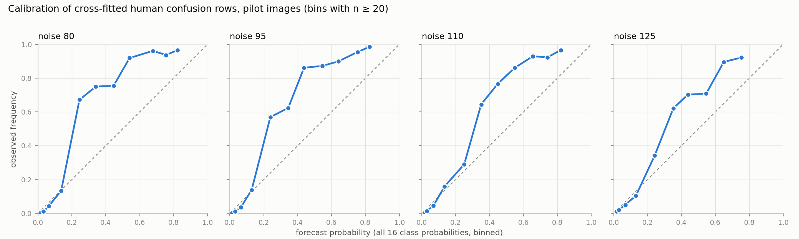
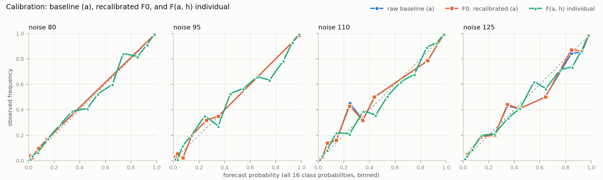
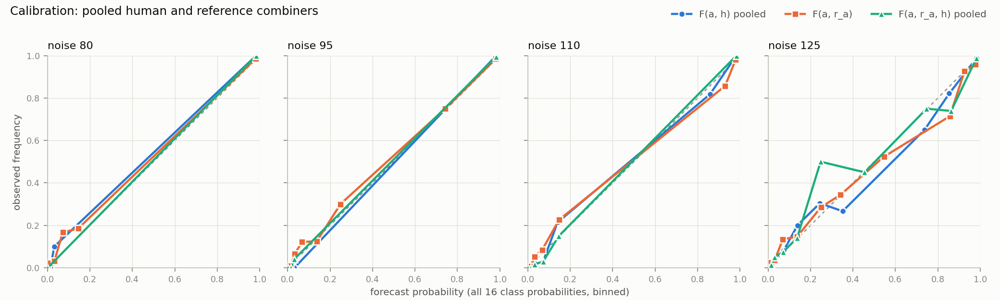

# Pilot report: H1a and H1b on 270 pilot images

SPEC v1, governing text at `1b013d7` (Amendment 2 fixes the scope of this pilot). Run 2026-09-16 (Pacific). Not committed.

**Scope (Amendment 2, item 5):** §9 items 3, 4 and 9, plus H1a and H1b on the pilot images. This report does **not** include the H1c curve, leverage marks, H2, Tejeda quantities or any robustness item. The pilot is self-contained (Amendment 2, item 2): confusion rows and combiner weights were fitted only within the 270 pilot images. The full run refits over all 900 test images, so none of the numbers below is a preview of full-run values.

§9 items 1 and 2 (environment, snapshot hashes, the three §2 confirmations, de-identification) carry over unchanged from `reports/d1_d2_snapshot_deid.md`.

## Summary

- **Baseline (a)** is `vgg19_epoch10`: selection-set log loss 0.4362 on 300 images (1,200 items). Runner-up is `densenet161_epoch10` at 0.4767. The reference `r_a` pools the other four architectures at epoch10.
- **H1a (pilot):** `I(h | a)` individual +0.132 [+0.083, +0.185]; pooled +0.244 [+0.161, +0.329] nats per item, 95% image-cluster bootstrap.
- **H1b (pilot):**
  - `D(h | a)`: individual +0.097 [+0.038, +0.160]; pooled +0.209 [+0.122, +0.299].
  - `I(h | a, r_a)`: individual +0.120 [+0.069, +0.175]; pooled +0.222 [+0.141, +0.310].
  - `I(r_a | a)`: +0.035 [+0.003, +0.068].
- **Pipeline checks passed:**
  - Every optimizer converged, and no fitted weight is negative.
  - Two runs give byte-identical results.
  - With human labels shuffled, every human increment is about 0, and the reference increment is unchanged (below).
- **Needs the designer's attention before the full run:** the cross-fitted human confusion rows are strongly **underconfident**. Across pilot ratings, the smoothed probability on the human's own label averages 0.584, against an observed accuracy of 0.776. This is the α = 1 prior on 16 cells acting on sparse rows: 116 of 192 rows have fewer than 30 ratings. The combiner cannot undo it (individual `w_h` ≈ 1.05), so the individual increment is probably understated. See §9.4.

This is a check on the pipeline. The pilot intervals come from 270 images, and they are not the confirmatory H1 result.

## Pilot set and pipeline checks

| Check | Value |
|---|---|
| Images: selection / test / pilot | 300 / 900 / 270 (no overlap between selection and pilot, asserted) |
| Pilot items | 1080 (every pilot image has all 4 noise levels) |
| Pilot ratings | 6,516 from 145 persons (per person: min 28, median 45, max 57) |
| Humans per item | 6 on 1044 items, 7 on 36 items |
| Duplicates (Amendment 1, item 5; first rating kept) | 6 dropped in total, 0 of them on pilot images |
| Folds | 54 images / 216 items per fold; ratings per fold 1305, 1304, 1300, 1304, 1303 |
| Optimizer convergence | all 30 fits converged |
| Negative fitted weights (Amendment 2, item 4) | none |
| Reproducibility | a second run gave byte-identical `pilot_results.json` |
| Shuffled-label check (software check, not a hypothesis test) | Within each noise level, (label, confidence) pairs were permuted across ratings, then the whole pipeline was rerun. `I(h | a)` individual −0.002 [−0.004, +0.001], pooled −0.004 [−0.012, +0.004]; `I(h | a, r_a)` individual −0.001 [−0.003, +0.001], pooled −0.002 [−0.009, +0.005]; `I(r_a | a)` unchanged. The nested cross-fitting does not leak outcomes into the human vectors or the weights. |

### Implementation readings

These are my choices where the spec fixes the rule but not the mechanics. None changes a [LOCKED] parameter; each is listed so it can be confirmed or ruled on before the full run.

1. **Random draws:** each seed starts its own `numpy.random.default_rng(seed)`, applied to the alphabetically sorted image list.
   - Selection set: `rng(20260915).choice(1200, 300, replace=False)`.
   - Pilot: `rng(20260916).choice(900, 270, replace=False)` over the sorted test images.
   - Folds: `rng(20260915).permutation(270)`; fold = position mod 5.
   - Bootstrap: `rng(20260916).integers(0, 270, (2000, 270))`, percentile intervals.
2. **Log-linear pools** use weight 1 on each input (the "normalized product" of §4). That applies to the reference `r_a` and to the pooled human vector. Amendment 2 says "equal-weight", which a geometric mean (weights 1/n) also satisfies. The fitted `w_h` absorbs most of the difference, but not the interaction with clipping. If a geometric mean was intended, the pooled numbers will move somewhat.
3. **Clipping** (Amendment 1, item 6): clip at 0.001 and renormalize every classifier vector, human row, pooled vector and combiner output before it is scored or pooled again.
4. **Nested cross-fitting of confusion rows:**
   - A test-fold rating uses rows fitted on the other four folds.
   - A training-fold rating used to fit combiner weights uses rows fitted on the other three training folds.
   - So no rating's own image contributes to any human vector it is scored or fitted with. The shuffled-label check above confirms this.
5. **Fitting units:**
   - `F0`, `F(a, r_a)` and the pooled-human combiners are fitted on items.
   - The individual-human combiners are fitted on ratings.
   - An individual increment is `loss(F0 on the item) − loss(F(a, h) on the rating)`, averaged over the item's humans. `I(h | a, r_a)` is the same, with `F(a, r_a)` as the comparison (Amendment 2, item 4).
6. **Optimizer:** minimize mean clipped log loss. Start with L-BFGS-B on the unclipped objective, then run Nelder-Mead on the clipped objective. Weights are unconstrained.
7. **Bootstrap statistic:** the mean over items in the resampled images. Every image has 4 items.

## §9.3 Baseline (a): selection-set table

Log loss of each raw classifier vector, clipped and renormalized, on the 300 selection images (1,200 items). Selection-set human ratings are not used anywhere.

| Rank | Variant | Selection log loss | Selection accuracy |
|---:|---|---:|---:|
| 1 | `vgg19_epoch10` **(a)** | 0.4362 | 0.870 |
| 2 | `densenet161_epoch10` runner-up | 0.4767 | 0.855 |
| 3 | `vgg19_epoch01` | 0.6082 | 0.811 |
| 4 | `resnet152_epoch01` | 0.6902 | 0.776 |
| 5 | `densenet161_epoch01` | 0.7021 | 0.800 |
| 6 | `googlenet_epoch01` | 0.7490 | 0.759 |
| 7 | `resnet152_epoch10` | 0.8077 | 0.749 |
| 8 | `alexnet_epoch10` | 0.8288 | 0.724 |
| 9 | `googlenet_epoch10` | 0.8400 | 0.749 |
| 10 | `densenet161_epoch00` | 0.8839 | 0.738 |
| 11 | `alexnet_epoch01` | 0.9422 | 0.710 |
| 12 | `vgg19_epoch00` | 1.0753 | 0.673 |
| 13 | `resnet152_epoch00` | 1.1766 | 0.649 |
| 14 | `googlenet_epoch00` | 1.2225 | 0.612 |
| 15 | `alexnet_epoch00` | 1.3769 | 0.552 |
| 16 | `googlenet_baseline` | 1.7532 | 0.456 |
| 17 | `densenet161_baseline` | 1.8397 | 0.494 |
| 18 | `resnet152_baseline` | 2.1305 | 0.449 |
| 19 | `vgg19_baseline` | 2.3125 | 0.366 |
| 20 | `alexnet_baseline` | 2.5561 | 0.293 |

Chosen: `vgg19_epoch10` (0.4362). Runner-up: `densenet161_epoch10` (0.4767). Reference `r_a` = normalized product of `alexnet_epoch10`, `densenet161_epoch10`, `googlenet_epoch10`, `resnet152_epoch10`.

## §9.4 Confusion rows and combiner weights (ImageNet-16H only)

### Confusion rows

`P(true class | human label, confidence)` per noise level, Dirichlet α = 1 per cell, cross-fitted over 5 folds of the 270 pilot images. The full 12 tables are in the appendix and in `reports/pilot_tables/confusion_rows_pilot.csv`. For display, those tables are fitted on all 270 pilot images. Each scored rating actually used a fold version fitted without its own image's fold. The largest single-cell difference between a fold version and the display version is 0.218, in the sparse rows.

| Noise | Confidence | Ratings | Rows with n < 30 (of 16) | Median n per row | Observed accuracy | Mean smoothed diagonal (rating-weighted) |
|---:|---|---:|---:|---:|---:|---:|
| 80 | low | 153 | 16 | 8.5 | 0.542 | 0.268 |
| 80 | medium | 258 | 16 | 15.5 | 0.795 | 0.438 |
| 80 | high | 1221 | 0 | 78.0 | 0.954 | 0.803 |
| 95 | low | 241 | 16 | 15.5 | 0.498 | 0.281 |
| 95 | medium | 339 | 13 | 21.5 | 0.850 | 0.521 |
| 95 | high | 1043 | 1 | 67.5 | 0.960 | 0.788 |
| 110 | low | 411 | 10 | 25.0 | 0.382 | 0.260 |
| 110 | medium | 365 | 13 | 22.0 | 0.751 | 0.477 |
| 110 | high | 855 | 4 | 52.0 | 0.927 | 0.736 |
| 125 | low | 710 | 3 | 42.0 | 0.352 | 0.273 |
| 125 | medium | 386 | 14 | 24.0 | 0.684 | 0.437 |
| 125 | high | 534 | 10 | 27.0 | 0.852 | 0.622 |

*Observed accuracy* is the share of ratings in that cell where the label is correct. *Mean smoothed diagonal* is the probability the smoothed row puts on the human's own label, averaged over ratings.

**Finding: the rows are underconfident.**
- Overall, the smoothed diagonal averages 0.584 against an accuracy of 0.776. At noise 80, medium confidence, it is 0.438 against 0.795.
- The cause is mechanical. A row with n ratings, k of them correct, puts (k + 1)/(n + 16) on the label. At the pilot's row sizes (median 8.5 to 25 for low and medium confidence), the 16 pseudo-counts roughly halve the diagonal.
- The calibration figure shows it directly: forecast probabilities of 0.2 to 0.5 are right 60 to 85% of the time.
- A log-linear weight cannot correct a flattened row (individual `w_h` fits at 1.01 to 1.07), so the individual human vector carries less than the data support.
- This is the same distortion §3 gives as the reason to reject the uniform off-diagonal vector, arriving by another route.
- The full run fits rows on 720 training images per fold instead of 216. Counting ratings on the 900 test images (counts only), about 19 of 192 rows per training fold would stay under 30 ratings: 12 low-confidence rows at noise 80, 5 at noise 95 and 2 medium-confidence rows at noise 80. The shrinkage persists at larger n. For example, a row with 60 ratings at 80% accuracy puts (48 + 1)/(60 + 16) = 0.64 on the label. So the full run will be less underconfident, but not calibrated.
- I have not changed anything. Whether α = 1 stands is the designer's call.

### Combiner weights

Fitted separately on each fold's four training folds (`reports/pilot_tables/combiner_weights.csv`). All weights are positive.

| Combiner | Fitted on | `w_m` mean (min to max) | `w_r` mean (min to max) | `w_h` mean (min to max) |
|---|---|---|---|---|
| F0 (a) | items (864 per fold) | 0.994 (0.986 to 1.000) | — | — |
| F(a, r_a) | items (864 per fold) | 0.754 (0.723 to 0.797) | 0.233 (0.204 to 0.275) | — |
| F(a, h) individual | ratings (≈5,212 per fold) | 0.907 (0.874 to 0.979) | — | 1.047 (1.010 to 1.074) |
| F(a, h) pooled | items (864 per fold) | 0.851 (0.801 to 0.943) | — | 0.580 (0.548 to 0.602) |
| F(a, r_a, h) individual | ratings (≈5,212 per fold) | 0.680 (0.651 to 0.763) | 0.217 (0.200 to 0.255) | 1.029 (0.995 to 1.057) |
| F(a, r_a, h) pooled | items (864 per fold) | 0.642 (0.593 to 0.712) | 0.198 (0.152 to 0.240) | 0.573 (0.534 to 0.597) |

Per fold:

| Fold | Combiner | `w_m` | `w_r` | `w_h` |
|---:|---|---:|---:|---:|
| 1 | F0 (a) | 0.986 | — | — |
| 1 | F(a, r_a) | 0.742 | 0.236 | — |
| 1 | F(a, h) individual | 0.885 | — | 1.074 |
| 1 | F(a, h) pooled | 0.848 | — | 0.582 |
| 1 | F(a, r_a, h) individual | 0.662 | 0.218 | 1.057 |
| 1 | F(a, r_a, h) pooled | 0.620 | 0.223 | 0.583 |
| 2 | F0 (a) | 0.989 | — | — |
| 2 | F(a, r_a) | 0.741 | 0.239 | — |
| 2 | F(a, h) individual | 0.874 | — | 1.060 |
| 2 | F(a, h) pooled | 0.817 | — | 0.602 |
| 2 | F(a, r_a, h) individual | 0.666 | 0.200 | 1.024 |
| 2 | F(a, r_a, h) pooled | 0.651 | 0.152 | 0.584 |
| 3 | F0 (a) | 0.998 | — | — |
| 3 | F(a, r_a) | 0.723 | 0.275 | — |
| 3 | F(a, h) individual | 0.920 | — | 1.053 |
| 3 | F(a, h) pooled | 0.843 | — | 0.573 |
| 3 | F(a, r_a, h) individual | 0.651 | 0.255 | 1.026 |
| 3 | F(a, r_a, h) pooled | 0.593 | 0.240 | 0.565 |
| 4 | F0 (a) | 1.000 | — | — |
| 4 | F(a, r_a) | 0.797 | 0.204 | — |
| 4 | F(a, h) individual | 0.979 | — | 1.037 |
| 4 | F(a, h) pooled | 0.943 | — | 0.593 |
| 4 | F(a, r_a, h) individual | 0.763 | 0.209 | 1.043 |
| 4 | F(a, r_a, h) pooled | 0.712 | 0.216 | 0.597 |
| 5 | F0 (a) | 0.998 | — | — |
| 5 | F(a, r_a) | 0.769 | 0.212 | — |
| 5 | F(a, h) individual | 0.875 | — | 1.010 |
| 5 | F(a, h) pooled | 0.801 | — | 0.548 |
| 5 | F(a, r_a, h) individual | 0.656 | 0.202 | 0.995 |
| 5 | F(a, r_a, h) pooled | 0.633 | 0.157 | 0.534 |

Reading the weights:
- `F0` barely recalibrates (`w_m` ≈ 0.99): `vgg19_epoch10` is already close to calibrated on these images.
- The reference gets about a quarter of the weight when paired with `a`.
- The pooled human vector gets `w_h` ≈ 0.58, which discounts the product of 6 to 7 rows. That is expected, because humans on the same item make correlated errors.

### Calibration plots

Bins pool all 16 class probabilities for each forecast. Only bins with at least 20 probabilities are drawn. Series are told apart by marker shape as well as color, and every plotted value is in `reports/pilot_tables/calibration_bins.csv`.

*Figure 1.* Cross-fitted human confusion rows (individual ratings), by noise level. The curve lies well above the diagonal at middling probabilities: the rows are underconfident.

*Figure 2.* Raw baseline (a), recalibrated `F0` and `F(a, h)` individual. The raw and `F0` curves almost coincide because `w_m` ≈ 0.99, so the blue line is mostly hidden under the orange one.

*Figure 3.* `F(a, h)` pooled, `F(a, r_a)` and `F(a, r_a, h)` pooled. All three stay near the diagonal. The noise-125 panels are noisier because fewer items fall in each bin.

## H1a and H1b on the pilot images

Positive values mean the added source lowers out-of-fold log loss. Units are nats per item. The bootstrap resamples the 270 pilot images, 2,000 draws, seed 20260916, with 95% percentile intervals (Amendment 1, item 8).

### H1a: `I(h | a) > 0`

| Quantity | Mean (nats per item) | 95% CI (image cluster bootstrap) | Share of draws ≤ 0 | CI excludes 0 |
|---|---:|---|---:|---|
| `I(h | a)` individual | +0.1317 | [+0.0827, +0.1853] | 0.0000 | yes |
| `I(h | a)` pooled | +0.2437 | [+0.1611, +0.3288] | 0.0000 | yes |

### H1b: `D(h | a)` and `I(h | a, r_a)`

| Quantity | Mean (nats per item) | 95% CI (image cluster bootstrap) | Share of draws ≤ 0 | CI excludes 0 |
|---|---:|---|---:|---|
| `I(r_a | a)` | +0.0346 | [+0.0027, +0.0682] | 0.0155 | yes |
| `D(h | a)` individual | +0.0971 | [+0.0380, +0.1601] | 0.0000 | yes |
| `D(h | a)` pooled | +0.2091 | [+0.1223, +0.2989] | 0.0000 | yes |
| `I(h | a, r_a)` individual | +0.1200 | [+0.0692, +0.1752] | 0.0000 | yes |
| `I(h | a, r_a)` pooled | +0.2218 | [+0.1411, +0.3105] | 0.0000 | yes |

**The reading rule of §7, applied mechanically:** the claim that humans carry information the classifiers lack is supported only where `I(h | a, r_a)` is bounded away from zero. On the pilot images, both the individual and pooled intervals exclude zero. Because of the underconfidence finding above, the individual figure is probably a lower bound on what a calibrated human row would give. This is a pilot result on 270 images with pilot-only fits, and it is not the confirmatory test.

### Mean out-of-fold losses (descriptive)

| Forecast (pilot items, out of fold) | Mean log loss |
|---|---:|
| raw baseline (a) | 0.4720 |
| F0: recalibrated (a) | 0.4726 |
| F(a, r_a) | 0.4380 |
| human confusion row alone (individual, item mean) | 1.1583 |
| pooled human alone | 0.5432 |
| F(a, h) individual (item mean) | 0.3409 |
| F(a, h) pooled | 0.2289 |
| F(a, r_a, h) individual (item mean) | 0.3179 |
| F(a, r_a, h) pooled | 0.2162 |

On their own, the smoothed individual human vectors (1.158) score far worse than the classifier (0.472). The pooled human vector (0.543) comes close to it, and combining with humans brings the loss down to 0.229 (pooled). `F0` scores slightly worse than the raw baseline (0.4726 vs 0.4720): with `w_m` ≈ 1 there is nothing to recalibrate, and the out-of-fold fit only adds noise.

## §9.9 Limits

- **6 to 7 humans per item.** The pooled human vector is a pool of at most 7 correlated ratings, and item-level human quantities are noisy.
- **Labels, not probabilities.** People gave a label and a three-level confidence. The human vector is a model of the label (a confusion row), so every human quantity depends on how well that model is estimated. The pilot shows this estimate is underconfident at the current smoothing and sample size.
- **MTurk population.** 145 MTurk workers with no feedback; results may not carry over to trained annotators or other crowds.
- **One image domain.** 16 ImageNet classes under phase noise, with classifiers fine-tuned to this noise.
- **The Tejeda participants each saw one level.** Not part of this pilot. For H3, AI level is a between-participant factor.
- **Pilot-specific limits:**
  - 270 images.
  - Confusion rows and weights are fitted on 216 images per fold.
  - Pilot intervals are wider than full-run intervals will be and are not confirmatory.
  - Baseline (a) was chosen on a 300-image selection set, and its runner-up is 0.04 nats behind.

## Stop

Stopped after delivery, per §6 and §10. Nothing is committed.

**Files written:**
- `pipeline/01_pilot_h1.py`
- `reports/pilot_REPORT.md`
- `reports/pilot_results.json`
- `reports/pilot_tables/` (`selection_set.csv`, `confusion_rows_pilot.csv`, `combiner_weights.csv`, `calibration_bins.csv`)
- `reports/pilot_figures/` (3 PNG)
- `data/pilot_item_values.csv` (item-level values; gitignored)

**Before the full run, the designer decides on:**
1. The α = 1 smoothing and the resulting underconfidence (§9.4).
2. Normalized product vs geometric mean for the pooled human vector (implementation reading 2).
3. The remaining implementation readings 1 and 3 to 7.

## Appendix: cross-fitted confusion rows, display fit on all 270 pilot images

Entries are `P(true class | human label, confidence) × 100`, rounded. The bold cell is the human's own label. † marks rows with fewer than 30 ratings. Column abbreviations are the first three letters of the true class: air = airplane, bea = bear, bic = bicycle, bir = bird, boa = boat, bot = bottle, car, cat, cha = chair, clo = clock, dog, ele = elephant, key = keyboard, kni = knife, ove = oven, tru = truck.

#### Noise 80, confidence low

| Human label | n | air | bea | bic | bir | boa | bot | car | cat | cha | clo | dog | ele | key | kni | ove | tru |
|---|---:|---:|---:|---:|---:|---:|---:|---:|---:|---:|---:|---:|---:|---:|---:|---:|---:|
| airplane† | 3 | **11** | 5 | 5 | 5 | 5 | 5 | 5 | 11 | 5 | 5 | 11 | 5 | 5 | 5 | 5 | 5 |
| bear† | 9 | 4 | **32** | 4 | 8 | 4 | 4 | 4 | 4 | 4 | 4 | 8 | 4 | 4 | 4 | 4 | 4 |
| bicycle† | 8 | 8 | 17 | **21** | 4 | 4 | 4 | 4 | 4 | 4 | 4 | 4 | 4 | 4 | 4 | 4 | 4 |
| bird† | 11 | 4 | 4 | 4 | **33** | 4 | 4 | 4 | 4 | 4 | 4 | 15 | 4 | 4 | 4 | 4 | 4 |
| boat† | 5 | 5 | 5 | 5 | 5 | **19** | 5 | 5 | 5 | 10 | 5 | 10 | 5 | 5 | 5 | 5 | 5 |
| bottle† | 11 | 7 | 4 | 4 | 4 | 4 | **33** | 4 | 4 | 4 | 4 | 4 | 4 | 4 | 11 | 4 | 4 |
| car† | 1 | 6 | 6 | 6 | 6 | 6 | 6 | **6** | 6 | 6 | 6 | 6 | 6 | 6 | 12 | 6 | 6 |
| cat† | 9 | 4 | 12 | 4 | 4 | 4 | 4 | 4 | **20** | 8 | 4 | 8 | 4 | 4 | 8 | 4 | 4 |
| chair† | 17 | 3 | 3 | 3 | 3 | 3 | 3 | 3 | 3 | **27** | 3 | 3 | 3 | 3 | 12 | 21 | 3 |
| clock† | 10 | 4 | 4 | 4 | 4 | 8 | 4 | 4 | 4 | 19 | **12** | 4 | 4 | 8 | 4 | 12 | 4 |
| dog† | 6 | 5 | 5 | 5 | 5 | 5 | 5 | 5 | 9 | 5 | 5 | **23** | 9 | 5 | 5 | 5 | 5 |
| elephant† | 4 | 5 | 5 | 5 | 5 | 5 | 5 | 5 | 5 | 5 | 5 | 5 | **25** | 5 | 5 | 5 | 5 |
| keyboard† | 25 | 2 | 5 | 2 | 2 | 2 | 5 | 2 | 2 | 7 | 10 | 2 | 2 | **27** | 10 | 15 | 2 |
| knife† | 6 | 5 | 9 | 5 | 5 | 5 | 9 | 5 | 5 | 14 | 5 | 5 | 5 | 5 | **14** | 5 | 5 |
| oven† | 21 | 3 | 3 | 3 | 3 | 3 | 14 | 3 | 3 | 3 | 5 | 3 | 3 | 3 | 5 | **43** | 3 |
| truck† | 7 | 9 | 4 | 4 | 4 | 4 | 9 | 4 | 4 | 4 | 4 | 4 | 4 | 4 | 4 | 13 | **17** |

#### Noise 80, confidence medium

| Human label | n | air | bea | bic | bir | boa | bot | car | cat | cha | clo | dog | ele | key | kni | ove | tru |
|---|---:|---:|---:|---:|---:|---:|---:|---:|---:|---:|---:|---:|---:|---:|---:|---:|---:|
| airplane† | 8 | **29** | 4 | 4 | 4 | 8 | 4 | 8 | 4 | 4 | 4 | 4 | 4 | 4 | 4 | 4 | 4 |
| bear† | 16 | 3 | **53** | 3 | 3 | 3 | 3 | 3 | 3 | 3 | 3 | 3 | 3 | 3 | 3 | 3 | 3 |
| bicycle† | 13 | 3 | 3 | **45** | 3 | 3 | 3 | 3 | 3 | 3 | 7 | 3 | 3 | 3 | 3 | 3 | 3 |
| bird† | 13 | 3 | 7 | 3 | **41** | 3 | 3 | 3 | 3 | 7 | 3 | 3 | 3 | 3 | 3 | 3 | 3 |
| boat† | 18 | 6 | 3 | 3 | 3 | **41** | 3 | 3 | 3 | 6 | 3 | 3 | 6 | 3 | 3 | 3 | 9 |
| bottle† | 15 | 3 | 3 | 3 | 3 | 3 | **42** | 3 | 3 | 6 | 3 | 6 | 3 | 3 | 3 | 6 | 3 |
| car† | 16 | 3 | 6 | 3 | 3 | 3 | 3 | **31** | 3 | 3 | 3 | 3 | 3 | 6 | 3 | 6 | 16 |
| cat† | 23 | 3 | 5 | 3 | 5 | 3 | 3 | 3 | **56** | 3 | 3 | 3 | 3 | 3 | 3 | 3 | 3 |
| chair† | 12 | 4 | 4 | 4 | 4 | 4 | 4 | 4 | 4 | **43** | 4 | 4 | 4 | 4 | 7 | 4 | 4 |
| clock† | 10 | 4 | 4 | 4 | 4 | 4 | 4 | 4 | 4 | 4 | **35** | 4 | 4 | 8 | 4 | 8 | 4 |
| dog† | 17 | 3 | 15 | 3 | 3 | 3 | 3 | 3 | 9 | 3 | 3 | **36** | 3 | 3 | 3 | 3 | 3 |
| elephant† | 19 | 3 | 3 | 3 | 3 | 3 | 3 | 3 | 3 | 3 | 3 | 6 | **54** | 3 | 3 | 3 | 3 |
| keyboard† | 25 | 2 | 5 | 2 | 2 | 2 | 2 | 5 | 5 | 2 | 2 | 2 | 2 | **39** | 5 | 17 | 2 |
| knife† | 15 | 3 | 3 | 3 | 3 | 3 | 6 | 3 | 6 | 3 | 3 | 3 | 3 | 3 | **42** | 3 | 6 |
| oven† | 26 | 2 | 2 | 2 | 2 | 2 | 2 | 2 | 2 | 2 | 12 | 2 | 2 | 2 | 2 | **55** | 2 |
| truck† | 12 | 7 | 4 | 4 | 4 | 4 | 4 | 4 | 4 | 7 | 4 | 4 | 4 | 4 | 4 | 11 | **32** |

#### Noise 80, confidence high

| Human label | n | air | bea | bic | bir | boa | bot | car | cat | cha | clo | dog | ele | key | kni | ove | tru |
|---|---:|---:|---:|---:|---:|---:|---:|---:|---:|---:|---:|---:|---:|---:|---:|---:|---:|
| airplane | 93 | **82** | 1 | 1 | 1 | 5 | 1 | 1 | 1 | 1 | 1 | 1 | 1 | 1 | 1 | 2 | 1 |
| bear | 52 | 1 | **78** | 1 | 1 | 1 | 1 | 1 | 1 | 1 | 1 | 1 | 1 | 1 | 1 | 1 | 1 |
| bicycle | 93 | 1 | 1 | **86** | 1 | 1 | 1 | 1 | 1 | 1 | 1 | 1 | 1 | 1 | 1 | 1 | 1 |
| bird | 81 | 1 | 1 | 1 | **82** | 1 | 1 | 1 | 1 | 2 | 1 | 1 | 1 | 1 | 1 | 2 | 1 |
| boat | 72 | 3 | 1 | 1 | 2 | **80** | 1 | 1 | 1 | 1 | 1 | 1 | 1 | 1 | 1 | 1 | 1 |
| bottle | 57 | 1 | 1 | 1 | 1 | 1 | **78** | 1 | 1 | 1 | 1 | 1 | 1 | 1 | 1 | 3 | 1 |
| car | 85 | 2 | 1 | 1 | 1 | 1 | 1 | **72** | 2 | 2 | 2 | 1 | 1 | 1 | 2 | 3 | 7 |
| cat | 83 | 1 | 4 | 1 | 2 | 1 | 1 | 1 | **80** | 2 | 1 | 1 | 1 | 1 | 1 | 1 | 1 |
| chair | 30 | 2 | 2 | 2 | 2 | 2 | 2 | 2 | 4 | **63** | 2 | 2 | 2 | 2 | 2 | 4 | 2 |
| clock | 75 | 1 | 1 | 1 | 1 | 1 | 1 | 1 | 1 | 1 | **84** | 1 | 1 | 1 | 1 | 1 | 1 |
| dog | 73 | 1 | 3 | 1 | 1 | 1 | 1 | 1 | 6 | 2 | 1 | **74** | 2 | 1 | 1 | 1 | 1 |
| elephant | 96 | 1 | 2 | 1 | 1 | 1 | 1 | 1 | 1 | 1 | 1 | 1 | **86** | 1 | 1 | 1 | 1 |
| keyboard | 103 | 1 | 1 | 1 | 1 | 1 | 1 | 2 | 1 | 1 | 1 | 1 | 1 | **83** | 2 | 3 | 1 |
| knife | 132 | 1 | 1 | 1 | 1 | 1 | 1 | 1 | 1 | 1 | 1 | 1 | 1 | 1 | **87** | 1 | 1 |
| oven | 56 | 1 | 1 | 1 | 3 | 1 | 1 | 1 | 1 | 1 | 4 | 1 | 1 | 1 | 1 | **75** | 1 |
| truck | 40 | 2 | 2 | 2 | 2 | 2 | 4 | 4 | 2 | 2 | 2 | 4 | 2 | 2 | 2 | 4 | **66** |

#### Noise 95, confidence low

| Human label | n | air | bea | bic | bir | boa | bot | car | cat | cha | clo | dog | ele | key | kni | ove | tru |
|---|---:|---:|---:|---:|---:|---:|---:|---:|---:|---:|---:|---:|---:|---:|---:|---:|---:|
| airplane† | 5 | **19** | 10 | 5 | 5 | 5 | 5 | 5 | 5 | 10 | 5 | 5 | 5 | 5 | 5 | 5 | 5 |
| bear† | 19 | 3 | **40** | 3 | 6 | 3 | 3 | 3 | 9 | 9 | 3 | 6 | 3 | 3 | 3 | 3 | 3 |
| bicycle† | 7 | 4 | 4 | **26** | 9 | 4 | 4 | 4 | 4 | 4 | 4 | 4 | 4 | 4 | 4 | 9 | 4 |
| bird† | 15 | 3 | 6 | 3 | **16** | 3 | 6 | 3 | 6 | 10 | 3 | 13 | 10 | 3 | 3 | 6 | 3 |
| boat† | 20 | 3 | 3 | 3 | 6 | **28** | 6 | 3 | 6 | 3 | 3 | 6 | 3 | 3 | 17 | 6 | 6 |
| bottle† | 13 | 3 | 3 | 3 | 3 | 3 | **34** | 3 | 7 | 7 | 3 | 3 | 3 | 3 | 7 | 7 | 3 |
| car† | 16 | 3 | 6 | 3 | 3 | 3 | 9 | **12** | 3 | 6 | 3 | 3 | 3 | 3 | 9 | 19 | 9 |
| cat† | 19 | 3 | 20 | 3 | 6 | 3 | 3 | 3 | **31** | 3 | 3 | 9 | 3 | 3 | 3 | 3 | 3 |
| chair† | 20 | 3 | 3 | 3 | 3 | 3 | 8 | 3 | 14 | **28** | 3 | 3 | 6 | 3 | 6 | 11 | 3 |
| clock† | 9 | 4 | 4 | 8 | 4 | 4 | 4 | 4 | 4 | 20 | **12** | 4 | 4 | 4 | 4 | 12 | 4 |
| dog† | 18 | 3 | 9 | 3 | 3 | 3 | 6 | 3 | 15 | 3 | 3 | **32** | 6 | 3 | 3 | 3 | 3 |
| elephant† | 10 | 4 | 4 | 4 | 4 | 4 | 4 | 4 | 4 | 8 | 4 | 4 | **38** | 4 | 4 | 4 | 4 |
| keyboard† | 25 | 2 | 2 | 2 | 2 | 2 | 2 | 2 | 2 | 5 | 2 | 2 | 2 | **20** | 17 | 29 | 2 |
| knife† | 9 | 4 | 4 | 4 | 4 | 4 | 4 | 4 | 4 | 16 | 4 | 4 | 4 | 4 | **28** | 4 | 4 |
| oven† | 24 | 2 | 2 | 2 | 2 | 2 | 8 | 2 | 2 | 2 | 2 | 2 | 2 | 10 | 5 | **48** | 2 |
| truck† | 12 | 4 | 7 | 4 | 4 | 7 | 7 | 4 | 4 | 11 | 4 | 4 | 4 | 4 | 7 | 14 | **14** |

#### Noise 95, confidence medium

| Human label | n | air | bea | bic | bir | boa | bot | car | cat | cha | clo | dog | ele | key | kni | ove | tru |
|---|---:|---:|---:|---:|---:|---:|---:|---:|---:|---:|---:|---:|---:|---:|---:|---:|---:|
| airplane† | 15 | **52** | 3 | 3 | 3 | 3 | 3 | 3 | 3 | 3 | 3 | 3 | 3 | 3 | 3 | 3 | 3 |
| bear | 30 | 2 | **59** | 2 | 4 | 2 | 2 | 2 | 4 | 2 | 2 | 4 | 4 | 2 | 2 | 2 | 2 |
| bicycle† | 14 | 3 | 3 | **50** | 3 | 3 | 3 | 3 | 3 | 3 | 3 | 3 | 3 | 3 | 3 | 3 | 3 |
| bird† | 24 | 2 | 5 | 2 | **45** | 5 | 2 | 2 | 2 | 5 | 2 | 8 | 2 | 2 | 2 | 8 | 2 |
| boat† | 23 | 5 | 3 | 3 | 3 | **51** | 3 | 5 | 3 | 3 | 3 | 3 | 3 | 3 | 3 | 3 | 8 |
| bottle† | 22 | 3 | 3 | 3 | 3 | 3 | **53** | 3 | 3 | 3 | 3 | 5 | 3 | 3 | 8 | 3 | 3 |
| car† | 13 | 3 | 3 | 3 | 3 | 3 | 3 | **38** | 3 | 7 | 3 | 3 | 3 | 3 | 3 | 7 | 7 |
| cat† | 27 | 2 | 2 | 2 | 2 | 2 | 2 | 2 | **63** | 2 | 2 | 5 | 2 | 2 | 2 | 2 | 2 |
| chair† | 10 | 4 | 4 | 4 | 4 | 4 | 4 | 4 | 4 | **42** | 4 | 4 | 4 | 4 | 4 | 4 | 4 |
| clock† | 16 | 3 | 3 | 3 | 3 | 3 | 3 | 3 | 3 | 3 | **50** | 3 | 3 | 3 | 6 | 3 | 3 |
| dog† | 17 | 3 | 6 | 3 | 9 | 6 | 3 | 3 | 3 | 3 | 3 | **39** | 6 | 3 | 3 | 3 | 3 |
| elephant† | 22 | 3 | 5 | 3 | 3 | 3 | 3 | 3 | 5 | 3 | 3 | 3 | **55** | 3 | 3 | 3 | 3 |
| keyboard | 35 | 2 | 4 | 2 | 2 | 2 | 6 | 2 | 2 | 6 | 4 | 2 | 2 | **51** | 2 | 10 | 2 |
| knife† | 21 | 3 | 3 | 3 | 5 | 3 | 3 | 3 | 3 | 3 | 3 | 3 | 3 | 5 | **54** | 3 | 3 |
| oven | 42 | 2 | 2 | 2 | 2 | 2 | 3 | 2 | 2 | 2 | 9 | 2 | 2 | 3 | 5 | **60** | 2 |
| truck† | 8 | 4 | 4 | 4 | 4 | 4 | 4 | 4 | 4 | 4 | 4 | 4 | 4 | 4 | 4 | 8 | **33** |

#### Noise 95, confidence high

| Human label | n | air | bea | bic | bir | boa | bot | car | cat | cha | clo | dog | ele | key | kni | ove | tru |
|---|---:|---:|---:|---:|---:|---:|---:|---:|---:|---:|---:|---:|---:|---:|---:|---:|---:|
| airplane | 85 | **83** | 1 | 1 | 1 | 2 | 1 | 1 | 1 | 1 | 1 | 1 | 1 | 2 | 1 | 1 | 1 |
| bear | 36 | 2 | **69** | 2 | 2 | 2 | 2 | 2 | 4 | 2 | 2 | 2 | 2 | 2 | 2 | 2 | 2 |
| bicycle | 89 | 1 | 2 | **85** | 1 | 1 | 1 | 1 | 1 | 1 | 1 | 1 | 1 | 1 | 1 | 1 | 1 |
| bird | 75 | 1 | 2 | 1 | **79** | 1 | 1 | 1 | 2 | 1 | 1 | 2 | 2 | 1 | 1 | 1 | 1 |
| boat | 59 | 1 | 1 | 1 | 1 | **77** | 1 | 1 | 1 | 1 | 1 | 1 | 1 | 1 | 1 | 1 | 4 |
| bottle | 42 | 2 | 2 | 2 | 2 | 2 | **74** | 2 | 2 | 2 | 2 | 2 | 2 | 2 | 2 | 2 | 2 |
| car | 75 | 1 | 1 | 1 | 1 | 1 | 1 | **77** | 1 | 1 | 1 | 1 | 2 | 1 | 1 | 1 | 7 |
| cat | 65 | 1 | 4 | 1 | 1 | 2 | 1 | 1 | **74** | 4 | 1 | 2 | 1 | 1 | 1 | 1 | 1 |
| chair† | 25 | 2 | 2 | 2 | 2 | 2 | 5 | 2 | 2 | **59** | 2 | 2 | 2 | 5 | 2 | 2 | 2 |
| clock | 70 | 1 | 1 | 1 | 1 | 1 | 1 | 1 | 1 | 1 | **83** | 1 | 1 | 1 | 1 | 1 | 1 |
| dog | 59 | 1 | 3 | 1 | 3 | 1 | 1 | 1 | 3 | 1 | 1 | **73** | 3 | 1 | 3 | 1 | 1 |
| elephant | 84 | 1 | 2 | 1 | 1 | 1 | 1 | 1 | 1 | 1 | 1 | 1 | **84** | 1 | 1 | 1 | 1 |
| keyboard | 92 | 1 | 1 | 1 | 1 | 1 | 1 | 1 | 1 | 1 | 1 | 1 | 1 | **82** | 1 | 5 | 1 |
| knife | 109 | 1 | 1 | 1 | 1 | 1 | 1 | 1 | 1 | 1 | 1 | 1 | 1 | 1 | **88** | 1 | 1 |
| oven | 37 | 2 | 2 | 2 | 2 | 2 | 2 | 2 | 2 | 2 | 9 | 2 | 2 | 2 | 2 | **64** | 2 |
| truck | 41 | 2 | 2 | 2 | 4 | 2 | 2 | 4 | 4 | 2 | 2 | 2 | 2 | 2 | 2 | 4 | **67** |

#### Noise 110, confidence low

| Human label | n | air | bea | bic | bir | boa | bot | car | cat | cha | clo | dog | ele | key | kni | ove | tru |
|---|---:|---:|---:|---:|---:|---:|---:|---:|---:|---:|---:|---:|---:|---:|---:|---:|---:|
| airplane† | 19 | **17** | 3 | 3 | 3 | 11 | 9 | 3 | 9 | 6 | 3 | 6 | 3 | 3 | 14 | 6 | 3 |
| bear† | 24 | 2 | **28** | 5 | 10 | 2 | 2 | 2 | 5 | 2 | 2 | 8 | 15 | 5 | 2 | 5 | 2 |
| bicycle† | 10 | 4 | 4 | **38** | 4 | 4 | 4 | 4 | 4 | 4 | 4 | 8 | 4 | 4 | 4 | 4 | 4 |
| bird† | 25 | 2 | 15 | 2 | **27** | 2 | 2 | 2 | 12 | 2 | 2 | 10 | 7 | 5 | 2 | 2 | 2 |
| boat | 32 | 2 | 4 | 6 | 4 | **23** | 2 | 4 | 8 | 12 | 2 | 6 | 6 | 2 | 2 | 6 | 8 |
| bottle† | 26 | 5 | 5 | 2 | 2 | 7 | **33** | 2 | 5 | 7 | 2 | 2 | 5 | 2 | 12 | 5 | 2 |
| car† | 15 | 10 | 6 | 3 | 3 | 10 | 6 | **6** | 3 | 6 | 3 | 3 | 3 | 6 | 6 | 19 | 3 |
| cat | 40 | 2 | 25 | 2 | 7 | 2 | 2 | 2 | **23** | 5 | 2 | 11 | 5 | 4 | 2 | 5 | 2 |
| chair | 33 | 2 | 4 | 2 | 2 | 6 | 6 | 2 | 14 | **22** | 2 | 8 | 6 | 2 | 6 | 12 | 2 |
| clock† | 12 | 4 | 7 | 11 | 4 | 4 | 7 | 4 | 4 | 11 | **18** | 4 | 4 | 4 | 4 | 11 | 4 |
| dog | 37 | 2 | 19 | 4 | 2 | 2 | 4 | 2 | 9 | 4 | 4 | **15** | 21 | 8 | 2 | 2 | 2 |
| elephant† | 24 | 2 | 10 | 2 | 2 | 2 | 5 | 2 | 2 | 8 | 2 | 2 | **48** | 2 | 2 | 2 | 2 |
| keyboard | 34 | 6 | 4 | 2 | 2 | 2 | 2 | 2 | 4 | 8 | 2 | 2 | 4 | **18** | 16 | 22 | 4 |
| knife† | 25 | 2 | 2 | 2 | 2 | 2 | 7 | 2 | 5 | 5 | 2 | 5 | 7 | 5 | **44** | 2 | 2 |
| oven | 39 | 2 | 2 | 4 | 2 | 2 | 11 | 2 | 2 | 11 | 5 | 2 | 5 | 7 | 5 | **36** | 2 |
| truck† | 16 | 3 | 3 | 3 | 3 | 6 | 9 | 3 | 3 | 6 | 6 | 3 | 3 | 3 | 9 | 19 | **16** |

#### Noise 110, confidence medium

| Human label | n | air | bea | bic | bir | boa | bot | car | cat | cha | clo | dog | ele | key | kni | ove | tru |
|---|---:|---:|---:|---:|---:|---:|---:|---:|---:|---:|---:|---:|---:|---:|---:|---:|---:|
| airplane† | 22 | **50** | 3 | 3 | 3 | 11 | 3 | 3 | 3 | 5 | 3 | 3 | 3 | 3 | 3 | 3 | 3 |
| bear† | 20 | 3 | **53** | 3 | 3 | 3 | 3 | 3 | 8 | 3 | 3 | 3 | 3 | 3 | 3 | 3 | 3 |
| bicycle† | 25 | 2 | 2 | **56** | 2 | 2 | 2 | 5 | 2 | 2 | 2 | 2 | 2 | 5 | 2 | 5 | 2 |
| bird† | 20 | 3 | 3 | 3 | **50** | 3 | 3 | 3 | 3 | 8 | 3 | 3 | 6 | 3 | 3 | 3 | 3 |
| boat† | 27 | 7 | 2 | 5 | 5 | **42** | 2 | 2 | 5 | 7 | 2 | 2 | 2 | 2 | 2 | 9 | 2 |
| bottle† | 21 | 3 | 3 | 3 | 3 | 3 | **49** | 3 | 5 | 5 | 3 | 3 | 5 | 3 | 5 | 3 | 3 |
| car† | 18 | 3 | 3 | 3 | 3 | 3 | 3 | **32** | 6 | 3 | 3 | 3 | 3 | 6 | 3 | 9 | 15 |
| cat† | 22 | 3 | 13 | 3 | 5 | 3 | 3 | 3 | **45** | 3 | 3 | 5 | 3 | 3 | 3 | 3 | 3 |
| chair† | 11 | 4 | 4 | 7 | 4 | 4 | 4 | 4 | 7 | **30** | 4 | 7 | 4 | 4 | 4 | 7 | 4 |
| clock† | 19 | 3 | 3 | 3 | 3 | 6 | 6 | 3 | 3 | 6 | **43** | 3 | 3 | 6 | 6 | 3 | 3 |
| dog† | 28 | 5 | 7 | 2 | 5 | 2 | 5 | 2 | 7 | 5 | 2 | **45** | 5 | 2 | 2 | 2 | 2 |
| elephant† | 22 | 3 | 5 | 8 | 5 | 3 | 3 | 3 | 3 | 3 | 3 | 5 | **47** | 3 | 3 | 3 | 3 |
| keyboard | 36 | 2 | 2 | 2 | 2 | 2 | 2 | 2 | 2 | 2 | 2 | 2 | 2 | **54** | 6 | 15 | 2 |
| knife | 31 | 2 | 2 | 4 | 2 | 2 | 2 | 2 | 2 | 2 | 2 | 4 | 2 | 4 | **60** | 4 | 2 |
| oven | 34 | 2 | 2 | 2 | 2 | 2 | 6 | 2 | 2 | 2 | 8 | 2 | 2 | 8 | 4 | **50** | 4 |
| truck† | 9 | 4 | 4 | 4 | 4 | 4 | 4 | 8 | 4 | 8 | 4 | 4 | 4 | 4 | 8 | 12 | **20** |

#### Noise 110, confidence high

| Human label | n | air | bea | bic | bir | boa | bot | car | cat | cha | clo | dog | ele | key | kni | ove | tru |
|---|---:|---:|---:|---:|---:|---:|---:|---:|---:|---:|---:|---:|---:|---:|---:|---:|---:|
| airplane | 74 | **77** | 1 | 1 | 1 | 7 | 1 | 1 | 1 | 1 | 1 | 1 | 1 | 2 | 1 | 1 | 1 |
| bear† | 21 | 3 | **59** | 3 | 3 | 3 | 3 | 3 | 3 | 3 | 3 | 3 | 3 | 3 | 3 | 3 | 3 |
| bicycle | 67 | 2 | 1 | **80** | 1 | 1 | 1 | 1 | 2 | 1 | 1 | 1 | 1 | 1 | 1 | 1 | 1 |
| bird | 67 | 1 | 1 | 1 | **78** | 1 | 1 | 1 | 4 | 1 | 1 | 1 | 1 | 1 | 1 | 1 | 2 |
| boat | 47 | 3 | 2 | 2 | 2 | **71** | 2 | 2 | 2 | 2 | 2 | 2 | 2 | 2 | 3 | 2 | 3 |
| bottle† | 29 | 2 | 2 | 2 | 2 | 2 | **64** | 2 | 2 | 2 | 2 | 4 | 2 | 2 | 2 | 2 | 2 |
| car | 81 | 3 | 1 | 1 | 1 | 1 | 2 | **73** | 1 | 1 | 1 | 1 | 1 | 2 | 1 | 2 | 7 |
| cat | 50 | 2 | 2 | 2 | 2 | 2 | 2 | 2 | **77** | 2 | 2 | 2 | 2 | 2 | 2 | 2 | 2 |
| chair† | 17 | 3 | 3 | 3 | 3 | 3 | 6 | 3 | 6 | **42** | 3 | 3 | 3 | 3 | 6 | 6 | 3 |
| clock | 70 | 1 | 1 | 1 | 1 | 2 | 1 | 1 | 1 | 1 | **78** | 1 | 1 | 2 | 2 | 2 | 1 |
| dog | 47 | 2 | 8 | 2 | 3 | 2 | 2 | 2 | 2 | 2 | 2 | **65** | 5 | 2 | 2 | 2 | 2 |
| elephant | 54 | 1 | 1 | 1 | 1 | 1 | 1 | 1 | 3 | 3 | 1 | 3 | **74** | 1 | 1 | 1 | 1 |
| keyboard | 80 | 1 | 1 | 1 | 1 | 1 | 4 | 1 | 1 | 1 | 2 | 1 | 1 | **75** | 1 | 5 | 2 |
| knife | 83 | 1 | 1 | 1 | 1 | 1 | 1 | 1 | 1 | 1 | 1 | 1 | 1 | 1 | **85** | 1 | 1 |
| oven† | 29 | 2 | 2 | 2 | 2 | 2 | 2 | 2 | 2 | 2 | 11 | 2 | 2 | 2 | 4 | **56** | 2 |
| truck | 39 | 2 | 2 | 2 | 2 | 2 | 2 | 4 | 4 | 2 | 2 | 2 | 2 | 2 | 2 | 5 | **65** |

#### Noise 125, confidence low

| Human label | n | air | bea | bic | bir | boa | bot | car | cat | cha | clo | dog | ele | key | kni | ove | tru |
|---|---:|---:|---:|---:|---:|---:|---:|---:|---:|---:|---:|---:|---:|---:|---:|---:|---:|
| airplane | 39 | **29** | 11 | 2 | 4 | 9 | 5 | 4 | 11 | 2 | 2 | 2 | 7 | 5 | 2 | 4 | 2 |
| bear | 44 | 3 | **23** | 5 | 5 | 2 | 3 | 2 | 7 | 8 | 2 | 13 | 15 | 2 | 3 | 3 | 3 |
| bicycle | 31 | 2 | 11 | **30** | 2 | 9 | 2 | 2 | 4 | 6 | 2 | 4 | 11 | 2 | 4 | 2 | 6 |
| bird | 40 | 4 | 4 | 4 | **34** | 4 | 4 | 2 | 11 | 2 | 2 | 7 | 11 | 4 | 4 | 5 | 2 |
| boat | 79 | 7 | 4 | 4 | 7 | **19** | 6 | 3 | 5 | 7 | 4 | 2 | 8 | 5 | 4 | 6 | 5 |
| bottle† | 20 | 3 | 3 | 6 | 3 | 3 | **36** | 3 | 6 | 6 | 3 | 8 | 3 | 3 | 8 | 6 | 3 |
| car | 46 | 6 | 2 | 5 | 3 | 3 | 5 | **19** | 3 | 6 | 5 | 5 | 3 | 3 | 8 | 15 | 8 |
| cat | 73 | 1 | 18 | 3 | 11 | 2 | 3 | 1 | **25** | 3 | 2 | 11 | 8 | 3 | 2 | 3 | 1 |
| chair | 46 | 2 | 5 | 5 | 5 | 3 | 2 | 2 | 8 | **16** | 2 | 5 | 8 | 5 | 11 | 21 | 2 |
| clock† | 22 | 3 | 11 | 8 | 5 | 3 | 5 | 3 | 8 | 11 | **11** | 5 | 5 | 8 | 5 | 8 | 3 |
| dog | 48 | 2 | 9 | 6 | 9 | 2 | 2 | 2 | 16 | 8 | 2 | **23** | 6 | 3 | 2 | 3 | 6 |
| elephant | 35 | 2 | 10 | 2 | 6 | 4 | 4 | 2 | 2 | 2 | 2 | 4 | **49** | 2 | 2 | 6 | 2 |
| keyboard | 75 | 3 | 2 | 2 | 2 | 4 | 11 | 1 | 3 | 4 | 7 | 1 | 2 | **24** | 10 | 20 | 2 |
| knife | 37 | 2 | 2 | 6 | 2 | 4 | 6 | 4 | 2 | 4 | 2 | 6 | 6 | 4 | **43** | 4 | 6 |
| oven | 53 | 3 | 1 | 3 | 1 | 3 | 6 | 1 | 4 | 9 | 3 | 3 | 4 | 4 | 9 | **43** | 1 |
| truck† | 22 | 5 | 3 | 5 | 3 | 3 | 3 | 8 | 3 | 3 | 3 | 3 | 8 | 8 | 5 | 16 | **24** |

#### Noise 125, confidence medium

| Human label | n | air | bea | bic | bir | boa | bot | car | cat | cha | clo | dog | ele | key | kni | ove | tru |
|---|---:|---:|---:|---:|---:|---:|---:|---:|---:|---:|---:|---:|---:|---:|---:|---:|---:|
| airplane† | 24 | **48** | 2 | 5 | 2 | 10 | 2 | 5 | 5 | 2 | 2 | 2 | 2 | 2 | 2 | 2 | 2 |
| bear† | 20 | 3 | **39** | 3 | 3 | 3 | 3 | 3 | 8 | 3 | 3 | 8 | 8 | 6 | 3 | 3 | 3 |
| bicycle† | 21 | 3 | 3 | **54** | 3 | 3 | 3 | 3 | 3 | 3 | 3 | 3 | 3 | 3 | 3 | 8 | 3 |
| bird† | 27 | 2 | 5 | 2 | **49** | 5 | 2 | 2 | 7 | 2 | 2 | 2 | 9 | 2 | 2 | 2 | 2 |
| boat | 31 | 2 | 2 | 2 | 4 | **38** | 2 | 13 | 6 | 4 | 2 | 6 | 2 | 2 | 4 | 2 | 6 |
| bottle† | 22 | 3 | 3 | 5 | 3 | 3 | **47** | 3 | 3 | 5 | 5 | 5 | 3 | 5 | 3 | 3 | 3 |
| car | 34 | 4 | 2 | 4 | 2 | 4 | 4 | **36** | 4 | 4 | 4 | 2 | 4 | 6 | 4 | 6 | 10 |
| cat† | 25 | 2 | 12 | 5 | 2 | 5 | 5 | 2 | **39** | 2 | 2 | 2 | 10 | 2 | 2 | 2 | 2 |
| chair† | 18 | 3 | 3 | 3 | 9 | 6 | 3 | 3 | 3 | **38** | 3 | 3 | 6 | 3 | 6 | 6 | 3 |
| clock† | 18 | 3 | 3 | 3 | 3 | 6 | 3 | 3 | 3 | 3 | **50** | 3 | 3 | 3 | 3 | 6 | 3 |
| dog† | 27 | 2 | 12 | 2 | 7 | 2 | 2 | 2 | 7 | 2 | 5 | **37** | 5 | 5 | 2 | 5 | 2 |
| elephant† | 24 | 2 | 5 | 2 | 5 | 5 | 2 | 2 | 5 | 5 | 2 | 5 | **42** | 2 | 2 | 8 | 2 |
| keyboard† | 29 | 2 | 2 | 2 | 2 | 2 | 2 | 2 | 2 | 2 | 9 | 2 | 2 | **51** | 7 | 7 | 2 |
| knife† | 29 | 2 | 4 | 2 | 7 | 2 | 2 | 2 | 2 | 2 | 2 | 2 | 2 | 2 | **60** | 2 | 2 |
| oven† | 21 | 5 | 3 | 3 | 3 | 3 | 5 | 3 | 3 | 8 | 8 | 3 | 3 | 5 | 8 | **35** | 3 |
| truck† | 16 | 6 | 3 | 6 | 3 | 9 | 3 | 3 | 3 | 3 | 3 | 3 | 3 | 3 | 3 | 12 | **31** |

#### Noise 125, confidence high

| Human label | n | air | bea | bic | bir | boa | bot | car | cat | cha | clo | dog | ele | key | kni | ove | tru |
|---|---:|---:|---:|---:|---:|---:|---:|---:|---:|---:|---:|---:|---:|---:|---:|---:|---:|
| airplane | 64 | **65** | 1 | 1 | 4 | 12 | 1 | 1 | 2 | 1 | 1 | 1 | 1 | 1 | 1 | 1 | 2 |
| bear† | 12 | 4 | **39** | 4 | 4 | 4 | 4 | 4 | 4 | 4 | 4 | 4 | 7 | 7 | 4 | 4 | 4 |
| bicycle | 44 | 2 | 2 | **72** | 2 | 2 | 2 | 2 | 2 | 3 | 2 | 2 | 2 | 2 | 3 | 2 | 2 |
| bird† | 28 | 2 | 2 | 2 | **57** | 2 | 2 | 2 | 7 | 2 | 2 | 7 | 2 | 2 | 2 | 2 | 2 |
| boat† | 26 | 2 | 2 | 2 | 2 | **48** | 5 | 5 | 2 | 2 | 2 | 7 | 5 | 2 | 2 | 2 | 7 |
| bottle† | 17 | 3 | 3 | 3 | 3 | 3 | **52** | 3 | 3 | 3 | 3 | 3 | 3 | 6 | 3 | 3 | 3 |
| car | 53 | 1 | 1 | 3 | 1 | 3 | 3 | **65** | 1 | 1 | 1 | 1 | 1 | 4 | 3 | 1 | 6 |
| cat† | 29 | 2 | 7 | 2 | 2 | 2 | 4 | 2 | **51** | 2 | 4 | 7 | 2 | 2 | 2 | 4 | 2 |
| chair† | 8 | 4 | 4 | 8 | 4 | 4 | 4 | 4 | 4 | **25** | 4 | 4 | 4 | 4 | 8 | 8 | 4 |
| clock | 58 | 1 | 1 | 3 | 1 | 1 | 3 | 1 | 1 | 1 | **76** | 1 | 1 | 3 | 1 | 1 | 1 |
| dog† | 26 | 2 | 7 | 5 | 2 | 2 | 2 | 2 | 10 | 2 | 2 | **45** | 5 | 5 | 2 | 2 | 2 |
| elephant† | 20 | 3 | 8 | 6 | 3 | 3 | 3 | 3 | 3 | 3 | 3 | 3 | **50** | 3 | 3 | 3 | 3 |
| keyboard | 57 | 1 | 1 | 3 | 1 | 1 | 7 | 1 | 3 | 1 | 1 | 1 | 1 | **68** | 1 | 4 | 1 |
| knife | 63 | 1 | 1 | 1 | 1 | 1 | 1 | 1 | 1 | 1 | 1 | 1 | 1 | 1 | **80** | 1 | 3 |
| oven† | 14 | 3 | 3 | 3 | 3 | 3 | 3 | 3 | 3 | 3 | 10 | 3 | 3 | 10 | 10 | **30** | 3 |
| truck† | 15 | 6 | 3 | 3 | 3 | 3 | 3 | 6 | 3 | 3 | 3 | 3 | 3 | 3 | 3 | 3 | **45** |

