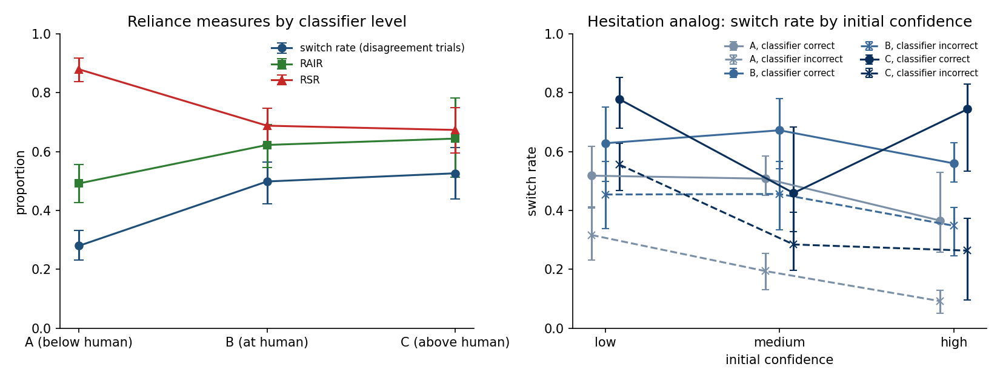

# SPEC v2: reliance behavior on the Tejeda sequential data, across classifier levels

SPEC v2, LOCKED 2026-10-09, spec commit `afd91a6b8f6f74f6a30966412c416cb652a3b03d`. Repo HEAD at run: `afd91a6b8f6f74f6a30966412c416cb652a3b03d`.

- **Deviation from the spec wording.** The spec names `code/reliance_v2.py`. This repository keeps its scripts in `pipeline/`, so the script is `pipeline/reliance_v2.py`.
- Levels: A = below human, B = at human, C = above human (between participants).

## Step 0: literature check

Searched 2026-10-09: all 54 works citing Tejeda et al. (2022) in OpenAlex (Semantic Scholar's API was rate-limited); OpenAlex full-text search for "ImageNet-16H"; Steyvers' publication list (2022 to 2026); the reference lists of Schemmer et al. (2023) and the Eckhardt et al. AI-reliance survey (ACM CSUR, doi 10.1145/3776528), cross-checked against the citing set; and the works citing the two HHAI papers from the same group.

**Result: no published or preprint analysis found that reports switch rates split by classifier correctness, or RAIR/RSR, by classifier level on the Tejeda sequential data or ImageNet-16H.** The closest items:

- Tejeda, Kumar & Steyvers (HHAI 2023, doi 10.3233/FAIA230087), "How Displaying AI Confidence Affects Reliance". Same group, same interface, sequential judge-advisor design, three classifiers; the confidence-displayed arm has 66 participants (23/23/20), against 75 recruited (25 per level) in Tejeda (2022), so it may overlap with these data but is not identical. Its Fig. 5 reports switch probability per classifier by noise level and by initial confidence, **not** split by classifier correctness, with no RAIR/RSR. Its confidence row is the unsplit counterpart of quantity 5 here.
- Tejeda, Kumar & Steyvers (HHAI 2022, doi 10.3233/FAIA220201): concurrent design; optimal-combination and automation-bias comparisons by confidence. No switch measures.
- Steyvers & Kumar (2024, Perspectives on Psychological Science): cites Tejeda (2022) descriptively; no reanalysis.
- Li & Steyvers (2025 arXiv 2507.22365; 2026 J. Math. Psych.): ImageNet-16H used for metacognitive sensitivity and combined accuracy; no switch or reliance rates.
- Not read in full: Boidot & Mourato (SSRN 7294165, August 2026), "What can the Judge-Advisor System tell about appropriate reliance…". The abstract describes a measurement framework and three models for categorical JAS tasks and names no dataset; the full text was behind a Cloudflare check and could not be retrieved. It cites Tejeda (2022). **Open item:** whether it illustrates its measures on the Tejeda data.

## Frame check

- Participants: 72 (H3 frame: 72); per level A 24, B 24, C 24 (H3 frame: 24 each).
- Trial rows: 27648 (H3 frame: 27648); initial/final pairs: 13824 (H3 frame: 13824); pairs per participant: [192].
- Exclusions (v1 Amendment 1 item 4, via `load_tejeda`): S143, S661 (two-tab).
- **Frame check: passed.**

## Reproduction check (Tejeda 2022, Fig. 7)

Fig. 7 (bottom row) of Tejeda et al. (2022) plots switch proportions on disagreement trials by human confidence and classifier-confidence bin, without printed values, and the text reports that advice is more likely to be taken from more accurate classifiers. The check is therefore the pattern: overall switch rate on disagreement trials rising from A to C.

- Switch rate: A 0.280, B 0.498, C 0.526. **Rising A < B < C: passed.**
- Extra check (not in the spec): final accuracy on all trials A 0.557, B 0.614, C 0.647; Tejeda (2022) report 56%, 61%, 65% for the sequential paradigm (before their exclusions, 75 participants).
- Classifier accuracy on all trials: A 0.450, B 0.628, C 0.682. The spec's "56% to 65%" is Tejeda's human-with-AI accuracy, not classifier accuracy; the classifier range on these trials is the one above.
- Classifier class = argmax of the stored probability vector on 100.0% of trials.

## Readings made at run time

- **Rates pool trials.** Each rate is (trials meeting the condition) / (trials in the denominator), pooled over the participants in the level; participants with more disagreement trials weigh more. This is the proportion Tejeda plot.
- **Bootstrap.** Participants resampled with replacement within level (levels are between participants), 2,000 draws, seed 20261009, percentile 95%. Pooled draws stack the three level resamples of the same draw. Level differences are taken draw by draw on these resamples (the spec's paired difference; with different people at each level the pairing is by draw, not by person). A draw whose denominator is empty is dropped from that interval and counted.
- **Overreliance.** Computed as defined, the share of initial-right / classifier-wrong trials whose final answer is the classifier's. It equals 1 − RSR only when nobody moves to a third class; the third-class share is reported so the gap is visible.
- **RT analog.** Response time exists. The hesitation analog uses the final-stage classification time (classifier shown to final click, `classification_time` on the final row), split into terciles within participant over that participant's disagreement trials (ties broken by order).
- RAIR and RSR trials are disagreement trials by construction (one of initial and classifier is right, the other wrong).
- **Quantity 2 (classifier correct) is RAIR.** On a disagreement trial where the classifier is right, the initial answer is wrong, so the two denominators are the same trials and the rates are identical (underreliance is its complement). Quantity 2 (classifier incorrect) is not RSR: it also holds the trials where both answers are wrong and differ.
- `*` in the level-difference table marks an interval that excludes zero. No test is run.

## 1. Switch rate on disagreement trials

| quantity | A (k / n) | B (k / n) | C (k / n) | pooled (k / n) |
|---|---|---|---|---|
| share of trials that are disagreement trials | 0.623 [0.604, 0.640] (2869 / 4608) | 0.526 [0.503, 0.550] (2424 / 4608) | 0.543 [0.503, 0.588] (2503 / 4608) | 0.564 [0.546, 0.582] (7796 / 13824) |
| switch rate | 0.280 [0.231, 0.332] (803 / 2869) | 0.498 [0.423, 0.565] (1208 / 2424) | 0.526 [0.439, 0.615] (1317 / 2503) | 0.427 [0.387, 0.467] (3328 / 7796) |

## 2. Switch rate by classifier correctness

| quantity | A (k / n) | B (k / n) | C (k / n) | pooled (k / n) |
|---|---|---|---|---|
| switch, classifier correct | 0.492 [0.427, 0.557] (270 / 549) | 0.623 [0.546, 0.693] (536 / 861) | 0.644 [0.514, 0.782] (760 / 1180) | 0.605 [0.539, 0.667] (1566 / 2590) |
| switch, classifier incorrect | 0.230 [0.183, 0.278] (533 / 2320) | 0.430 [0.355, 0.498] (672 / 1563) | 0.421 [0.345, 0.493] (557 / 1323) | 0.338 [0.303, 0.375] (1762 / 5206) |

## 3. RAIR and RSR

| quantity | A (k / n) | B (k / n) | C (k / n) | pooled (k / n) |
|---|---|---|---|---|
| RAIR (initial wrong, classifier right: final = classifier) | 0.492 [0.427, 0.557] (270 / 549) | 0.623 [0.546, 0.693] (536 / 861) | 0.644 [0.514, 0.782] (760 / 1180) | 0.605 [0.539, 0.667] (1566 / 2590) |
| RSR (initial right, classifier wrong: final = initial) | 0.879 [0.838, 0.917] (693 / 788) | 0.688 [0.624, 0.747] (194 / 282) | 0.674 [0.596, 0.749] (196 / 291) | 0.796 [0.764, 0.828] (1083 / 1361) |

## 4. Over- and underreliance

| quantity | A (k / n) | B (k / n) | C (k / n) | pooled (k / n) |
|---|---|---|---|---|
| overreliance (initial right, classifier wrong: final = classifier) | 0.070 [0.045, 0.096] (55 / 788) | 0.209 [0.153, 0.268] (59 / 282) | 0.216 [0.167, 0.267] (63 / 291) | 0.130 [0.108, 0.152] (177 / 1361) |
| underreliance (initial wrong, classifier right: final ≠ classifier) | 0.508 [0.443, 0.573] (279 / 549) | 0.377 [0.307, 0.454] (325 / 861) | 0.356 [0.218, 0.486] (420 / 1180) | 0.395 [0.333, 0.461] (1024 / 2590) |
| third class (initial right, classifier wrong: final is neither) | 0.051 [0.028, 0.078] (40 / 788) | 0.103 [0.060, 0.156] (29 / 282) | 0.110 [0.068, 0.160] (32 / 291) | 0.074 [0.054, 0.096] (101 / 1361) |

## 5. Hesitation analog (labelled as an analog, not the CHI 2026 indicator)

Switch rate on disagreement trials by initial confidence, split by classifier correctness.

| quantity | A (k / n) | B (k / n) | C (k / n) | pooled (k / n) |
|---|---|---|---|---|
| low confidence, classifier correct | 0.518 [0.412, 0.617] (143 / 276) | 0.628 [0.499, 0.751] (252 / 401) | 0.778 [0.680, 0.853] (413 / 531) | 0.669 [0.601, 0.731] (808 / 1208) |
| medium confidence, classifier correct | 0.508 [0.451, 0.584] (97 / 191) | 0.672 [0.543, 0.780] (158 / 235) | 0.459 [0.327, 0.683] (219 / 477) | 0.525 [0.426, 0.642] (474 / 903) |
| high confidence, classifier correct | 0.366 [0.257, 0.530] (30 / 82) | 0.560 [0.497, 0.630] (126 / 225) | 0.744 [0.534, 0.829] (128 / 172) | 0.593 [0.497, 0.681] (284 / 479) |
| low confidence, classifier incorrect | 0.316 [0.232, 0.408] (355 / 1122) | 0.454 [0.338, 0.567] (376 / 828) | 0.556 [0.468, 0.629] (380 / 684) | 0.422 [0.362, 0.482] (1111 / 2634) |
| medium confidence, classifier incorrect | 0.194 [0.131, 0.254] (129 / 666) | 0.456 [0.333, 0.565] (170 / 373) | 0.284 [0.196, 0.393] (118 / 415) | 0.287 [0.232, 0.343] (417 / 1454) |
| high confidence, classifier incorrect | 0.092 [0.050, 0.130] (49 / 532) | 0.348 [0.245, 0.410] (126 / 362) | 0.263 [0.096, 0.374] (59 / 224) | 0.209 [0.144, 0.265] (234 / 1118) |

Switch rate on disagreement trials by final-stage response-time tercile within participant.

| quantity | A (k / n) | B (k / n) | C (k / n) | pooled (k / n) |
|---|---|---|---|---|
| fast tercile, classifier correct | 0.379 [0.282, 0.477] (64 / 169) | 0.632 [0.516, 0.735] (184 / 291) | 0.634 [0.465, 0.808] (258 / 407) | 0.584 [0.493, 0.667] (506 / 867) |
| middle tercile, classifier correct | 0.537 [0.438, 0.636] (101 / 188) | 0.661 [0.565, 0.749] (191 / 289) | 0.671 [0.525, 0.812] (267 / 398) | 0.639 [0.563, 0.712] (559 / 875) |
| slow tercile, classifier correct | 0.547 [0.466, 0.622] (105 / 192) | 0.573 [0.515, 0.631] (161 / 281) | 0.627 [0.528, 0.734] (235 / 375) | 0.591 [0.540, 0.643] (501 / 848) |
| fast tercile, classifier incorrect | 0.113 [0.065, 0.167] (89 / 787) | 0.386 [0.276, 0.504] (199 / 515) | 0.382 [0.293, 0.476] (163 / 427) | 0.261 [0.216, 0.308] (451 / 1729) |
| middle tercile, classifier incorrect | 0.314 [0.250, 0.380] (239 / 760) | 0.513 [0.424, 0.597] (263 / 513) | 0.451 [0.351, 0.549] (192 / 426) | 0.408 [0.362, 0.455] (694 / 1699) |
| slow tercile, classifier incorrect | 0.265 [0.219, 0.311] (205 / 773) | 0.393 [0.328, 0.461] (210 / 535) | 0.430 [0.365, 0.497] (202 / 470) | 0.347 [0.314, 0.382] (617 / 1778) |

## 6. Accuracy on disagreement trials

| quantity | A (k / n) | B (k / n) | C (k / n) | pooled (k / n) |
|---|---|---|---|---|
| initial-answer accuracy | 0.275 [0.240, 0.311] (788 / 2869) | 0.116 [0.100, 0.135] (282 / 2424) | 0.116 [0.094, 0.141] (291 / 2503) | 0.175 [0.159, 0.192] (1361 / 7796) |
| classifier accuracy | 0.191 [0.166, 0.217] (549 / 2869) | 0.355 [0.329, 0.380] (861 / 2424) | 0.471 [0.426, 0.517] (1180 / 2503) | 0.332 [0.310, 0.354] (2590 / 7796) |
| final-answer accuracy | 0.367 [0.343, 0.392] (1053 / 2869) | 0.331 [0.306, 0.354] (802 / 2424) | 0.410 [0.356, 0.460] (1027 / 2503) | 0.370 [0.350, 0.389] (2882 / 7796) |

## Level differences (later level minus earlier level)

| quantity | B − A | C − B | C − A |
|---|---|---|---|
| switch | +0.218 [+0.132, +0.303] * | +0.028 [-0.089, +0.141] | +0.246 [+0.144, +0.346] * |
| switch_ai_correct | +0.131 [+0.033, +0.226] * | +0.022 [-0.126, +0.174] | +0.152 [+0.009, +0.301] * |
| switch_ai_incorrect | +0.200 [+0.116, +0.285] * | -0.009 [-0.113, +0.095] | +0.191 [+0.099, +0.276] * |
| RAIR | +0.131 [+0.033, +0.226] * | +0.022 [-0.126, +0.174] | +0.152 [+0.009, +0.301] * |
| RSR | -0.191 [-0.264, -0.121] * | -0.014 [-0.112, +0.078] | -0.206 [-0.289, -0.117] * |
| overreliance | +0.139 [+0.081, +0.205] * | +0.007 [-0.068, +0.080] | +0.147 [+0.091, +0.203] * |
| underreliance | -0.131 [-0.226, -0.033] * | -0.022 [-0.174, +0.126] | -0.152 [-0.301, -0.009] * |
| dis_initial_acc | -0.158 [-0.197, -0.120] * | -0.000 [-0.030, +0.029] | -0.158 [-0.203, -0.117] * |
| dis_ai_acc | +0.164 [+0.126, +0.199] * | +0.116 [+0.066, +0.168] * | +0.280 [+0.227, +0.334] * |
| dis_final_acc | -0.036 [-0.072, -0.002] * | +0.079 [+0.021, +0.135] * | +0.043 [-0.015, +0.097] |

## Readings fixed before the run, against the results

- **Expected: switch rises with level.** Observed A 0.280, B 0.498, C 0.526. B − A +0.218 (in the expected direction, interval excludes zero); C − B +0.028 (in the expected direction, interval includes zero); C − A +0.246 (in the expected direction, interval excludes zero).
- **Expected: RSR falls with level.** Observed A 0.879, B 0.688, C 0.674. B − A -0.191 (in the expected direction, interval excludes zero); C − B -0.014 (in the expected direction, interval includes zero); C − A -0.206 (in the expected direction, interval excludes zero).
- **Expected: RAIR rises with level.** Observed A 0.492, B 0.623, C 0.644. B − A +0.131 (in the expected direction, interval excludes zero); C − B +0.022 (in the expected direction, interval includes zero); C − A +0.152 (in the expected direction, interval excludes zero).

**The paper's claim, as the intervals allow it.** Between A and B, 5 of 5 distinct reliance rates (switch, switch with the classifier incorrect, RAIR, RSR, overreliance) move with an interval excluding zero; between A and C, 5 of 5; between B and C, 0 of 5. Within one task and one participant pool, the reliance measures move with classifier level from A to the two better classifiers, so a reliance figure reported for a single AI is a point on a curve. Between B and C every level-difference interval includes zero: the measures are flat across that part of the range (classifier accuracy 63% to 68% on these trials). The full range is 45% to 68%, not the 56% to 65% in the spec text (see the reproduction check).

**Hesitation analog.** Descriptive only. No claim about the CHI 2026 interaction-log indicators follows from it.

**Multiplicity.** Three levels, the rates above and the confidence and RT breakdowns are reported as tables and a figure, not as a list of tests.

## Figure

*Left:* switch rate (disagreement trials), RAIR and RSR by classifier level, 95% participant-cluster bootstrap intervals. *Right:* switch rate by initial confidence; solid = classifier correct, dashed = classifier incorrect; shade = level.

